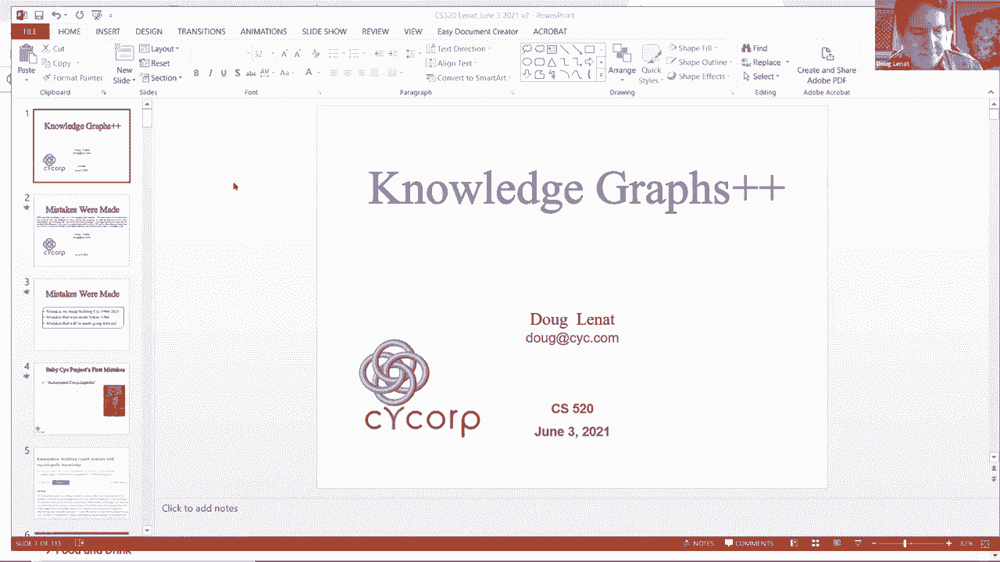
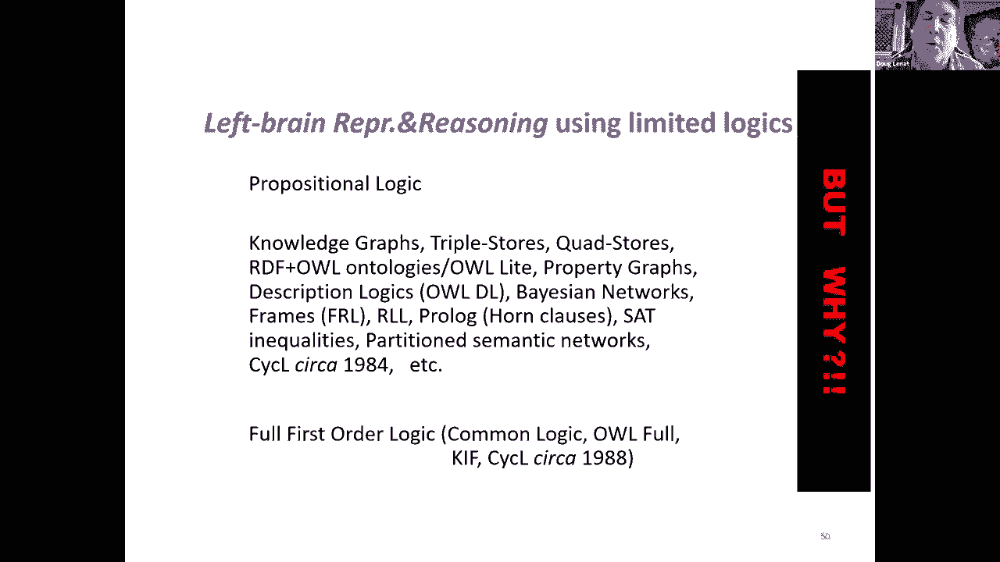
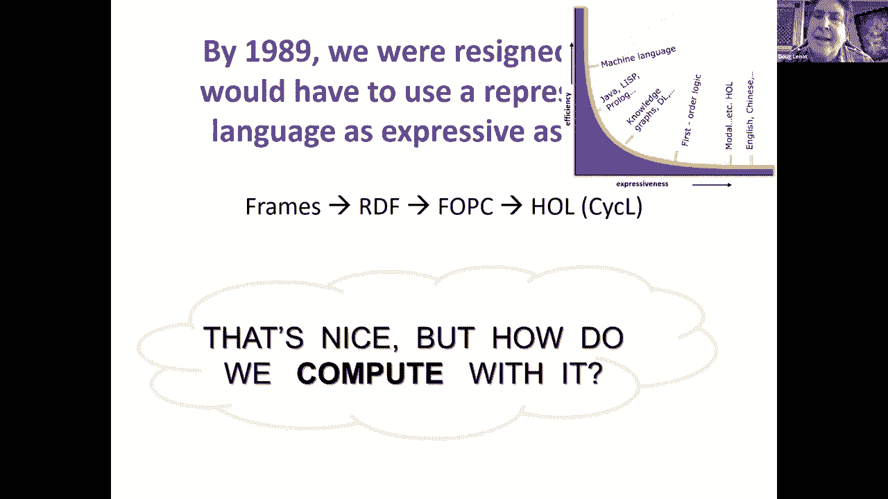
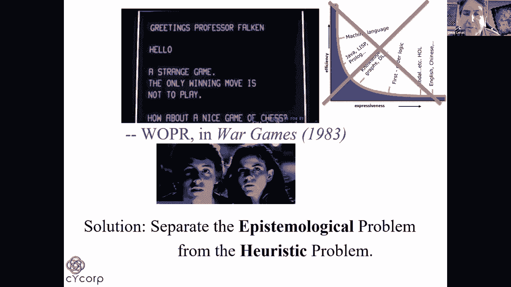
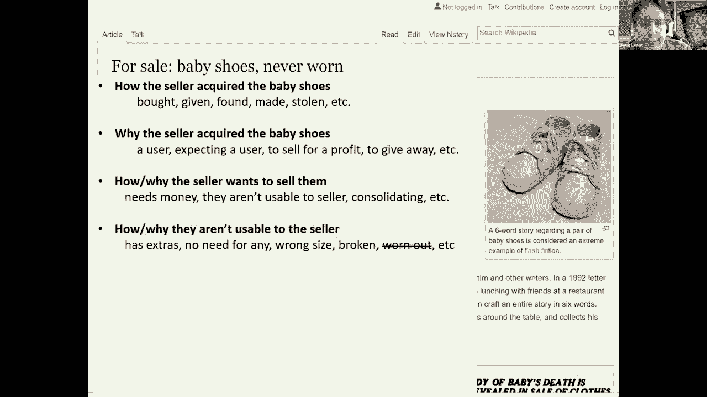
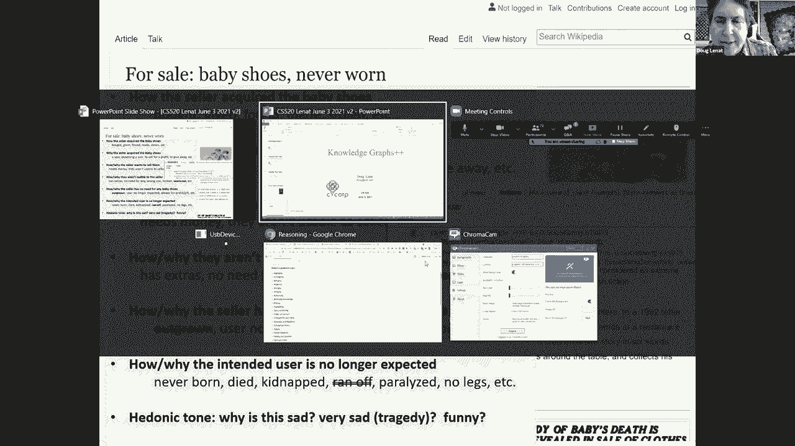
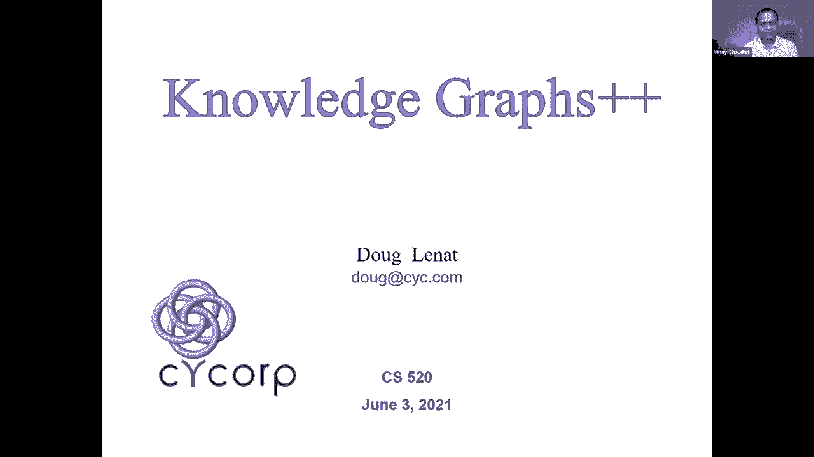

# 35：L20.2 - 知识图谱的局限与超越 🧠

在本节课中，我们将学习知识图谱（Knowledge Graph）在人工智能项目构建过程中的局限性，以及如何通过更具表现力的表示方法和架构设计来克服这些挑战。课程内容基于一个长期AI项目的经验教训，旨在为初学者提供一个清晰、直白的理解。

## 概述 📋

知识图谱是一种强大的知识表示工具，但它并非万能。在构建复杂的AI系统（如心理AI项目）时，我们发现仅依赖知识图谱会遇到诸多瓶颈。本节课程将探讨知识图谱的不足，并介绍如何通过高阶逻辑、上下文感知和多层表示等方法，构建更强大、更灵活的知识系统。

---

## 早期错误与核心教训

在20世纪80年代初，我们专注于将纸质文本（如百科全书）的内容转化为结构化表示。然而，我们很快意识到一个关键问题：文本中蕴含的“常识”远比文章明确陈述的内容更重要。作者假设读者已经了解世界如何运作，从而能够消除语言歧义、理解言外之意并进行推理。

### 对上层本体论的过度关注

我们早期的一个错误是过度纠结于构建“完美的”上层本体论（Upper Ontology），即试图为所有知识定义一个绝对正确的顶层分类体系。许多项目都将大量精力耗费于此。

**核心教训**：真正重要的是本体论的“充分性”，而非其顶层分类的绝对正确性。即使分类方式不同（例如，按“有无灵魂”来划分事物），只要所做的区分足够，系统仍然能够有效工作。这本质上是一个**效率问题**。如果你的本体论区分不足，就像大部分名词和动词都用“蓝精灵”代替一样，你需要更冗长的表述才能传达相同的意思。

### 本体论并非越大越好

我们学到的另一个教训是，本体论并非越大越好。

**核心教训**：过大的本体论会导致“用多种方式说同一件事”的问题。例如，“太阳是黄色的”可以有多种表述（“它是一个黄色物体”、“它具有黄色”、“它的颜色是黄色”）。如果你在知识图谱中定义了所有这些词汇，就需要编写大量的公理（`n²` 级别的关联）来连接它们，这增加了系统的复杂性。因此，有些概念（如“黑白相间的猫”）可能不值得在知识图谱中拥有独立的术语。

---

## 为何需要超越知识图谱？

上一节我们讨论了知识图谱在构建时的效率与充分性问题。本节中，我们来看看为什么简单的知识图谱（主要表现为二元关系）在表达能力上存在根本局限。

### 表达能力的限制

我们最初使用的表示法（如框架、槽、关联三元组）本质上等同于今天的知识图谱。但我们逐渐被需求推动，必须使用更具表现力的表示方法。

**原因一：需要表达多元关系**
许多事实不仅仅是两个事物之间的关系。例如，“A在圣何塞和圣地亚哥之间的1号公路上”这个事实涉及多个参数。如果被迫用多个二元三元组来表示，那么这些三元组本身没有独立意义，只有组合起来才有意义。在这种情况下，不如直接使用**多元关系**。

**原因二：需要表达复杂逻辑**
自然语言和真实推理涉及大量逻辑连接词，而这是基础知识图谱难以直接表达的。
*   **否定、量词与嵌套**：我们需要区分“每个国王都有母亲”和“有一个母亲是所有国王的母亲”。在一阶逻辑中，这两者看起来完全不同。
*   **传递性与集合论**：我们需要区分传递关系和非传递关系，以及处理集合概念（如“1到10的整数集合”是有限集，但“1到10之间的整数”是无限个有限集中的一个）。
*   **变量与元级别推理**：我们需要使用变量提问（如“X和Y是什么关系？”），甚至进行元推理（如“谁告诉我这个信息？我为什么要相信它？”）。
*   **情态与反事实**：我们需要表示信念、欲望、可能性以及反事实条件（如“如果……会怎样？”）。

这些元素在新闻报道和日常对话中无处不在。试图将这类内容仅表示为三元组集合，会丢失绝大部分的语义信息和推理潜力。

### 表现力与效率的权衡

显然，在表示语言的表达能力和推理效率之间存在权衡。
*   一个极端是**自然语言/高阶逻辑**，表现力极强但难以直接计算。
*   另一个极端是**机器学习/机器语言**，效率高但表现力受限。

**核心解决方案**：借鉴电影《战争游戏》的启示——“赢得游戏的唯一方法就是不玩”。我们将系统“应该知道什么”（认识论问题）与“如何高效地推理它知道的东西”（启发式问题）分离开。这意味着我们需要**多种表示语言**以及它们之间的**翻译器**。

在我们的系统中，我们使用至少两种主要表示：
*   **EL (Epistemological Level - 认识论层)**：干净、富有表现力的高级表示（如高阶逻辑），由“哲学家”维护。
*   **HL (Heuristic Level - 启发式层)**：高效、专门化的低级表示和推理模块，由“程序员”优化。

实际上，我们现在拥有超过1000种不同的HL表示和模块。很多工作在于寻找概括性的方法，将知识压缩到少数公理中，而不是海量的特定规则。

---

## 提升效率的关键策略

以下是我们在实践中总结出的、能显著提升系统效率的一些关键策略：

*   **明智地使用元知识**：通过元规则（关于规则的规则）甚至元元规则，系统可以花费少量时间进行元级推理，从而在大部分时间里极大地提升问题解决效率。
*   **定义规则宏谓词**：将频繁出现的复杂模式定义为一个新的、简单的谓词。这样，复杂的推理模式就被“打包”成一个原子公式，使得推理更加高效。
*   **优化推理参数**：我们曾拥有约150个控制推理过程的参数（如推理步数限制）。后来发现，只需其中6个特定的参数组合，就能在历史问题上获得几乎相同的答案。这大大简化了系统配置。

### 效率演示示例

为了直观展示系统的能力，我们可以进行快速问答演示。系统可以实时生成复杂的逻辑表达式来回答“为什么”类问题，或处理涉及信念、反事实的复杂情景。
例如，询问“如果蒙太古和凯普莱特两家不是世仇，蒙太古勋爵会对罗密欧与朱丽叶的婚礼有何看法？”，系统能够基于修改后的上下文（移除世仇前提）进行推理并给出不同答案（可能变为赞同）。

这展示了系统在保持丰富表现力的同时，也能实现高效推理。一个有趣的轶事是：由于一个通用定理证明器模块速度极慢，我们在十年前悄悄关闭了它，而用户从未察觉。这说明大多数问题并不需要最通用但最低效的推理器。

---

## 其他重要教训与未来方向

除了上述核心内容，我们还总结了其他一些关键教训：

*   **共享知识时，仅共享本体/图谱是不够的**：必须共享支撑推理的“常识”和上下文。知道“人”、“睡眠”、“夜晚”这些概念，不如知道“人通常在夜晚闭眼躺着睡觉数小时且不喜欢被吵醒”这条知识有用。
*   **上下文是第一公民**：我们放弃了“全局一致知识”的概念，转向“局部一致知识”。知识仅在特定上下文中为真，就像地球局部是平的，但整体是球形的。这通过在高阶逻辑中将**上下文作为一等对象**来实现。
*   **几乎没有绝对事实**：几乎所有事实都只在上下文中成立。因此，系统在回答问题时，应寻找支持和反对每个答案的论据，而不是假设只有一个正确答案。
*   **需要连接异构系统**：过去一二十年，一个重要的工作是将不同的本体、数据库、网络服务和机器学习系统映射和连接起来。

### 未来的挑战与愿景

如何让这种更具表现力的方法被更广泛地接受和应用？

*   **迈向知识效用**：理想的未来是建立一种“知识公用事业”，像电力或网络一样，具有巨大的规模经济效应，使得个人获取知识的成本变得极低。这可能需要一种**知识经济**模型，用户可以通过贡献微小的知识来获取查询信用。
*   **降低使用门槛**：开发更好的工具，让即使不懂逻辑或知识图谱的领域专家，也能帮助系统调试和扩展知识。例如，当系统答错时，能自动生成一系列可能的缺失公理供专家选择确认。
*   **互操作性的推动力**：大公司开放其知识图谱以实现互操作性，往往源于众多小公司通过协作形成的挑战（如同电商比价），或出于企业间数据整合的实际商业需求。

---

## 总结 🎯

本节课我们一起学习了知识图谱在构建高级AI系统中的局限性。我们认识到，仅依赖二元关系图谱不足以表达复杂的逻辑、情态和上下文。通过采用**多层表示架构**（如EL和HL分离），将富有表现力的认识论层与高效特化的启发式层结合，并重视**上下文**和**局部一致性**，我们可以构建出更强大、更灵活的知识系统。未来的方向在于创建**知识公用事业**、降低构建门槛，并通过经济和技术手段促进大规模知识共享与互操作性。

---
*（注：本教程根据提供的演讲内容整理，保留了原文每一句话的核心含义，并按照要求进行了结构化、简化和格式调整。）*