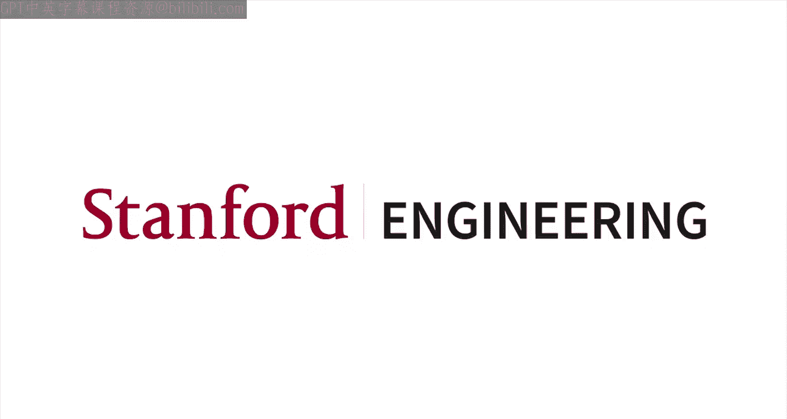
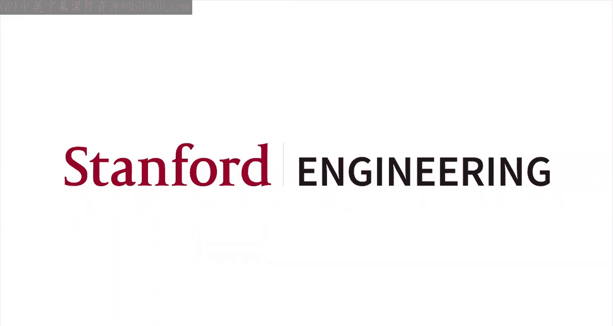

#  001：课程信息

## 概述
在本节课中，我们将了解斯坦福大学2020年春季的机器学习入门课程的基本信息。

## 课程介绍
Hello and welcome to EE 104 or CME 107， this is the course. Introduction to machine learning at Stanford University Spring 2020. My name is Sanja Lau. I am the instructor of this class. This class was written by myself and Professor Stephen Boy at Stanford over the past three years.

## 课程安排
We are, as you know, in the middle of coronavirus outbreak and as a result, much of the university is closed and many of you are working at home. The course is therefore going to be entirely online. All of the lectures will be pre-recorded and we will not have any live lectures, unfortunately. We are aware that many of you are watching these lectures from a variety of different time zones and we will do our best to accommodate that. We will post new lectures every Tuesday and Thursday morning. And we will hold office hours via Zoom.

## 考试安排
Due to the current situation, there will be no exams in this class. All classes in the School of Engineering are going to be credit or no credit only, and this class is no exception, but there will be homework, it will be given out weekly. 😊.

## 作业内容
Now, the homework will be about half programming and the other half will be conceptual questions. Maybe a little bit of mathematics. 😊, The programming questions will be using Julia for those. Julia is a modern language which is developed primarily for numerical computing and machine learning, in particular, it's very fast. It's got a very nice syntax which makes it very simple to write sophisticated programs. You do not need to have a very sophisticated understanding of the Julia programming language. Most of the coding that we will do in this class is very short scripts. 😊, We will using the Flux machine learning package that is a package that sits on top of Julia.

## 课程先决条件
There are some prerequisites in this class, in particular linear algebra. We will be using a lot of the notation of linear algebra and we will need you to be familiar with things such as least squares and a basic understanding of eigenvalues and eigenvectors later in the class. 😊, We don't need anything more sophisticated than that. So any first class in the new algebra will cover enough. 😊, Similarly for programming, we do need you to be able to write code, but very simple code will suffice as I said. We're only going to be writing short scripts, but you do need to be familiar with how to bring data in, how to generate plots, how to understand what data types are. You don't need to have any understanding of complex data structures or object-oriented programming or anything like that. Probability is a corequisite, not a prerequisite. 😊. So, any basic class in probability will do, you can. If you haven't taken it up until now, you can take it concurrently with the class and that's fine. We won't be using probability for the first few weeks. But after that, we will stop to use both the language and some of the ideas and methods of probability as well.

## 总结
And that brings me to the end of the mechanics section of the class. Hope you enjoy. E1 at4.