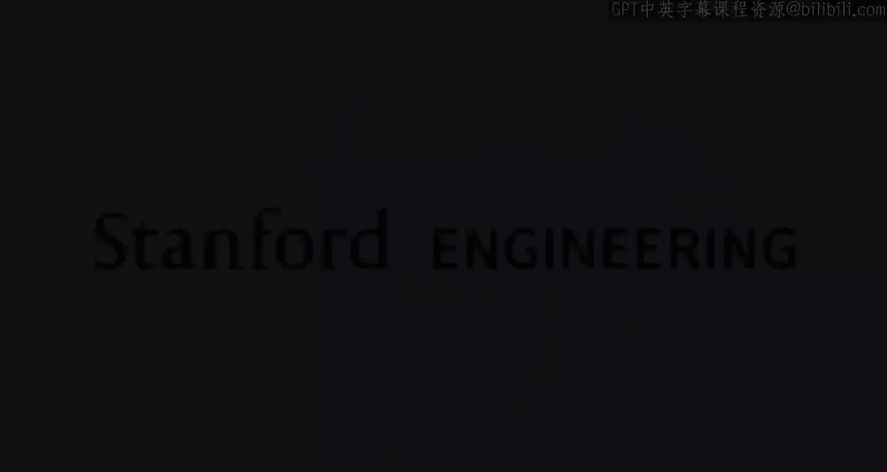
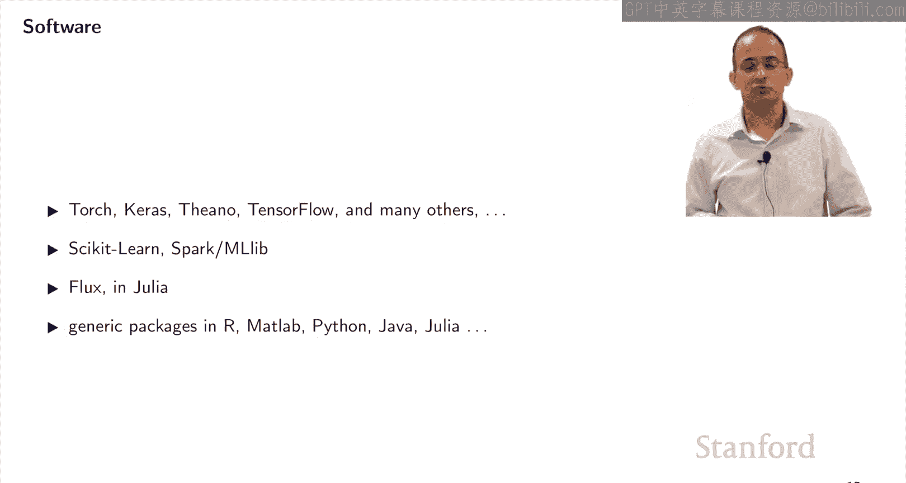
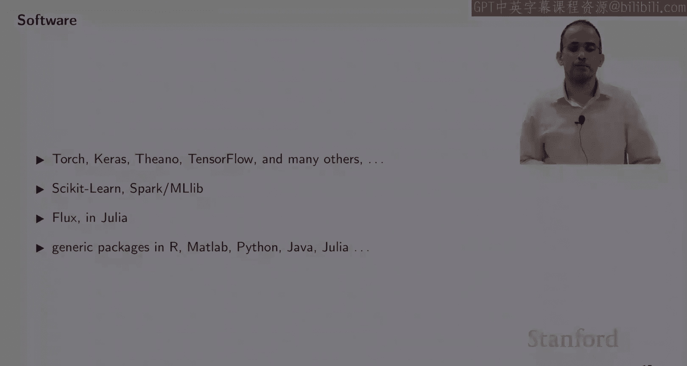
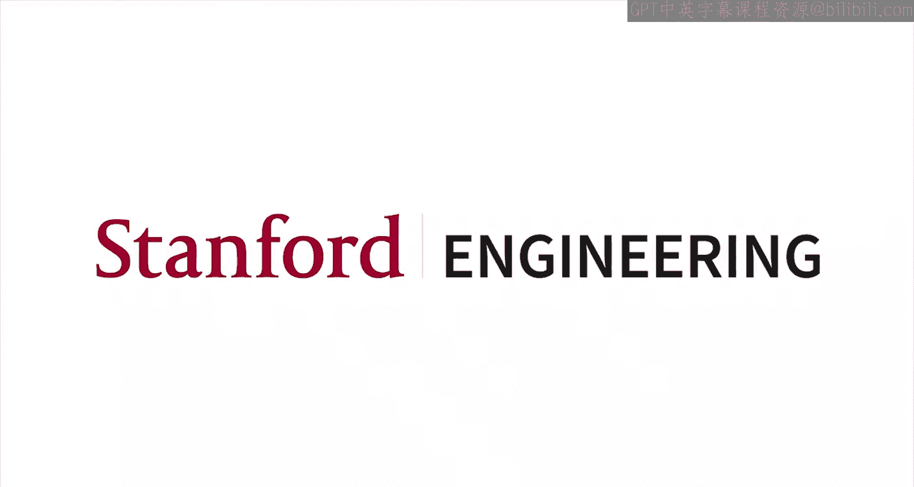

#  002：斯坦福大学《机器学习｜Stanford EE104 Introduction to Machine Learning 2020》deepseek翻译 p02 Lecture - 2 overview.zh_en -BV1utzNYqEkr_p2-

## 🧠 机器学习概述

在本节课中，我们将介绍机器学习的基本概念和方法。

### 1. 机器学习的基本思想

机器学习的主要目标是使计算机能够执行复杂的任务，例如医疗诊断。

**公式**：机器学习 = 数据 + 算法 + 模型

**代码**：`model = algorithm(data)`

### 2. 机器学习的方法

机器学习方法可以分为两大类：

* **基于知识的系统**：通过编码逻辑来表示世界属性和含义。
* **机器学习**：使用历史数据训练模型，使其能够进行预测。

### 3. 机器学习的过程

机器学习过程可以分为两个主要任务：

1. **构建模型**：从数据中构建模型，包括：
    * 将数据转换为计算机可理解的格式。
    * 选择模型形式（例如，线性回归、决策树、神经网络）。
    * 选择模型参数。
2. **测试模型**：在未参与训练的数据上测试模型，以验证其性能。

### 4. 机器学习模型分类

* **监督学习**：从标记数据中学习，用于预测。
    * **分类**：预测离散标签。
    * **回归**：预测连续值。
* **无监督学习**：从未标记数据中学习，用于模式识别和聚类。

### 5. 机器学习应用示例

* **预测降雨量**：使用过去10天的降雨数据预测明天的降雨量。
* **人脸识别**：根据照片识别用户身份。
* **疾病诊断**：根据患者数据和测试结果预测疾病。
* **客户细分**：将客户分为具有相似购买习惯的组。
* **异常检测**：识别可疑数据。
* **数据生成**：生成类似于给定数据的新数据。

### 6. 机器学习性能评估

* **回归**：均方误差（MSE）。
* **分类**：错误率、精确度、召回率。
* **概率模型**：似然函数。

### 7. 数据和软件

* **数据集**：Caggle、ImageNet、Street View、自动驾驶汽车数据。
* **软件**：PyTorch、Keras、TensorFlow、Flux、Spark MLlib。

### 8. 总结

本节课介绍了机器学习的基本概念、方法和应用。通过学习本节课，你将了解机器学习的基本原理，并能够将其应用于实际问题。

**本节课中我们一起学习了**：

* 机器学习的基本概念和方法
* 机器学习的过程
* 机器学习模型分类
* 机器学习应用示例
* 机器学习性能评估
* 数据和软件