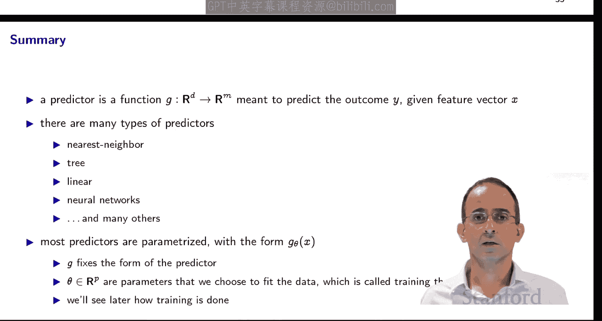

#  003：斯坦福大学《机器学习｜Stanford EE104 Introduction to Machine Learning 2020》deepseek翻译 p03 Lecture 3 - predictors.zh_en -BV1utzNYqEkr_p3-

## 🧠 斯坦福大学《机器学习》课程：第3节：预测器

### 概述

在本节课中，我们将学习机器学习中的预测器。预测器是一种模型，它接受特征向量X并预测相应的结果Y。

### 数据拟合

在机器学习中，数据拟合是一个主要任务。我们有一个变量Y和一个变量X，我们认为它们是相关的。通过某个函数，比如说y。

y等于f(x)。我们认为y大约等于F(x)。

在这里，我们认为x是自变量，y是结果。或者响应。

我们可能会称它为目标或标签或因变量。

通常，y在RM中，x在RD中，所以这两个都是向量。通常，M是1。

因此，结果是标量。我们说，嗯，目标是与自变量相关的。

大约通过Y是F(x)。

我们将被告知X，我们希望能够预测Y。并且。

我们不知道这个函数是什么。当然，可能没有这样的函数，因为y和X可能只是一堆无关的数据。

它们是否通过我们不知道的其他变量相关，或者你在一个时间点放一个x，你会得到一个y，你在一个不同的时间点放一个x，你会得到一个不同的y。有很多噪声。

Y和X之间存在概率关系，而不是纯粹的确定性关系。

通常，这些x是，这些变量x。通常，这些变量x是特征向量，而不是底层数据本身。例如。

如果我们有文档，对于每个文档，我们可能会制作一个词频直方图。然后计算所有不同单词的数量。这将X。

这是词频向量。如果我们有患者数据，那么X可能是一组不同的患者属性。

一组测试结果，也许是一组症状。如果我们数据由客户组成。

那么对于每个客户，我们都会有一个X，这将是该客户的购买历史。

也许是一般框架。从原始输入数据构建特征。

所以原始输入数据可能是向量本身。它可能是一个单词或文档。

它可能是一张图片，它可能是一段视频，它可能是一段音频。

或它可能是一组此类属性。可以考虑多个属性。

我们将称该输入数据为U。我们将将其映射到函数φ下构建x。

我们将其称为相应的特征向量。

这个函数φ有一个名字，它被称为嵌入，或特征函数或特征映射。

有时φ非常简单，有时它非常复杂。

我们将从φ中提取一个特定的属性，我们确保由于φ是一个向量。

我们将确保φ的第一个分量总是1。

因此，这可以表示为x1φ或5hiφ1。它是常数特征。

我们将在稍后解释这个原因。同样，我们嵌入或构建输出数据的特征。

我们将称这些为y。

我们将有y等于ψ(V)。所以我们的数据以对的形式出现。UIs in VIs。

数据元素是一个对UI VI，我们将它们映射到对X IYI。

我们有N个数据点，x1到Xn，y1到Yn。

一旦我们嵌入它们，一旦我们构建了特征。

然后我们不再需要直接查看U和V，相反，我们可以专注于X和Y。

所以我们将有N个D维向量，x1到xn。

M维向量，y1到Yn。

我们将X IYI称为I数据对或观察。特别地。

一个有启发性的术语是将其称为我们希望从中学习的I示例。

集体地。

我们称X和Y的整个集合为数据集。

嗯。所以这是我们将要使用来构建。

一些。拟合。

模型，用于X和Y之间的关系。我们还有。

所以那是我们的基本数据，我们将使用它来构建。

一些。拟合。

模型。我们可能还知道F可能看起来像什么。

例如，多项式。

我们可能会说F是平滑的或连续的。

这意味着如果x和x t是两个彼此接近的向量。

那么f(x)和f(x t)也应该彼此接近。

在F之前，我们可能知道的其他先验知识是，我们可能知道y始终是非负的。

因此，我们希望确保F poles在模型中的这一属性。

我们将从x和y中学习，我们将看到很多y值。

无论我们看到什么y值，我们都希望确保。

我们的学习算法产生的模型具有这样的属性，即任何x的f都是始终非负的。

还有很多其他这样的先验知识。

所以有很多其他先验知识的例子。

所以我们要构建的东西被称为预测器。

它是一个接受X并给出在该X处y的预测的模型。

我们用G表示，它是一个接受RD中的向量x并给出RM中的向量y的函数。

对于特征向量x的预测，我们将表示为y^，y^是G(x)。

预测器G是基于两件事选择的。

我们看到的数据和我们拥有的先验知识。

这意味着我们可以。

在原始数据方面，使用新的原始数据记录构建预测。

所以如果你给我一个我以前从未见过的U。

我将将其映射到φ下嵌入，并给出x，构建与该U对应的特征向量。

然后我可以取那个X并将其输入到预测器中，构建G(x)。

这是对y的估计，对y的预测。

然后我可以通过应用特征映射ψ的逆来取消嵌入，给出V的估计，我们将其称为V^。

这意味着我可以根据原始数据测试预测器的性能。

在原始数据方面，而不是在x和y方面。

当然，你也可以评估这个预测器在数据上的表现如何。

我们可以取一个数据对，I数据对是X I，你将XI输入G。

我们将得到Y^，我们将其称为Y^ I。

我们希望Y^ I接近Y I。这意味着预测器在数据上表现良好。

这是对预测器的一个非常合理的要求。

当然，我们的真正目标不是让。

预测器在数据上表现良好，而是让预测器在。

我们尚未看到的潜在数据上表现良好。

当有人给我们一些新的。

X或一些新的U时。

他们可以相当合理地问，嗯嗯，你从所有那些早期数据中学到了什么？

我们给你。答案是，嗯，从所有这些数据中。

我了解到这些类型的x会产生这些类型的y，让我预测由你给出的x生成的特定y。

现在当我们使用预测器时，我们通常不会说，嗯，这里有一个预测器。

我们通常有一个预测器的参数化形式。

所以预测器是x的函数。

它是θ的函数。所以我们将有Y^是G(x, θ)。

有时我们将其写成下标，所以我们将写成Y^是G_θ(x)。

这只是为了方便引用G。

G_θ是一个函数，它接受X并给出y。

这为我们指定了一个形式，一个结构。

😊允许预测器或我们喜欢的预测器。

我们只选择与θ对应的预测器。

我们的工作变成了，而不是选择一个任意映射X到y的函数，选择θ。

然后评估G(x, θ)。所以θ是一个参数，它通常是一个向量。

它是预测模型的参数。θ通常在某个欧几里得空间中。

这里我们写了RPP，有时它是一个矩阵，我们将会看到。

有时它是一个列表，有不止一个参数，不止一个参数向量。

不止一个参数矩阵。

😊选择一个特定的θ。

这被称为调整或训练或拟合模型。

学习算法是选择θ的配方，例如。

我们可能有一个线性回归模型。

它说Y^是θ1x1加上θ2x2一直加到θD。

我们的工作是要选择θ，使得。

这是一个好的预测器。

我们在之前的线性代数课程中已经看到，可以使用这些平方来拟合这样的线性回归模型。

选择θ以最小化均方误差。

当然，有很多其他方法可以用来选择，进行线性回归，选择θ。

即使在线性回归模型中，我们将在本课程中讨论其中一些。

我想谈谈一类特殊的预测器，称为最近邻预测器。

😊。

它们的工作方式如下，我们得到一个数据集。

X1到Xn，Y1到Yn。

预测器说以下内容。你有一些新的X，你想要预测相应的Y^。

你这样做的方式是，在所有你有的数据中。

你找到最接近X的Xi。然后你预测相应的Y^ I。

这就是G在X处的定义。

这非常直观。

如果你有一些新的数据，你想要预测在该数据点x处的y。

嗯，为什么不寻找与之匹配的最近示例呢？

嗯。这可能是我们拥有的最接近的示例。所以让我们预测。

我们得到的y是之前示例中得到的y。

当然，这当然是一个参数化预测器。

参数有点有趣，因为参数是整个数据集。

你可以认为θ是整个数据集中的x1到Xn和y1到Yn。

我们不需要选择参数，参数是由数据给出的。

它是数据。所以训练很简单，没有训练，没有计算要做。

我们只需要做。

是。跟踪我们所看到的所有数据，每当得到一个新的查询点。

一个新的X。我们只需在数据集中找到最接近的X即可。

并返回相应的Y。

这意味着G将是x的分段常数函数。

因为当x比所有其他x更接近Xi时。

geo x只是yi。我们可以看到这一点。

在这个图表中。让我看看我是否可以突出显示这个图表上的某些点。

所以这些是数据点。

橙色线，我将用黑色突出显示，这条线。

这条线。它在这里。是预测器？

它告诉我们，例如，如果我们收到。

诶呀。x的值为0.2。

那么我们应该预测。

相应的y值为0.47。

所以即使我们只在特定点上得到数据点。

我们拟合了一个曲线，不是曲线，而是一个分段常数函数通过这些点。

要注意的是，函数有间断点。

让我们看看这些间断点。

所以这里有一个。也是哪个。还是哪个。

这些间断点正好位于两个相邻数据点之间。

所以当我们改变x时。

当我们在这里时。😊，我们的最近邻数据点是这个红色点。

然后当我们增加x时，我们突然切换到最接近的数据点是这个。

数据点X在这里，因此我们也将预测切换为预测这个数据点对应的y。

你可以在多个维度上这样做，这里不一定是单维X。

当x是d维时也可以这样做。

这里是一个二维案例。

在这个二维案例中，我们有数据点。

我会在这些点上突出显示这些蓝色点。

啊。并且。啊。现在与每个数据点相关联。

有一个区域，例如，对于这个数据点。

有一个区域是这个区域。

这是一个多面体，它有直线边界。

这是与这个数据点相关联的数据点的集合。

对于这个数据点，对于这个X。

我的最近邻数据点是这个。

现在如果我移动。

穿过这个边界。

突然我切换到最接近的数据点变成那个。

所以每个数据点都有一个对应区域。

这些区域称为与数据相关的Voi区域。

所以预测器是分段常数函数，它在Voi区域上是常数。

这里是它的三维图，这是x1，这是x2，这是预测。

Y或Y^？

所以这里我们有，再次，我们有数据点。

这里。

然后这是函数值。

根据每个数据点。

所以在这里，在这个Voi区域上。

这个Voi区域就在这里。

这是与这个数据点对应的Voi区域，该数据点的值是y1。

y I是-1，对不起。

所以如果我们给出一个新X，它在这个区域的任何地方。

那么我们将预测Y^也是-1。

所以现在我们已经看到了最近邻预测器。

我们可以扩展这个想法，谈谈K最近邻预测器。

😊。

这里的想法是，你选择一个数字K，一个整数。

然后你说，嗯，你给我一个x。

而不是只查看x的最近邻。

我将查看K个最近邻，Xi1到XiK。

😊，在给定数据中。

我们将预测Y^如下。

我们将选择那些K个最近邻。

😊，最近的Xi。

每个都有一个相应的Yi，直到我们得到K个相应的Yi。

我们将构建这些KYi的平均值。

这将Y^。

😊，这是最近邻预测器的推广。

它当然非常有用，它被广泛使用，你可能会看到。

它使你对数据的噪声更不敏感，如果数据变化很大。

那么K最近邻预测器将进行一些平均。

它将平滑数据。

它将消除一些噪声。

你可以用很多方法来扩展这个想法，你可以使用加权平均来形成Y^。

或者你可以预处理数据，你可以这样说，嗯，我只看。

数据而不是将其视为数据点的集合。

我只将其视为数据点的集合。

数据点的集合。😊，然后而不是选择最近邻。

我可能会选择最近的簇。

有很多你可以做的事情。

这是计算K最近邻预测器的方法，这是Julia。

😊。

它有一个函数。

它接受X，y，小x和K。

所以这里这个矩阵X。

它是一个N乘以D的矩阵。

它的第i行是第i个X点，它是X。

对应于I数据记录的变量。

y也是一个N乘以M的矩阵。

它是相应的目标。

y的第i行是第i个X行对应的目标变量。

这里，小x是。

查询点，我们给出一个新x，我们想要预测Y。

K在这里。

是K个最近邻，它是我们将考虑的邻居数量。

所以这里的第一行代码只是给我们N。

它查看矩阵X的行数。

这里我们。

查看每个。

Vow和从查询点中减去它，查看该向量的元素平方和。

然后我们得到一个列表，其中包含所有这些不同距离的平方和。

Fas one to n，这是disS，这是所有这些不同距离的列表。

disS的第i个元素是Xi到X的距离。

然后这个函数sort perm给出了指向排序。

🤢，条目的索引。

所以最近邻索引列表的第一个条目是一个整数。

如果查看disS，那么。

所以如果最近邻索引是。

如果最近邻索引列表的第一个条目是7。

那么disS7将是disS中最小的条目。

😊，disS。

同样，第二个。

最近邻索引列表中的第二个条目指向disS中第二个最小的条目。

所以如果我们查看前K个条目，通过从sort perm中提取前K个条目。

这给了我们K个数字。

这些数字指向与X最接近的对应数据记录。

然后我们做的是，我们构建相应的。

取相应的wises。

我们取它们的平均值。

并返回它作为Y^。

当然，如果你用Python或MATLb编写这个，它看起来非常相似。

😊。

这个代码的好处是它实际上非常类似于描述这个算法的数学。

😊。

这是K为2时的相同数据。

现在这很有趣，因为区域。

让我标记一个区域。

所以例如。

这个区域就在这里。

区域仍然是多面体，仍然是直线边界。

它们仍然是多面体。

但是它们现在不再对应于单个数据点。

它们对应于。

这K个数据点，在这种情况下，K是2。

所以这个区域中的每个点。

都是两个最近邻数据点。这个和一个。

你可以看到，如果我在这个区域中，我穿过这个区域。

然后我将从有。

这个和一个。

这是我的最近邻数据点到有。

这个和一个。

这是我的两个最近邻数据点。

所以现在区域与数据点的对相关联。

有更多的区域，因为数据点的数量比单个数据点的数量多。

尽管不是每个数据点的区域都是非空的。

我们可以在这里绘制相应的K最近邻估计。

这是在右侧。

有更多的区域，但函数本身也稍微平坦一些，可变性更小。

这是我们预期的，因为K最近邻预测器。

它将平滑函数。

它仍然是，当然，分段常数。

现在我们可以做的是K最近邻的另一个变体，这是软最近邻预测器。

😊。

我们在这里做的是，我们取测量y的加权平均。

但权重不是固定的，它们取决于x。

所以这里是一个非常常见的权重选择。

😊。

这些权重很有趣。

你可能会注意到，如果我将它们从I是1加到n。

那么I的和WI等于1。

让我们写下这一点。也许使用。

另一件事要注意的是，这里有一个参数。

参数是row。

它具有长度或缩放尺寸，所以特别是。

如果你看这里的分子，我得到了x减去Xi范数的平方除以row平方。

所以当row非常小。

那么1除以row平方非常大。

所以E到负某物。

除以row平方将非常小。

除非分子中有东西。

除非x减去xii范数的平方也。

😊，非常小，除非它们与row平方相似。

这意味着当row非常小。

这个量将等于1，当x接近Xi时。

并且几乎在所有其他地方都是0。

这意味着这个加权求和。

将得到。

最近的。

在最近点Xi处的y值。

所以这会回到最近邻预测器。

当rowe非常小。

当rowe很大时。

它变得有点不同。

😊，让我们看看它变成了什么。

所以我不通过代码。

但这个代码与之前的代码非常相似。

它只是再次明确遵循数学。

😊，所以这里是软最近邻预测器。

😊。

这是rowe为2的情况。

😊。

你可以看到它真的很平滑。

当row为1时。

它变得有点类似于最近邻预测器。

这里我们可以看到当row为0.5时。

在这里，我们可以看到与最近邻预测器非常接近的东西。

😊。

所以这是一种很好的方法来平滑。

最近邻预测器，而不是我们有一个不连续的。

😊，分段常数函数，我们有一个平滑函数。

我们可以使其。

并且我们可以使其尽可能平滑。

### 线性预测器

现在让我们转向另一类预测器，线性预测器。

😔。

G的形式是G(x, θ)是θ^T乘以x。

当M是1时，这意味着y是标量，参数θ是向量RD。

θ^T乘以x返回一个标量。

当M大于1时。

θ是一个D乘以M的矩阵。

😊，θ^T乘以x将返回一个M维向量。

与y相同的大小。

这也称为线性回归模型。

Y^，G(x)是θ1乘以x1加上θ2乘以x2一直加到θd乘以Xd。

这是θI的线性组合，系数是x1到Xd。

这里air。

如果M是1。

那么θI只是θ的第I个条目。

如果M大于1。

那么θI^T是θ的第I行。

所以每个θI都有与y相同的维度。

所以我们可以这样解释，假设y是标量，为了使解释简单。

当然，当y是向量时，你可以扩展所有这些想法？

那么线性预测器有形式Y^，G(x)是θ1乘以x1加上θ2乘以x2一直加到θd乘以Xd。

这意味着我们可以直接解释θI，所以，嗯。

Cta 3是当x3增加1时预测y^增加的量。

如果你碰巧处于x3是布尔值的情况。

😊，如果它有固定的值0或1。

那么Cta会告诉你当x3打开或关闭时，Y^会受到多大影响。

如果θ7是零，那么这也告诉我们一些东西。

它告诉我们预测不依赖于x7。

一般来说，θ是一个小的向量。

这意味着预测对x的变化不敏感。

这里有一个很好的一个小计算，它说明了这一点。

这里我们查看G(x)和G(x t)之间的绝对值。

我们有两个不同的x。

G(x)是θ^T乘以x，G(x t)是θ^T乘以x t。

所以我们将x收集起来。

等于θ^T