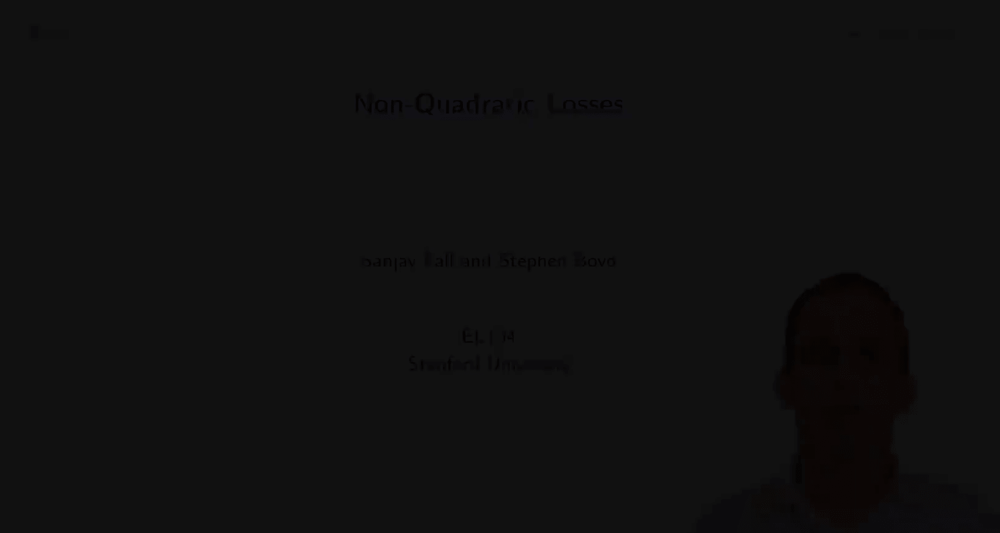

#  006：斯坦福大学《机器学习｜Stanford EE104 Introduction to Machine Learning 2020》deepseek翻译 p06 Lecture 8 - non quadratic losses.zh_en -BV1utzNYqEkr_p6-

## 📚 斯坦福大学《机器学习》：非线性损失函数

### 概述

在本节课中，我们将学习非线性损失函数，并探讨它们在经验风险最小化中的作用。

### 非线性损失函数

非线性损失函数通常表示为残差的惩罚函数，即 \( L(y, \hat{y}) = P(\hat{y} - y) \)，其中 \( P \) 是一个惩罚函数。

### 惩罚函数

惩罚函数 \( P \) 可以有多种形式，例如：

* **平方惩罚**： \( P(r) = r^2 \)，其中 \( r = \hat{y} - y \) 是预测误差。
* **绝对值惩罚**： \( P(r) = |r| \)。
* **倾斜绝对值惩罚**： \( P(r) = \begin{cases} -\tau r & \text{if } r < 0 \\ 1 - \tau r & \text{if } r \geq 0 \end{cases} \)，其中 \( \tau \) 是一个参数。

### 惩罚函数的影响

惩罚函数的选择会影响预测器的行为。例如：

* **平方惩罚**： 预测器倾向于产生较小的预测误差。
* **绝对值惩罚**： 预测器对正负预测误差的惩罚相同。
* **倾斜绝对值惩罚**： 预测器对低估和过估的惩罚不同。

### 例子：Huber 惩罚函数

Huber 惩罚函数是一种鲁棒惩罚函数，它对异常值不敏感。其公式如下：

\[ P(r) = \begin{cases} r^2 & \text{if } |r| \leq \alpha \\ \alpha & \text{if } |r| > \alpha \end{cases} \]

其中 \( \alpha \) 是一个参数。

### 例子：对数 Huber 惩罚函数

对数 Huber 惩罚函数是一种更鲁棒的惩罚函数，它对异常值更加不敏感。其公式如下：

\[ P(r) = \begin{cases} r^2 & \text{if } |r| \leq 1 \\ \log(r^2) & \text{if } |r| > 1 \end{cases} \]

### 总结

非线性损失函数在机器学习中扮演着重要的角色。它们可以帮助我们构建更鲁棒和更准确的预测器。

## 📚 斯坦福大学《机器学习》：分位数回归

### 概述

在本节课中，我们将学习分位数回归，它是一种用于估计数据分布的分位数的方法。

### 分位数回归

分位数回归是一种经验风险最小化方法，它使用一个倾斜惩罚函数作为损失函数。其目标是找到预测器，使得预测误差的 \( \tau \) 分位数等于零。

### 公式

分位数回归的损失函数如下：

\[ L(\theta) = \frac{1}{n} \sum_{i=1}^n P_{\tau}(G(\theta, x_i) - y_i) \]

其中：

* \( \theta \) 是预测器的参数。
* \( G(\theta, x) \) 是预测器。
* \( y_i \) 是第 \( i \) 个数据点的真实值。
* \( P_{\tau} \) 是 \( \tau \) 分位数函数。

### 例子

假设我们有一个数据集，其中 \( \tau = 0.5 \)。这意味着我们想要找到预测器，使得预测误差的中位数等于零。

### 总结

分位数回归是一种强大的工具，可以用于估计数据分布的分位数。它可以帮助我们更好地理解数据的分布，并构建更准确的预测器。