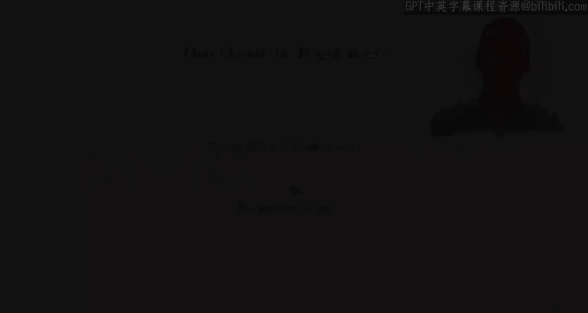

#  008：斯坦福大学《机器学习｜Stanford EE104 Introduction to Machine Learning 2020》deepseek翻译 p08 Lecture 10 - 非二次正则化.zh_en -BV1utzNYqEkr_p8-

**非二次正则化**

**正则化的概念**

正则化的目的是选择一个模型，它既能最小化经验风险，又能使预测器不过于敏感。也就是说，如果我们有一个接近于 \( \theta \) 的 \( x \)，那么我们希望 \( G_{\theta}(x) \) 也接近于 \( G_{\theta}(x_{\text{ta}}) \)。这种降低敏感度的原因在于，如果你使预测器过于敏感，最终得到的结果将无法很好地泛化。😊。

这是一种迫使预测器对数据不敏感的方法，从而使预测器泛化得更好。这是一种防止过拟合的方法。😊。

为了实现这一点，我们使用一个正则化函数 \( R \)，它是一个关于参数 \( \theta \) 的函数，并且是一个实值函数。它衡量 \( G_{\theta} \) 的敏感性，因此当 \( \theta \) 很大时，我们的正则化函数中的函数也很大。通过使正则化函数很小，我们可以使 \( \theta \) 很小，从而使得 \( G_{\theta} \) 的敏感性很小。😊。

另一种思考方式，这在统计文献中非常常见，是从统计的角度来看。也就是说，正则化编码了我们关于 \( \theta \) 的先验信息。具体来说，正则化后的 \( \theta \) 实际上很小。😊，这是一种说，我们相信 \( \theta \) 能够泛化，现在对应于数据下真正的预测器，真正的数据模型。作为一个小的 \( \theta \)，我们将在学习算法中强制执行这一点。我们只考虑实际上很小的 \( \theta \)。这是一种看待正则化器目的的完全不同的方式，但它同样有效。在这两种情况下，你都想使经验风险 \( L(\theta) \) 和正则化 \( R(\theta) \) 都很小。😊。

**正则化经验风险最小化**

我们选择 \( \theta \) 来最小化经验风险 \( L(\theta) \) 加上某个正的常数 \( \lambda \) 乘以 \( R(\theta) \) 的正则化。😊，记住，这里的 \( \lambda \) 被称为正则化超参数，我们可以通过验证集上的数据来权衡 \( L(\theta) \) 和 \( R(\theta) \)。😊。

当然，所有这一切的关键在于这实际上有效。它有效的原因在于，通过强制正则化，我们在训练集上的性能会变差，而在测试集上的性能会变好。我们真正关心的是测试集的性能。

**正则化函数**

到目前为止，我们已经看到，在岭回归中使用了隧道范数作为正则化函数。正则化函数的常见格式是惩罚函数 \( Q \)，它是一个将实数映射到实数的函数。\( \theta \) 的正则化是 \( Q(\theta_1) + Q(\theta_2) + \ldots + Q(\theta_P) \) 的总和。我们分别惩罚每个参数，每个 \( \theta \) 的组成部分，并将相应的惩罚相加。😊。

通常，我们选择这些惩罚函数 \( Q \)，因为它们是非负的，并且只有在 \( \theta_i \) 为零时才为零。因此，\( Q(\theta_2) \) 因此表达了我们对选择预测器系数 \( \theta_i \) 的不满，特别是通过将其定义为随着 \( \theta_2 \) 的值增加而增加，它表达了我们更喜欢小的 \( \theta_i \) 而不是大的 \( \theta_i \)。

**常见的正则化函数**

- **平方范数正则化（岭回归）**：\( Q(\theta_i) = \theta_i^2 \)，也称为平方范数正则化或 \( L_2 \) 正则化。
- **绝对值函数正则化（Lasso）**：\( Q(\theta_i) = |\theta_i| \)，也称为绝对值正则化或 \( L_1 \) 正则化。
- **非负正则化**：当 \( \theta_i \geq 0 \) 时，惩罚函数为零，当 \( \theta_i < 0 \) 时，惩罚函数为无穷大。

**敏感度分析**

现在，让我们在敏感度的背景下看看这个问题。假设我们有一个线性预测器 \( G_{\theta}(x) = \theta^T x \)，这里我们预测一个标量 \( y \)。我们将假设特征向量 \( X \) 变为 \( x_{\delta} \)，其中 \( \delta \) 是 \( X \) 的扰动或变化。我们假设现在任何 \( \delta \) 都是可能的，但我们只考虑扰动集 \( \Delta \)，我们只允许扰动 \( \delta \) 位于 \( \Delta \) 集中。

**L2 正则化**

如果我们在 \( \Delta \) 中允许 \( \delta \) 范围在某个 \( \Delta \) 中，我们可以看到最坏情况的敏感度，即 \( \Delta \) 中所有 \( \delta \) 的绝对值 \( \theta^T \delta \) 的最大值。这是对某个特定集 \( \Delta \) 的敏感度的度量。

**L1 正则化**

如果我们在 \( \Delta \) 中允许 \( \delta \) 范围在某个 \( \Delta \) 中，我们可以看到最坏情况的敏感度，即 \( \Delta \) 中所有 \( \delta \) 的绝对值 \( \theta^T \delta \) 的最大值。这是对某个特定集 \( \Delta \) 的敏感度的度量。

**总结**

本节课中，我们学习了非二次正则化，包括岭回归、Lasso 回归和非负正则化。我们讨论了正则化的目的和如何选择合适的正则化器。我们还分析了正则化对敏感度的影响，并讨论了如何使用正则化进行特征选择。