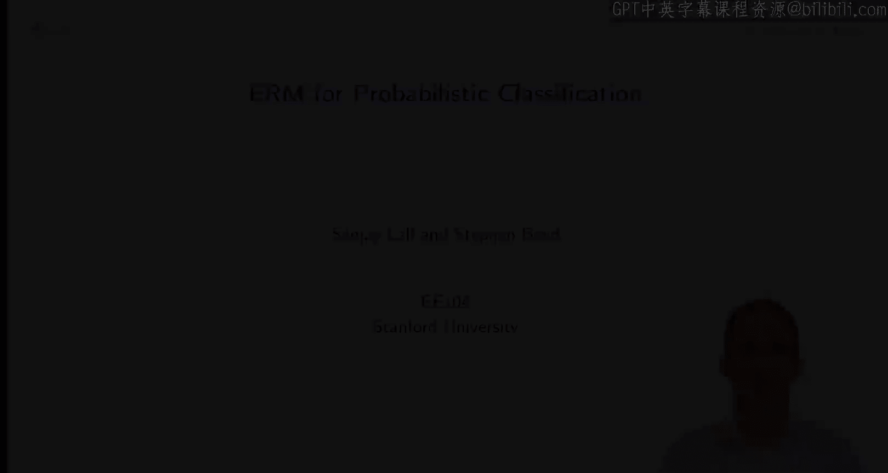

#  015：斯坦福大学《机器学习｜Stanford EE104 Introduction to Machine Learning 2020》deepseek翻译 p15 Lecture 17-erm for probabilistic classif..zh_en -BV1utzNYqEkr_p15-

## 📚 斯坦福大学《机器学习》：概率分类的ERM

### 概述

在本节课中，我们将学习如何使用期望最大化（ERM）方法进行概率分类。我们将探讨损失函数、交叉熵损失以及如何将线性预测器转换为概率分类器。

### 概率分类器

我们有一个概率分类器 \( G \)，它依赖于参数 \(\theta\)，输入为 \( x \)，并返回目标集上的概率分布。

### 损失函数

我们使用平均负对数似然（NLL）来评估概率分类器的性能。

### 交叉熵损失

交叉熵损失（CE）是负对数似然，表示为：

\[ L_{CE}(y, \hat{y}) = -\log P(y|\hat{y}) \]

其中 \( y \) 是真实标签，\( \hat{y} \) 是预测的概率分布。

### 线性预测器

对于线性预测器，我们使用逻辑函数（softmax）将预测向量转换为概率分布。

### 逻辑函数

逻辑函数（softmax）定义为：

\[ \sigma(y) = \frac{e^{y_i}}{\sum_{j=1}^{K} e^{y_j}} \]

其中 \( y \) 是预测向量，\( K \) 是类别数。

### 概率分类

对于概率分类，我们使用交叉熵损失函数，并通过逻辑函数将线性预测器的输出转换为概率分布。

### 总结

在本节课中，我们一起学习了如何使用期望最大化（ERM）方法进行概率分类。我们探讨了损失函数、交叉熵损失以及如何将线性预测器转换为概率分类器。