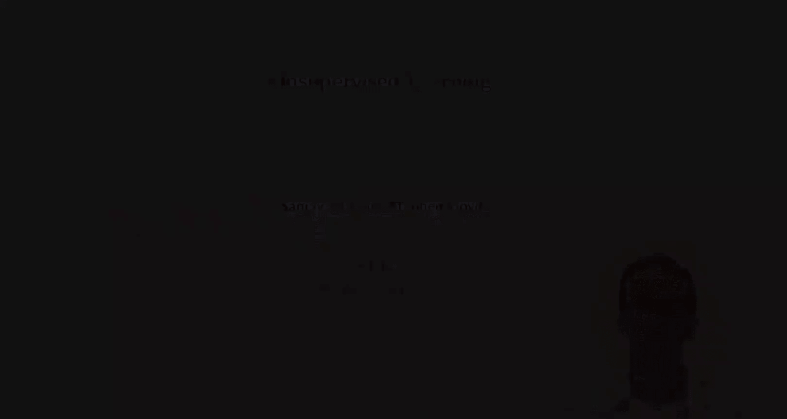

#  016：斯坦福大学《机器学习｜Stanford EE104 Introduction to Machine Learning 2020》deepseek翻译 p16 Lecture 18 - 无监督学习.zh_en -BV1utzNYqEkr_p16-

## 🤖 斯坦福大学《机器学习》：第18讲：无监督学习

### 概述

在本节课中，我们将学习无监督学习。无监督学习与监督学习不同，它不依赖于标签数据，而是通过探索数据中的结构来学习。

### 无监督学习

无监督学习的目标是构建一个模型来描述数据中的结构。以下是一些无监督学习的应用：

* **揭示数据结构**：例如，将数据聚类成不同的组。
* **处理缺失值**：例如，通过插补方法填充缺失值。
* **检测异常值**：例如，识别数据中的异常情况。

### 数据表示

与监督学习类似，我们首先将数据嵌入到特征向量中。假设我们有一个数据集 \( U = \{ u_1, u_2, ..., u_n \} \)，其中每个 \( u_i \) 是一个 \( D \) 维向量。我们将这些数据嵌入到特征向量 \( X = \{ x_1, x_2, ..., x_n \} \) 中，其中每个 \( x_i \) 是 \( \phi(u_i) \) 的结果。

### 损失函数

无监督学习中的模型是通过损失函数来描述的。损失函数 \( L(\theta, x) \) 是一个定义在 \( \mathbb{R}^D \) 上的实值函数，它衡量了 \( x \) 作为数据点的合理性。如果 \( L(x) \) 较小，则 \( x \) 看起来像数据中的典型点；如果 \( L(x) \) 较大，则 \( x \) 不像数据中的点。

### 模型示例

以下是一些常见的无监督学习模型：

* **高斯混合模型**：假设数据由多个高斯分布组成。
* **K均值聚类**：将数据聚类成 \( K \) 个簇。
* **主成分分析**：将数据投影到低维空间。

### 异常检测

异常检测是一种无监督学习方法，用于识别数据中的异常值。以下是一种异常检测方法：

1. 使用损失函数 \( L(\theta, x) \) 建立数据模型。
2. 计算所有数据点的损失函数值。
3. 选择一个阈值 \( T \)，例如，99% 分位数。
4. 如果某个数据点的损失函数值大于 \( T \)，则将其标记为异常。

### 缺失值插补

缺失值插补是一种无监督学习方法，用于填充数据中的缺失值。以下是一种缺失值插补方法：

1. 对于每个数据点 \( x \)，找到其已知值 \( K \)。
2. 使用损失函数 \( L(\theta, x) \) 填充缺失值。
3. 选择使 \( L(x) \) 最小的值。

### 总结

本节课中，我们学习了无监督学习的基本概念和应用。无监督学习是一种强大的工具，可以用于探索数据中的结构，并解决各种实际问题。