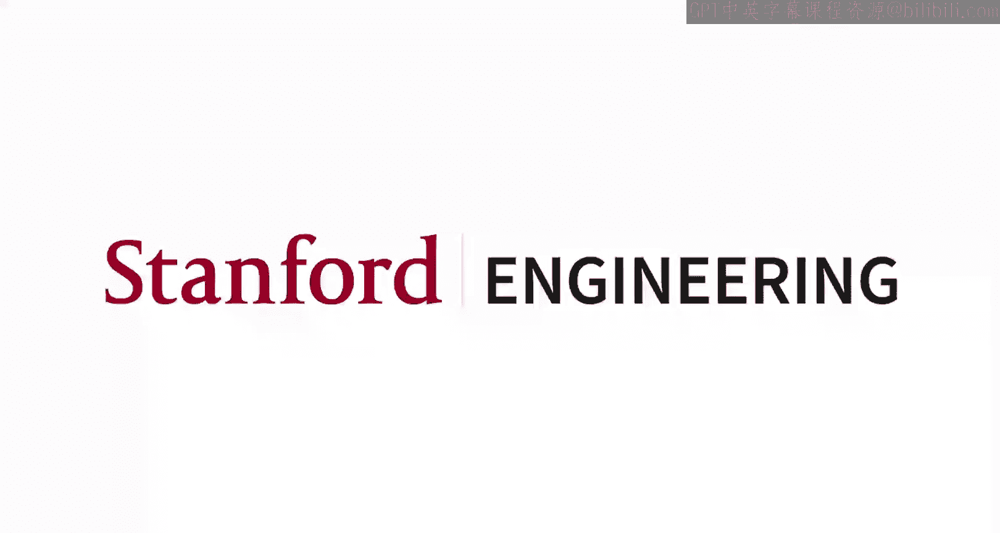
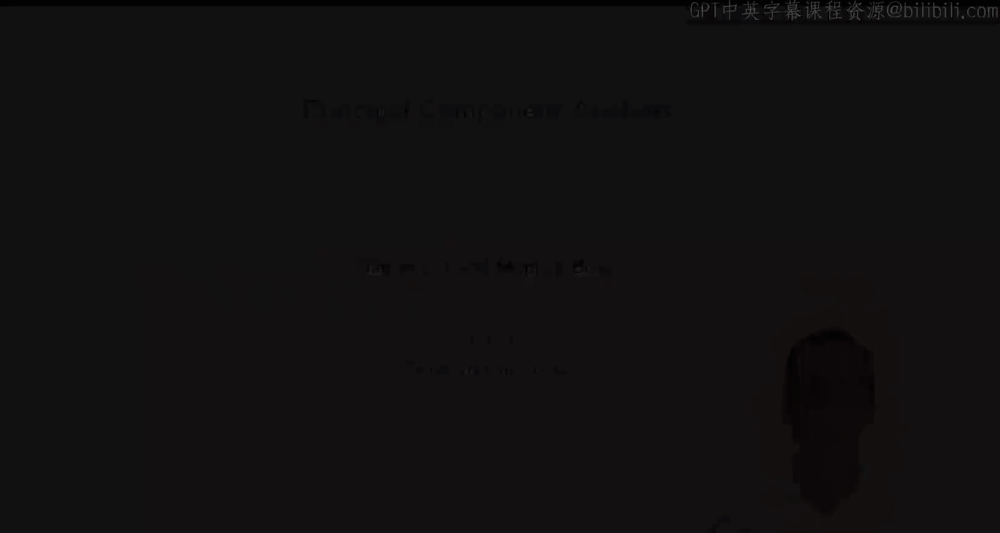
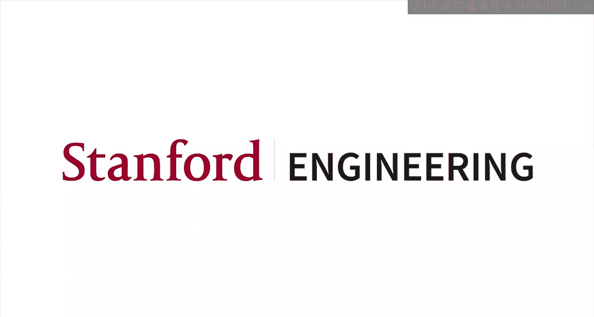

#  017：斯坦福大学《机器学习｜Stanford EE104 Introduction to Machine Learning 2020》deepseek翻译 p17 Lecture 19 - 主成分分析.zh_en -BV1utzNYqEkr_p17-

## 概述

在本节课中，我们将学习主成分分析（PCA），这是一种无监督学习方法，用于数据降维和特征提取。

## 主成分分析（PCA）

**主成分分析**是一种无监督学习方法，它使用特定的数据模型来分析数据，并利用子空间距离的概念。

### 子空间

给定一组D维向量 $\theta_1$ 到 $\theta_R$，通过所有可能的线性组合，我们可以得到一个子空间。例如，$X = a_1\theta_1 + a_2\theta_2 + ... + a_R\theta_R$，其中$a_i$ 可以任意选择。

### 子空间距离

如果我们有一个向量 $X$，我们想知道它到子空间 $S$ 的距离，我们可以找到子空间 $S$ 中与 $X$ 最接近的点 $X^*$。

### 最小二乘法

为了找到 $X^*$，我们可以使用最小二乘法。最小化目标函数 $||X - \theta a||^2$，其中 $\theta$ 是一个矩阵，其列是向量 $\theta_1$ 到 $\theta_R$，$a$ 是系数向量。

### 主成分

主成分分析的目标是找到一组正交基向量，这些向量可以最小化数据点到子空间的距离。

### 特征提取

PCA 可以用于特征提取，将高维数据转换为低维数据，同时保留大部分信息。

### 近似等距性质

PCA 具有近似等距性质，这意味着它近似地保留了原始数据中的距离。

## 应用

PCA 可以用于多种应用，包括：

* 数据降维
* 特征提取
* 异常检测
* 图像压缩

## 示例：潜在语义索引

潜在语义索引是一种使用 PCA 进行文本分析的方法。它可以将文档映射到低维空间，以便进行分类或聚类。

## 总结

在本节课中，我们学习了主成分分析（PCA），这是一种用于数据降维和特征提取的无监督学习方法。PCA 具有近似等距性质，可以近似地保留原始数据中的距离。PCA 可以用于多种应用，包括数据降维、特征提取、异常检测和图像压缩。