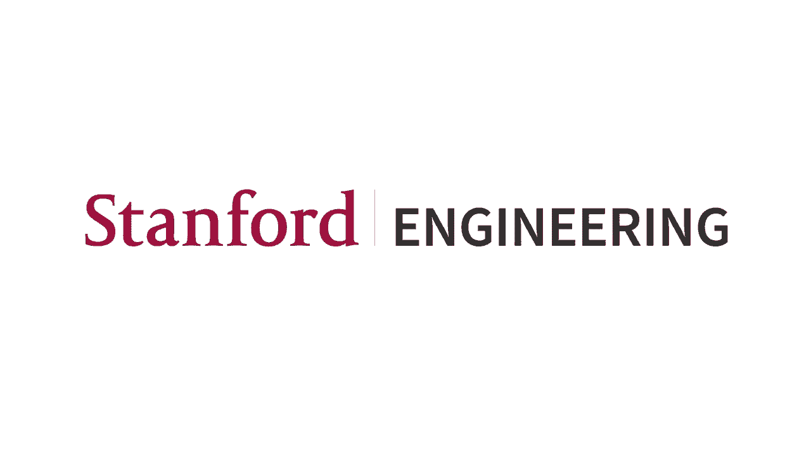
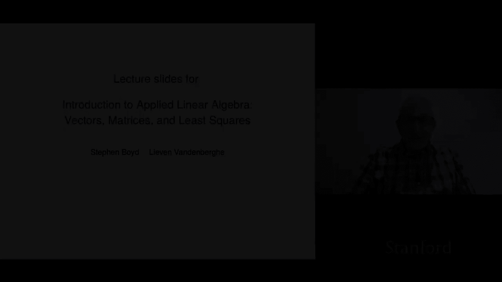
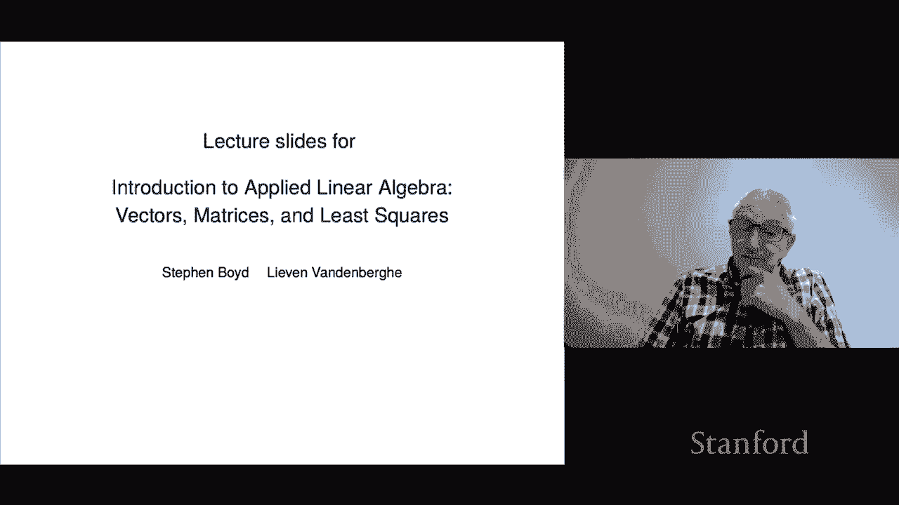

# 1：L1.1 课程介绍 📚

在本节课中，我们将介绍《应用线性代数导论》这门课程及其配套资源。我们将了解课程的基本信息、学习资源的使用方法，以及如何通过实践来掌握这门课程的核心内容。

---

大家好，我是 Stephen Boyd，我是《应用线性代数导论：向量、矩阵与最小二乘法》一书的合著者之一。我在斯坦福大学教授 ENGR 108 课程，我的合著者则在加州大学洛杉矶分校教授 EE133 课程。这些讲座将紧密跟随幻灯片的内容，而这些幻灯片又紧密地遵循了教材。

在深入细节之前，我将花几分钟时间谈谈你如何利用这些材料，包括讲座、书籍和其他资源。

首先，我需要说明一下学习本课程或阅读本书所需的先决条件。实际上，要求非常少。在课程中，我们会偶尔用到一点微积分，但这并非一个巨大的先决条件。另一个要求是，你应该对任何一门编程语言有简单的了解。你不需要成为专家级程序员，也不需要上完整个计算机科学课程，但需要懂一点基础。稍后我会详细说明这一点。

接下来，让我谈谈如何利用这些资源。第一个资源是教材。需要说明的是，这本书可以在线免费获取。你只需使用谷歌或其他搜索引擎，就能很快找到该书的 PDF 文件。这要感谢剑桥大学出版社的开明态度，允许我们将书籍发布在网上。实际上，我自己也经常使用在线版本，因为它有链接，可以方便地在不同章节间跳转和搜索。

同样，你也会在网上找到这些幻灯片，以及最终会上线的讲座视频。这些资源将对全世界的学习者开放。

现在，让我简要说明一下这些不同资源的特点，以及我认为最佳的学习方式。首先，教材是完整的。你可以像阅读传统书籍一样阅读它，逐章阅读。它内容详尽，语言相对严谨，几乎涵盖了所有内容。

幻灯片则是教材的浓缩版，更为简洁。它旨在从较高层面呈现课程的核心思想，但并非包含所有细节和定义。

最后是这些讲座。你可能会问，既然自己能阅读，为什么还要听讲座？讲座比幻灯片更加非正式。在讲座中，我会分享一些故事和背景知识，但它并不像教材那样完整和精确。

这三种资源如何为你所用，这非常个人化，取决于每个人的偏好。有些人喜欢先阅读一章教材，然后看幻灯片，再听讲座；有些人则喜欢先听讲座。实际上，所有这些方法都有效。

这引出了一个非常重要的话题：我们在本书和课程中将要涵盖的材料，不仅非常有趣，而且极其有用。最关键的一点是，这些知识都是“可行动的”。它不仅仅是理论，虽然其中包含优美的理论，但真正酷的地方在于，你可以实际应用它。它使你能够完成各种事情，例如在机器学习中拟合模型、在信号处理中从噪声中提取信号，甚至模拟流行病传播等。

因此，我认为，跟随课程和教材，使用某种计算机语言进行数值练习，这一点至关重要。即使你的兴趣只是学习理论，实践也能极大地帮助你从不同角度理解和巩固所学知识。例如，如果我展示一个恒等式，你不必完全相信我，可以打开计算机程序，分别计算等式的左右两边，看看数值结果是否一致或非常接近。

线性代数不应只是一项“观赏性运动”。你应该投身其中，亲自动手实践。启动你的工具，跟着课程一起操作，这会有很大帮助。我还要补充一点，如果你将来进行暑期实习或类似工作，需要应用这些知识，那么能够坐下来实际动手操作，而不仅仅是了解理论，将变得至关重要。

接下来，让我谈谈编程语言。在斯坦福的课程中，我们使用 Julia。这是一个相对较新的语言，其语法与我们的数学符号非常接近。另一个选择是 MATLAB，这是一个专有软件，需要付费，但也是跟随本课程思想的绝佳选择。最后一个选择是 Python。这是一个有趣的选择，我知道有些基于本书的课程正在使用 Python。这是一个非常好的选择，因为如今大多数人都在使用 Python 来完成你将在本课程中学到的这类任务。从这个意义上说，从你将来在实习、工作或创业中实际会使用的语言开始学习，是合理的。我没有在自己的课程中选择 Python 的唯一原因是，它的语法略显笨拙，与数学符号略有偏差。不过，总的来说，我强烈建议你在学习本课程时，通过做一些数值例子来跟进。

教材本身很少提及或仅偶尔提及计算。它描述了一些计算概念，但没有指定任何特定的计算机语言。书中会有一些练习，要求你通过计算来验证某些结论。此外，你还会在本书的网站上找到一系列“附加练习”。这些练习每年动态更新，与书中的练习不同，它们包含了真实数据的问题。你可以在网站上找到许多数据文件，可以进行金融投资组合构建、断层扫描成像、模型拟合和预测等实践。我认为这是课程的重要组成部分。

好了，我想这个初步介绍就到这里。接下来，我们将直接开始进入正题。

---

本节课中，我们一起学习了《应用线性代数导论》课程的基本框架和可用资源。我们明确了课程的先决条件要求不高，介绍了教材、幻灯片和讲座三种资源的特点及使用建议。最重要的是，我们强调了本课程知识的“可行动性”，鼓励大家通过编程实践（无论是使用 Julia、MATLAB 还是 Python）来深化理解，将理论转化为解决实际问题的能力。准备好你的工具，让我们开始这段学习之旅吧。