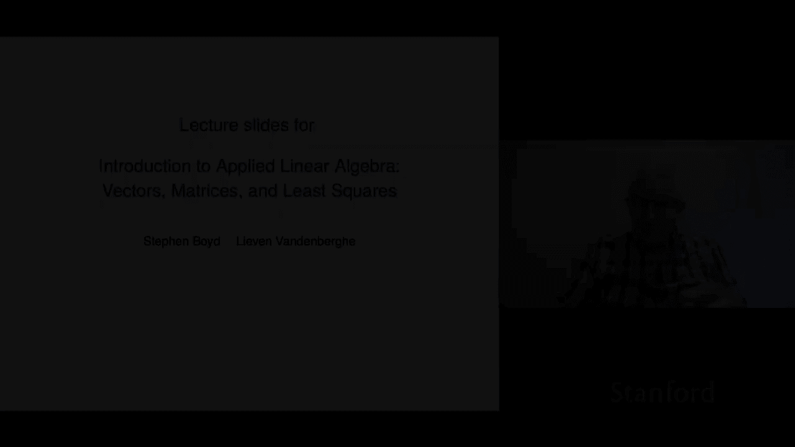
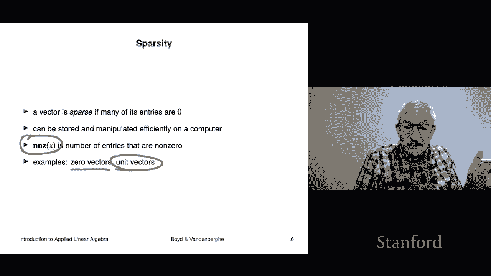

# 2：L1.2 - 向量标记与符号 📘

## 概述
在本节课中，我们将学习向量的基本概念、符号表示以及一些核心术语。向量是线性代数的基础，理解其表示方法是后续学习的关键。

---

## 向量的定义与符号
向量是一个有序的数字列表。在数学中，我们通常使用两种标准符号来表示向量：垂直堆叠的列形式或水平排列的行形式。

例如，一个向量可以表示为：
\[
\begin{bmatrix}
1 \\
0 \\
-7 \\
2
\end{bmatrix}
\]
或者写作：
\[
(1, 0, -7, 2)
\]

这两种表示是等价的，都是描述同一个向量的合理方式。

---

## 向量的元素与维度
向量中的数字称为**元素**、**条目**、**系数**或**分量**。例如，在上述向量中，第二个分量是 0，第四个条目是 2。

向量中元素的数量称为其**维度**或**长度**。例如，上述向量有 4 个元素，因此它是一个 4 维向量，或简称为 **4-向量**。

如果向量有 \( n \) 个元素（\( n \) 为整数），则称其为 **n-向量**。

---

## 标量与抽象表示
向量中的数字本身是**标量**，通常是实数（如 -1.1, π, 3.267）。在某些应用中，条目也可能是复数，但本课程主要关注实数。

向量常用抽象符号表示，例如小写字母 \( a \)、\( x \) 或大写字母 \( P \)、\( \beta \)。在某些领域（如物理学），向量可能用粗体（如 **a**）或带箭头的符号（如 \(\vec{a}\)）表示，但本课程将使用简单的字母表示。

向量的第 \( i \) 个元素用下标表示，例如 \( a_i \)。这里，\( i \) 称为**索引**，通常用 \( i, j, k, l, m \) 表示。索引从 1 开始，到 \( n \) 结束。

例如，如果向量 \( a = (1, 0, -7, 2) \)，则 \( a_2 = 0 \)。

---

## 向量的相等
两个大小相同的向量 \( a \) 和 \( b \) 相等，当且仅当它们所有对应的元素都相同。这是一个**重载**的概念：等号既用于标量相等，也用于向量相等。

例如：
\[
(0, -1) = (0, -1)
\]
表示两个向量相等。

---

## 数学符号与计算机符号
数学符号是标准且通用的，但计算机语言（如 Python、Julia）可能有不同的语法（例如使用分号或特定函数）。学习时需区分数学符号与编程符号，避免混淆。

---

## 块向量与堆叠
**块向量**是通过堆叠多个向量形成的。例如，给定向量 \( b \)（维度 \( m \)）、\( c \)（维度 \( n \)）和 \( d \)（维度 \( p \)），它们的堆叠向量为：
\[
\begin{bmatrix}
b \\
c \\
d
\end{bmatrix}
\]
这是一个维度为 \( m + n + p \) 的向量。

例如，设 \( s = (-1, 2) \)（2-向量），\( t = (0, 1, 2) \)（3-向量），则堆叠向量为：
\[
\begin{bmatrix}
-1 \\
2 \\
0 \\
1 \\
2
\end{bmatrix}
\]
这是一个 5-向量。

---

## 特殊向量
以下是几种常见的特殊向量：

### 零向量
**零向量**是所有元素都为 0 的向量，用符号 \( 0 \) 表示（再次重载）。如需指定维度，可写为 \( 0_n \)。例如，\( 0_3 = (0, 0, 0) \)。

### 全一向量
**全一向量**是所有元素都为 1 的向量，用粗体 \( \mathbf{1} \) 表示。例如，\( \mathbf{1}_2 = (1, 1) \)。

### 单位向量
**单位向量**是仅有一个元素为 1、其余为 0 的向量。例如，\( e_2 = (0, 1, 0) \) 是一个 3 维单位向量，其中第二个元素为 1。

---

## 稀疏向量
如果一个向量的大部分元素为零，则称其为**稀疏向量**。稀疏性在处理高维数据时非常重要，可以节省存储空间并提高计算效率。

**非零元素数量**（nnz）用于描述向量的稀疏程度。例如：
- 零向量 \( 0_n \) 的 nnz = 0。
- 单位向量 \( e_{17} \)（100 维）的 nnz = 1。

---

## 总结
本节课我们一起学习了向量的基本概念：定义、符号表示、元素与维度、相等性、块向量、特殊向量（零向量、全一向量、单位向量）以及稀疏向量。这些是线性代数的基石，后续课程将基于这些概念展开更深入的操作与应用。