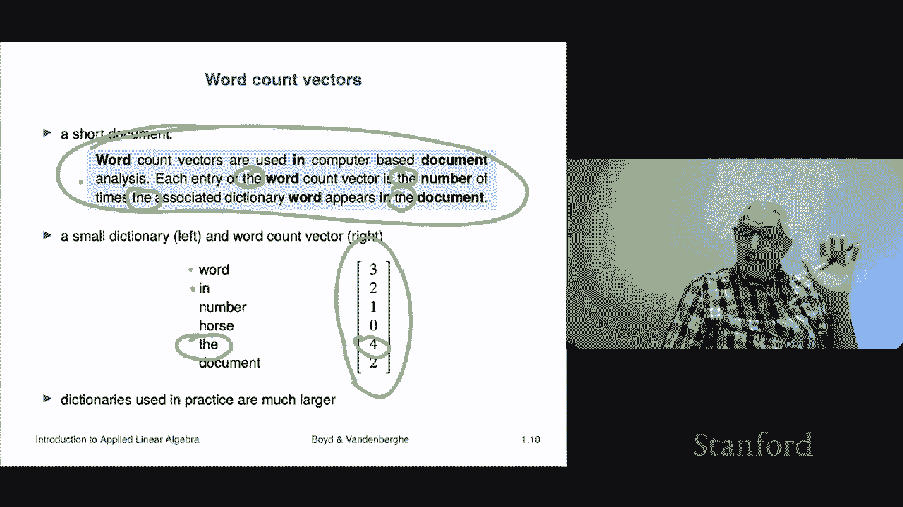

# 3：L1.3 - 向量示例 📚

在本节课中，我们将通过一系列具体的例子来探索向量在不同领域中的应用。这些例子将帮助你理解向量不仅仅是抽象的数学概念，更是描述现实世界中各种事物的强大工具。

上一节我们介绍了向量的基本概念，如元素、相等性和堆叠。本节中，我们来看看向量在实际场景中的具体应用。

## 位置与位移 📍

在物理学或力学课程中，你经常会遇到向量。这些向量通常是二维或三维的，用于描述位置或位移。

*   **位置向量**：一个向量可以表示平面或空间中的一个点。例如，一个二维向量 **X = [x1, x2]** 表示平面中的一个位置。在三维空间中，向量 **X = [x1, x2, x3]** 则表示空间中的一个点。这需要事先约定好坐标系。
*   **位移向量**：向量也可以描述位置的移动或变化。它通常被画成一个箭头，表示从起点到终点的方向和距离。例如，向量 **[x1, x2]** 表示向右移动 `x1` 个单位，向上移动 `x2` 个单位。

## 颜色表示 🎨

人眼感知的颜色可以用三维向量来描述，即 RGB（红、绿、蓝）强度值。

*   每个颜色分量用一个数字表示，例如 `1` 代表最大强度，`0` 代表关闭。
*   向量 **[1, 0, 0]** 代表纯红色。
*   向量 **[0, 0, 1]** 代表纯蓝色。
*   向量 **[1, 0, 1]** 代表红色和蓝色混合，产生紫色。

因此，任何颜色都可以用一个三维向量 **C = [R, G, B]** 来精确描述。

## 物料清单与稀疏向量 📦

一个 n 维向量可以用来表示一份物料清单或数量列表。

*   例如，制造一个产品需要 10 种原材料，向量 **M = [m1, m2, ..., m10]** 可以表示生产一个单位产品所需的各种原材料的数量。
*   如果这个向量中大部分元素都是零，那么它就是一个**稀疏向量**。这在现实中很常见，比如一个复杂产品可能只用到所有可能原材料中的一小部分。

## 金融投资组合 💰

在金融领域，投资组合（持有的资产集合）通常用向量表示。

*   向量可以表示每种资产持有的**美元价值**，例如 **P = [100, 50, 20]** 表示持有价值 100 美元的股票、50 美元的债券和 20 美元的现金。
*   向量也可以表示每种资产在总组合中的**比例**。
*   值得注意的是，向量中的元素可以是负数，这代表**空头头寸**，即你借入并需要在未来归还的资产。
*   投资组合的总价值就是向量所有元素之和：`total_value = sum(P)`。

## 现金流 💸

向量可以用来表示现金流，即在不同时间点发生的一系列支付。

*   向量 **CF = [cf1, cf2, ..., cfn]** 中的每个元素 `cfi` 代表在第 `i` 个时期（如天、月、年）的现金流入（正数）或流出（负数）。
*   如果现金流向量是稀疏的，意味着在大多数时间段内没有支付发生。

## 音频信号 🔊

声音可以被编码为一个很长的向量。

*   声音是气压的快速变化。常见的编码方式是将时间分割成极小的间隔（如每秒 44，100 个样本）。
*   向量 **A = [a1, a2, ..., an]** 中的每个元素 `ai` 表示在特定时刻的声压水平（通常减去平均气压，因此可正可负）。
*   因此，一段音频本质上就是一个高维向量。

## 特征向量（机器学习核心） 🔍

在机器学习和统计学中，向量被广泛用于描述实体的**特征**或**属性**。

*   每个实体（如一位病人、一家公司）对应一个特征向量。
*   向量的每个元素代表一个特定的特征。例如，描述病人的向量可能包含：`[体重， 身高， 舒张压， 收缩压， ...]`。
*   特征可以用数字编码，例如用 `+1` 表示女性，`-1` 表示男性。
*   特征向量可以很小，也可以非常庞大。例如，描述一家上市公司的特征向量可能包括：`[总市值， 股价波动率， 上季度收益率， 营收， ...]`。

## 客户购买记录 🛒

在电子商务中，单个客户的购买行为可以用一个向量表示。

*   向量的长度等于商品总数（SKU 数量）。
*   每个元素代表该客户在特定时期内购买某件商品的金额或数量。
*   这个向量**天然是稀疏的**，因为任何单个客户只可能购买所有商品中的极小一部分。例如，在亚马逊的数百万商品中，一个用户可能只购买了几百件。这种向量通常以稀疏格式存储，只记录非零项（商品ID和数量）。

## 词频向量（文档表示） 📖

一个文档可以用一个**词频向量**来表示，这是自然语言处理中的基础概念。

*   首先需要一个预定义的**词典**（单词列表）。
*   向量 **W = [w1, w2, ..., wn]** 的长度等于词典大小。
*   每个元素 `wi` 表示词典中第 `i` 个单词在该文档中出现的次数。
*   例如，对于词典 `[“the”, “cat”, “sat”, “mat”]`，句子 “The cat sat on the mat.” 对应的词频向量（忽略大小写）是 `[2, 1, 1, 1]`。
*   对于大多数文档（如一篇产品评论），词频向量是稀疏的，因为文档只包含词典中一小部分单词。

让我们看一个具体的例子。假设有一个简短的文档片段和一个小词典。

**词典**：`[“a”, “the”, “dog”, “cat”, “chases”, “runs”]`

**文档**：`“The dog chases the cat.”`

以下是构建词频向量的步骤：
1.  将文档转换为小写并分词：`[“the”, “dog”, “chases”, “the”, “cat”]`
2.  统计每个词典单词在文档中的出现次数：
    *   “a”: 0
    *   “the”: 2
    *   “dog”: 1
    *   “cat”: 1
    *   “chases”: 1
    *   “runs”: 0
3.  得到词频向量：`[0, 2, 1, 1, 1, 0]`

这个向量 `[0, 2, 1, 1, 1, 0]` 就是该文档基于给定词典的数学表示。在后续课程中，我们将探索如何利用这些向量进行比较、分类等操作。

---

本节课中我们一起学习了向量在多个领域的广泛应用示例。从表示物理位置和颜色，到描述金融投资组合、音频信号，再到作为机器学习的特征表示和自然语言处理的词频统计，向量为我们提供了一种统一、强大的方式来数字化和量化现实世界中的复杂信息。理解这些例子是掌握向量应用价值的关键第一步。