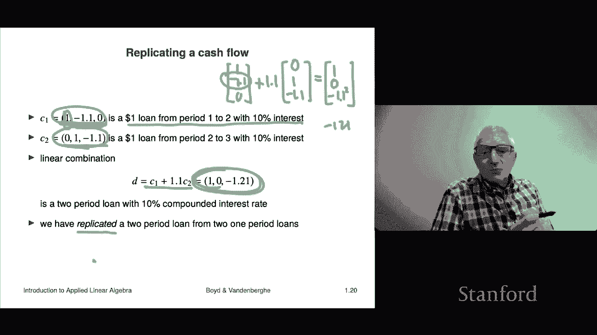

# 4：L1.4 - 标量乘法与加法 📐

在本节课中，我们将学习向量的两种基本运算：**加法**与**标量乘法**。到目前为止，我们只是认识了向量，但还没有对它们进行任何操作。本节将正式介绍如何对向量进行相加和与数字相乘，并探讨这些运算的实际意义。

## 向量加法 ➕

上一节我们介绍了向量的例子，本节中我们来看看如何将两个向量相加。

向量加法要求两个向量**维度相同**。我们使用熟悉的加号 `+` 来表示向量加法，但其含义是逐元素相加。

以下是向量加法的定义和示例：

*   **定义**： 若 `a` 和 `b` 都是 n 维向量，则它们的和 `a + b` 也是一个 n 维向量，其每个元素是 `a` 和 `b` 对应元素之和。
    *   公式： `(a + b)_i = a_i + b_i`，其中 `i = 1, ..., n`
*   **示例**：
    *   设 `a = [1, 7, 3]`, `b = [2, 2, -1]`
    *   则 `a + b = [1+2, 7+2, 3+(-1)] = [3, 9, 2]`

**重要**：不能对维度不同的向量进行加法运算，例如 `[1, 2] + [1, 2, 3]` 是无意义的。

向量加法具有一些基本性质，这些性质与数字加法类似，但运算对象是向量：

*   **交换律**： `a + b = b + a`
*   **结合律**： `(a + b) + c = a + (b + c)`
*   **零向量**： 存在一个所有元素均为0的零向量 `0`，使得 `a + 0 = 0 + a = a`
*   **负向量**： 对于任意向量 `a`，存在一个向量 `-a`（每个元素是 `a` 对应元素的相反数），使得 `a + (-a) = 0`

阅读这些等式时，需要“ mindful equation reading ”，即留意其中的 `+`、`-`、`=` 都是作用于向量的运算，而 `0` 代表与 `a` 同维的零向量。

## 标量乘法 ✖️

除了向量间的加法，我们还可以将一个数（称为**标量**）与一个向量相乘。

标量乘法的定义很简单：用标量乘以向量的每一个元素。

*   **定义**： 若 `β` 是一个标量（实数），`a` 是一个 n 维向量，则 `βa` 也是一个 n 维向量，其每个元素是 `β` 与 `a` 对应元素的乘积。
    *   公式： `(βa)_i = β * a_i`，其中 `i = 1, ..., n`
*   **示例**：
    *   设 `β = -2`, `a = [1, 9, 6]`
    *   则 `βa = [-2*1, -2*9, -2*6] = [-2, -18, -12]`

标量乘法同样具有一些性质，理解这些等式时需仔细分辨运算对象是标量还是向量：

*   **结合律（对标量）**： `(βγ)a = β(γa)` （`β`, `γ` 是标量，`a` 是向量）
*   **分配律（对标量）**： `β(a + b) = βa + βb`
*   **分配律（对向量）**： `(β + γ)a = βa + γa`

## 线性组合：核心概念 ⚙️

将标量乘法与向量加法结合起来，我们就得到了本课程乃至许多数学领域的**核心概念——线性组合**。

以下是线性组合的定义：

*   **定义**： 给定一组向量 `a1, a2, ..., am`（每个都是 n 维向量）和一组标量 `β1, β2, ..., βm`，表达式 `β1*a1 + β2*a2 + ... + βm*am` 称为这些向量的一个**线性组合**。标量 `β1, ..., βm` 称为**系数**。

一个重要的特例是，**任何向量都可以表示为标准单位向量的线性组合**。

*   **公式**： 对于 n 维向量 `b = [b1, b2, ..., bn]`，有 `b = b1*e1 + b2*e2 + ... + bn*en`，其中 `ei` 是第 i 个元素为1、其余为0的单位向量。

## 实际应用示例 🌟

到目前为止，运算规则本身可能略显枯燥。现在，我们通过几个例子来看看这些运算在实际中的意义。

### 1. 位移的合成 🧭

在物理学中，向量可以表示位移。向量加法对应着连续执行两个位移。

*   **示例**： 向量 `a = [5, 1]` 表示向右5个单位，向上1个单位。向量 `b = [-1, 3]` 表示向左1个单位，向上3个单位。
*   **合成位移**： `a + b = [4, 4]`，表示从起点出发，最终净位移是向右4个单位，向上4个单位。这等价于先执行位移 `a` 再执行 `b`，或先执行 `b` 再执行 `a`。

向量减法 `p - q` 可以表示从点 `q` 到点 `p` 的位移向量。

### 2. 现金流组合 💰

在金融中，向量可以表示不同时间点的现金流。

*   **示例**： 考虑三个时期的现金流。
    *   `c1 = [1, -1.1, 0]`： 现在借入1美元（现金流入），一年后偿还1.1美元（现金流出）。这是一个利率为10%的一期贷款。
    *   `c2 = [0, 1, -1.1]`： 一年后借入1美元，两年后偿还1.1美元。这是另一个一期贷款。
*   **线性组合**： 现在，考虑组合 `c1 + 1.1 * c2`。
    *   计算： `[1, -1.1, 0] + 1.1 * [0, 1, -1.1] = [1, 0, -1.21]`
*   **解释**： 这个组合现金流表示：现在获得1美元，一年后无现金流，两年后支付1.21美元。这恰好等价于一个**年化利率10%的两期贷款**的现金流。我们通过两个一期贷款的线性组合，“复制”出了一个两期贷款。

## 总结 📝

本节课中我们一起学习了向量的基本运算：
1.  **向量加法**： 将两个同维向量的对应元素相加。
2.  **标量乘法**： 将一个标量与向量的每个元素相乘。
3.  **线性组合**： 上述两种运算的结合，是贯穿本课程的核心概念。我们通过位移和金融现金流的例子，看到了线性组合如何描述现实世界中的合成与复制现象。

理解这些运算的规则是基础，而洞察它们在不同领域（如物理、金融、数据科学等）中的应用，才是学习线性代数的关键所在。