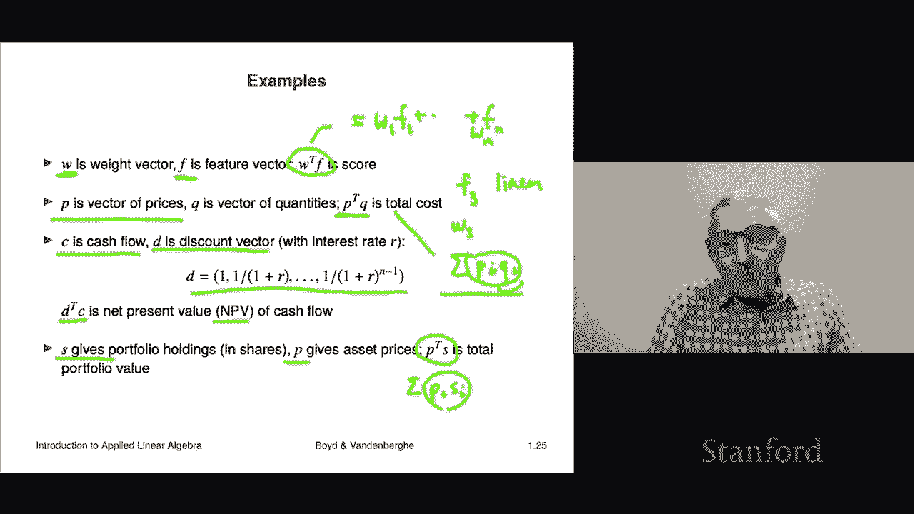

# 5：L1.5 - 向量与内积 📚

在本节课中，我们将要学习向量的一种重要运算——**内积**。内积在后续课程中会频繁出现并被大量使用。

## 概述

内积，也被称为点积或标量积，是一种作用于两个**同维度**向量上的运算。它的计算结果是一个**标量**（即一个数字）。理解内积的计算方式及其几何与物理意义，是学习线性代数和许多应用领域的基础。

## 内积的定义与计算

内积的运算符号有多种表示方法，例如 `aᵀb`、`<a, b>` 或 `a · b`。在本课程中，我们主要使用 `aᵀb` 这种记法，其含义将在后续课程中变得清晰。

内积的计算规则非常简单：**将两个向量对应位置的元素相乘，然后将所有乘积相加**。

用公式表示，对于两个 n 维向量 **a** = [a₁, a₂, ..., aₙ] 和 **b** = [b₁, b₂, ..., bₙ]，它们的内积为：
**aᵀb = a₁b₁ + a₂b₂ + ... + aₙbₙ**

让我们通过一个具体例子来理解这个计算过程。

以下是计算内积的步骤：
1.  将第一个向量的第一个元素与第二个向量的第一个元素相乘。
2.  将第一个向量的第二个元素与第二个向量的第二个元素相乘。
3.  以此类推，对向量中所有对应位置的元素进行相乘。
4.  最后，将所有乘积结果相加，得到的内积是一个标量。

**示例**：
假设有两个三维向量：
**a** = [-1, 2, 2]
**b** = [1, 0, -3]

计算它们的内积 **aᵀb**：
(-1 × 1) + (2 × 0) + (2 × -3) = -1 + 0 - 6 = **-7**

所以，向量 **a** 和 **b** 的内积是 -7。

## 内积的基本性质

理解了内积的计算方法后，我们来看看它的一些重要数学性质。掌握这些性质有助于我们更灵活地运用内积。

以下是内积的几个关键性质：
*   **交换律**：**aᵀb = bᵀa**
    *   这意味着两个向量内积的顺序可以互换，结果不变。因为数字乘法满足交换律。
*   **与标量乘法结合律**：**(γa)ᵀb = γ(aᵀb)**
    *   等式左边是先将向量 **a** 与标量 γ 相乘得到一个新向量，再与 **b** 做内积。
    *   等式右边是先计算 **a** 和 **b** 的内积得到一个数，再乘以标量 γ。
    *   两者结果相等。
*   **分配律**：**(a + b)ᵀc = aᵀc + bᵀc**
    *   这表示向量和的内积可以分配到每个向量上分别进行。
*   **双重分配律**：**(a + b)ᵀ(c + d) = aᵀc + aᵀd + bᵀc + bᵀd**
    *   这是分配律的扩展，涉及两个向量和的内积。

## 内积的特例与应用

现在，我们来看一些特殊向量内积的结果，以及内积在现实世界中的几个典型应用场景。这些例子将帮助我们直观理解内积的意义。

**特例1：与单位向量内积**
单位向量 **eᵢ** 是第 i 个位置为 1，其余位置为 0 的向量。向量 **a** 与第 i 个单位向量的内积，结果恰好是 **a** 的第 i 个元素 **aᵢ**。
> **公式**：**eᵢᵀa = aᵢ**

**示例**：若 **a** = [2, 1, -5]，**e₂** = [0, 1, 0]，则 **e₂ᵀa** = (0×2)+(1×1)+(0×-5) = 1，正好是 **a** 的第二个元素。

**特例2：与全1向量内积**
全1向量是所有元素都为1的向量。一个向量与全1向量的内积，等于该向量所有元素之和。

**特例3：向量与自身的内积**
向量 **a** 与自身的内积 **aᵀa**，等于其所有元素平方之和。
> **公式**：**aᵀa = a₁² + a₂² + ... + aₙ²**
这个结果在后续课程中非常重要。

理解了这些基本特例后，我们来看看内积在实际问题中是如何发挥作用的。

以下是内积的几个常见应用场景：
*   **加权评分**：在信息检索或机器学习中，**f** 可以是一个特征向量（如文档的词频），**w** 是一个权重向量。内积 **wᵀf** 的结果可以解释为一个“相关性分数”。权重 **wᵢ** 的大小决定了对应特征 **fᵢ** 对总分的贡献程度。
*   **计算总成本**：在商业中，**p** 可以是一个价格向量（每件商品单价），**q** 是一个数量向量（购买每件商品的数量）。内积 **pᵀq** 的结果就是总成本，因为它是每个商品的单价乘以数量再求和。
*   **计算净现值**：在金融中，**c** 是一个现金流向量（未来各期收到的金额），**d** 是一个折现因子向量（将未来价值折算成当前价值的系数）。内积 **cᵀd** 的结果就是该现金流的**净现值**，它反映了考虑时间价值后的当前总价值。
*   **计算投资组合价值**：在金融中，**s** 是一个投资组合向量（持有各股票的数量），**p** 是当前股价向量。内积 **pᵀs** 的结果就是该投资组合的**当前总市值**。

## 总结

在本节课中，我们一起学习了向量的内积运算。
我们首先定义了内积，并学会了如何通过对应元素相乘再求和来计算它。
接着，我们探讨了内积的数学性质，如交换律、结合律和分配律。
最后，我们通过几个特例和丰富的实际应用场景（如加权评分、成本计算、金融估值等），深入理解了内积的强大功能和广泛用途。
内积是连接向量与标量的一座关键桥梁，是后续学习更复杂线性代数概念和应用的重要基础。