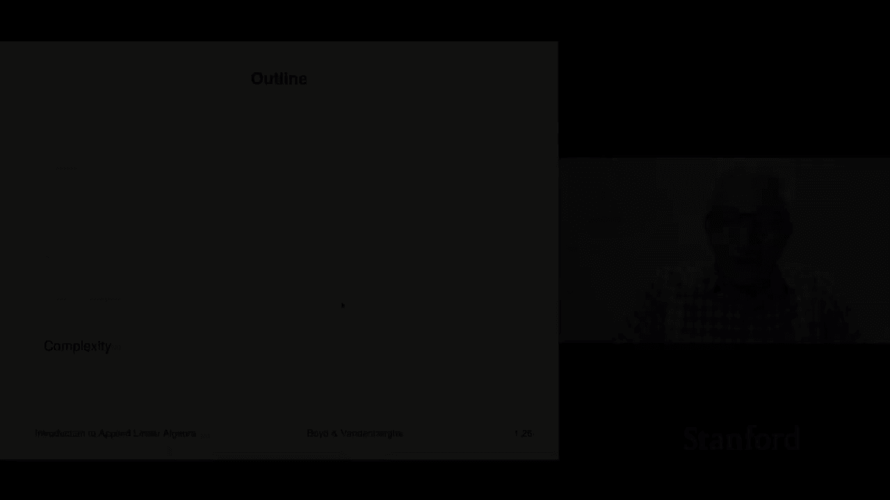
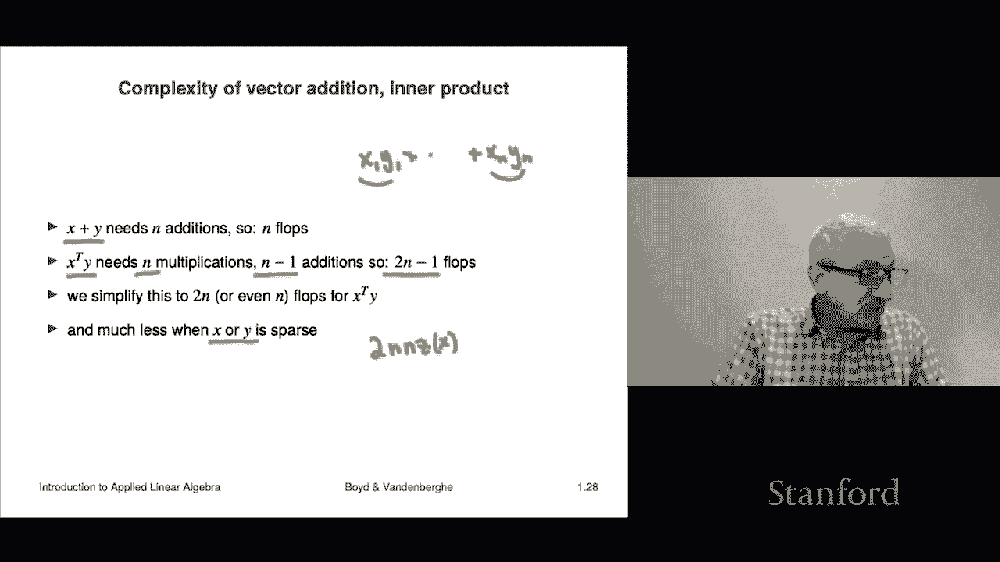
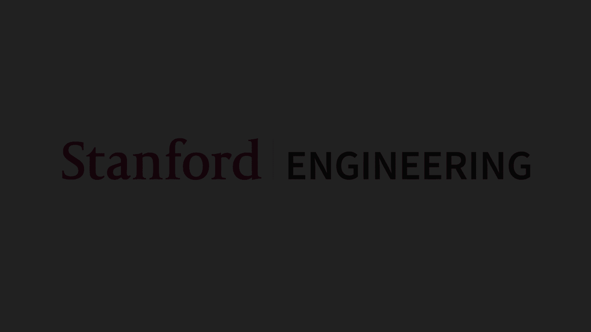

# 6：L1.6 - 复杂度计算 🧮

在本节课中，我们将要学习第一章的最后一个主题：复杂度。复杂度是衡量计算机执行特定操作所需时间的粗略指标。这个概念将在整个课程中被反复提及。

## 概述

复杂度计算的核心思想是估算算法执行所需的基本运算次数。计算机以浮点数格式存储实数。在本课程中，你无需了解其具体细节，只需知道它允许计算机以非常接近的精度表示数字。例如，计算机不会精确存储三分之一，而是存储为类似0.33333...的形式，这对于实际应用已经足够接近。

## 浮点运算与复杂度

当计算机对两个浮点数执行基本操作，如加法、乘法、除法或减法时，这被称为一次浮点运算。其缩写是 **flop**。一次 flop 就是在计算机上对两个数字进行一次加法运算。

算法的复杂度就是通过简单累加你需要执行的所有浮点运算次数来估算的。例如，你可以计算需要将两个数字相乘、相加、相减或相除的次数，并将这些数字加在一起，这就是你操作的 **flop 计数**。

## 复杂度估算的近似性

需要明确的是，这是一种非常粗略的近似。因为它隐含了一个假设：加法运算和除法运算的成本相同，而实际上除法运算耗时更长。然而，这种估算的目的在于给出一个大致概念，帮助我们判断一个操作是需要远少于一秒、一秒、一分钟、一小时还是一天才能完成。

## 计算时间估算

执行一组操作所需时间的粗略估算公式如下：

**执行时间 ≈ 所需总 flop 数 / 计算机速度**

其中，计算机速度以 **每秒 flop 数** 为单位。你可以看到，所需 flop 数除以每秒 flop 数，得到的结果单位是秒，这告诉你操作将花费多少时间。

这是一个非常粗略的近似，我们并不期望其精度在±20%以内。事实上，它甚至可能偏差10倍或更多，但它确实能有效区分秒级和小时级的耗时。

## 现代计算机的运算能力

当前一台普通计算机大约每秒能执行十亿次浮点运算。实际上，我的手机就能做到这一点。我的笔记本电脑可能能达到每秒百亿次。更强大的计算机，例如图形处理单元，其运算能力甚至远超于此。许多GPU现在每秒可以执行10^12次浮点运算，即一万亿次，这被称为每秒一太拉浮点运算的计算机。

让我们看一个简单的例子。假设你有一个操作需要执行10^10次浮点运算，这很多，是100亿次。在一台典型的每秒能执行10^10次浮点运算的计算机上，我们估计这个操作大约需要一秒钟。

## 向量运算的复杂度分析

上一节我们介绍了复杂度估算的基本概念，本节中我们来看看向量运算的具体复杂度。

以下是向量加法和内积运算的复杂度分析：

*   **向量加法**：将两个向量相加。这需要执行 n 次加法运算，因为你需要将每个 X_i 与对应的 Y_i 相加。因此，总复杂度是 **n flops**。

*   **向量内积**：计算 X_1 * Y_1 + ... + X_n * Y_n。首先，你需要将所有对应的元素对相乘，这需要 **n 次乘法**。然后，你需要将这些乘积相加。将两个数相加需要1次加法，将三个数相加需要2次加法，因此将 n 个数相加需要 **n-1 次加法**。所以总 flop 数为 n + (n-1) = **2n - 1**。

由于复杂度估算本身非常粗略，人们通常会忽略常数项，直接说内积运算的复杂度是 **2n flops**。事实上，很多人甚至简化为 **n flops**，因为我们在此并不追求2倍以内的精度。

## 稀疏向量的影响

顺便提一下，这一点很有趣。如果其中一个向量是稀疏的，计算量会大大减少。例如，假设向量 **x** 是稀疏的，而 **y** 不是。稀疏意味着 **x** 的大部分元素是0。

在计算内积时，我不需要处理那些元素，因为无论 **y** 对应元素是什么，0乘以任何数都是0，我不必执行这个乘法。实际上，我只需要对 **x** 中的每一个非零元素，将其与 **y** 中对应的元素相乘，然后将这些乘积相加。因此，复杂度大约为 **2 * (x 中非零元素的数量)**。

这就是为什么我们可能对稀疏向量感兴趣或关注它的一个例子。

## 总结

本节课中我们一起学习了复杂度计算。我们了解到，复杂度是通过估算算法所需的基本浮点运算次数来衡量的，这是一种粗略但有效的评估计算耗时的方法。我们分析了向量加法和内积运算的复杂度，并看到了稀疏向量如何能显著降低计算成本。掌握复杂度估算有助于我们预计算法的执行效率，是算法设计与分析中的重要基础。