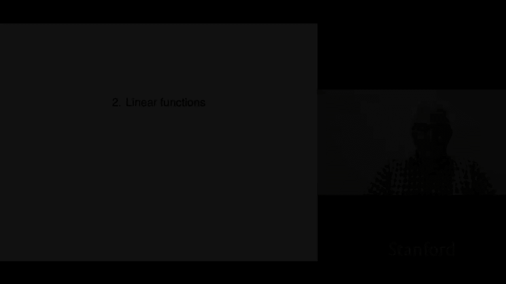
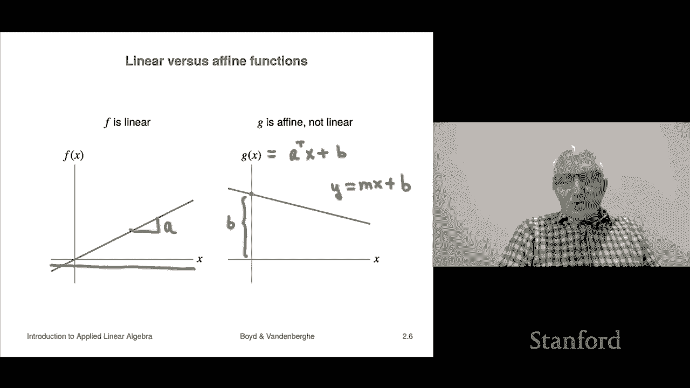

# 7：L2.1 - 线性函数 📘

在本节课中，我们将学习线性函数与仿射函数的基本概念。线性函数是许多数学、工程和科学领域的基础，而仿射函数则是线性函数的一个简单扩展，在实际应用中同样非常重要。

## 1️⃣ 函数与符号表示

首先，我们介绍函数的数学表示方法。符号 `F: R^n → R` 表示函数 `F` 接受一个 `n` 维向量作为输入，并输出一个实数。我们可以将 `F` 视为一个过程或计算机程序中的子程序，它接收 `n` 个数字，经过处理后返回一个数字。

例如，`F(u)` 表示函数 `F` 作用于向量 `u`，结果是一个数字。

## 2️⃣ 叠加性质与线性函数

上一节我们介绍了函数的符号表示，本节中我们来看看线性函数的核心特征：**叠加性质**。

一个从 `R^n` 到 `R` 的函数 `F` 满足叠加性质，如果对于任意向量 `x` 和 `y`，以及任意标量 `α` 和 `β`，以下等式恒成立：

**`F(αx + βy) = αF(x) + βF(y)`**

这个性质意味着，**先对输入进行线性组合再应用函数**，与**先应用函数再对结果进行线性组合**，得到的结果是相同的。数学家会说函数 `F` 与线性组合“可交换”。满足叠加性质的函数被称为**线性函数**。

## 3️⃣ 线性函数的例子：内积

理解了线性函数的定义后，我们来看一个具体的例子：**内积函数**。

假设我们有一个固定的 `n` 维向量 `a`。我们定义一个函数 `F(x) = a^T x`，即向量 `a` 与 `x` 的内积。这个函数计算的是 `x` 各分量的加权和，权重由 `a` 的分量决定。

我们可以验证它是线性的：
1.  `F(αx + βy) = a^T (αx + βy)`
2.  根据内积的分配律和标量乘法性质，上式等于 `α(a^T x) + β(a^T y)`
3.  这正好等于 `αF(x) + βF(y)`

因此，内积函数是线性函数。

## 4️⃣ 线性函数的表示定理

一个重要的结论是：**所有线性函数都可以表示为内积形式**。

如果 `F` 是线性函数，那么存在一个向量 `a`，使得对于任意输入 `x`，都有：

**`F(x) = a^T x`**

其中，向量 `a` 的分量 `a_i` 可以通过将 `F` 作用于第 `i` 个单位向量 `e_i` 得到，即 `a_i = F(e_i)`。这个结论被称为线性函数的**内积表示**。

## 5️⃣ 从线性到仿射

线性函数有一个重要性质：`F(0) = 0`。但在许多实际场景中，我们需要一个更灵活的形式。这就是**仿射函数**。

一个仿射函数是线性函数加上一个常数项：

**`G(x) = a^T x + b`**

其中，`b` 是一个实数，通常称为**偏移量**或**截距**。注意，对于仿射函数，`G(0) = b`，因此除非 `b=0`，否则它不是线性函数。

## 6️⃣ 仿射函数的叠加性质

仿射函数也满足一种“受限”的叠加性质。对于任意向量 `x` 和 `y`，以及满足 `α + β = 1` 的任意标量 `α` 和 `β`，以下等式成立：

**`G(αx + βy) = αG(x) + βG(y)`**

这种系数和为1的线性组合被称为**仿射组合**或**混合**。当且仅当一个函数对所有仿射组合都满足此性质时，它才是仿射函数。

## 7️⃣ 几何直观：直线图像

最后，我们通过几何图像来直观理解。当输入 `x` 是一维时（即一个数字），函数图像可以画在平面上。

*   **线性函数** `F(x) = ax` 的图像是一条**经过原点 `(0,0)` 的直线**。
*   **仿射函数** `G(x) = ax + b` 的图像是一条**不经过原点（除非 `b=0`）的直线**，它在纵轴上的截距是 `b`。

这解释了为什么在中学数学中，形如 `y = mx + b` 的方程被称为“线性方程”，尽管严格来说它是仿射函数。在实际交流中，人们常常将“仿射”和“线性”混用，但在严谨的数学语境下，区分它们是有必要的。

---

**本节课总结**

在本节课中，我们一起学习了：
1.  **线性函数**的定义：满足叠加性质 `F(αx + βy) = αF(x) + βF(y)` 的函数。
2.  线性函数的**内积表示定理**：任何线性函数都可写为 `F(x) = a^T x`。
3.  **仿射函数**的定义：线性函数加一个常数，`G(x) = a^T x + b`。
4.  仿射函数满足**受限的叠加性质**，要求系数之和为1。
5.  从几何上看，一维的线性函数图像是过原点的直线，而仿射函数图像是任意直线。

理解线性与仿射函数是学习更复杂数学模型和机器学习算法的重要基础。