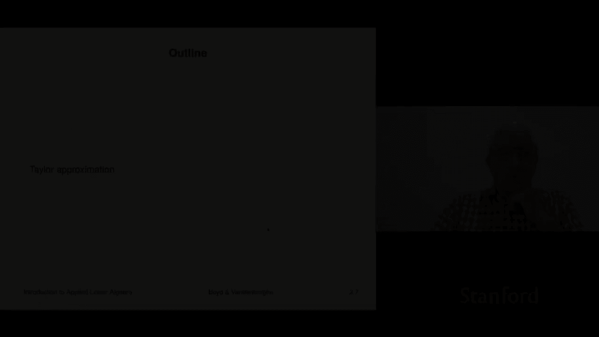
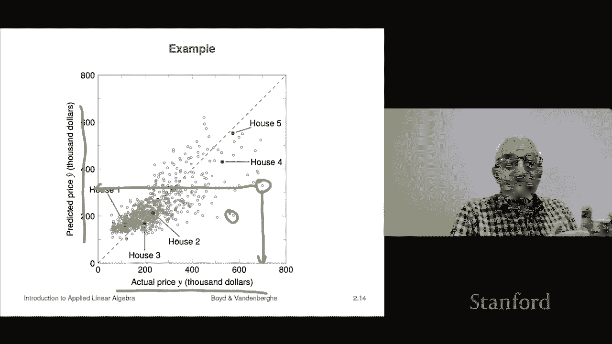

# 8：L2.2 - 泰勒近似与回归 📘

在本节课中，我们将学习两种非常著名且广泛应用的仿射函数例子：一个是来自微分学的**泰勒近似**，另一个是来自统计学的**回归模型**。这两种方法都是通过简单的线性（仿射）形式来近似描述更复杂的函数关系。

---

## 泰勒近似 🧮

上一节我们介绍了仿射函数的基本概念。本节中，我们来看看如何利用泰勒近似，将一个复杂的非线性函数在某个点附近用一个仿射函数来近似。

假设我们有一个函数 **f**，它将一个 **n** 维向量映射为一个实数。用数学符号表示为：
\[
f: \mathbb{R}^n \to \mathbb{R}
\]
这意味着函数 **f** 接受一个 **n** 维向量作为输入，并输出一个实数。

**一阶泰勒近似** 在点 **z** 附近展开，其形式如下：
\[
\hat{f}(x) = f(z) + \nabla f(z)^T (x - z)
\]
这里，\(\hat{f}\) 表示 **f** 的近似，\(\nabla f(z)\) 是函数 **f** 在点 **z** 处的**梯度向量**，其分量是 **f** 对各个变量的偏导数。

为了更清楚地看出这是一个仿射函数，我们可以将其重写为：
\[
\hat{f}(x) = \underbrace{\nabla f(z)^T}_{a^T} x + \underbrace{[f(z) - \nabla f(z)^T z]}_{b}
\]
这正好符合仿射函数的标准形式 \(a^T x + b\)。

**泰勒近似的核心性质**是：当 **x** 非常接近 **z** 时，近似值 \(\hat{f}(x)\) 会非常接近真实值 \(f(x)\)。在二维情况下，这相当于在曲线上某点作一条切线；在高维情况下，则是在该点作一个切平面。

---

## 回归模型 📈

理解了泰勒近似这种“自然产生”的仿射近似后，我们来看看一个“人为构建”的仿射模型——回归模型。它在统计学和机器学习中无处不在。

在回归模型中，我们有一个**特征向量** **x**，其分量代表了某个对象（如病人、公司、房屋）的各种属性。我们想要预测一个与之相关的**结果** **y**（如住院天数、股票收益、房屋售价）。

**线性回归模型**的预测公式如下：
\[
\hat{y} = v + \beta^T x = v + \beta_1 x_1 + \beta_2 x_2 + ... + \beta_n x_n
\]
其中：
*   \(\hat{y}\) 是对真实值 **y** 的预测或近似。
*   \(v\) 是一个常数，称为**偏移量**。
*   \(\beta\) 是一个**权重向量**或**系数向量**，其分量 \(\beta_i\) 代表了对应特征 \(x_i\) 对预测结果的贡献程度。

这个模型显然是一个关于特征 **x** 的仿射函数。

以下是关于模型参数的解释：
*   **偏移量 \(v\)**：可以理解为当所有特征值 \(x_i\) 都为 0 时，模型的预测基准值。
*   **系数 \(\beta_i\)**：表示当特征 \(x_i\) 增加 1 个单位，而其他特征保持不变时，预测值 \(\hat{y}\) 的变化量。如果 \(\beta_i\) 为负，则意味着该特征增加会导致预测值下降。

---

### 回归模型实例：房屋价格预测 🏠

让我们通过一个简化的例子来具体理解回归模型。假设我们想预测房屋的售价（**y**，单位：千美元），并且只使用两个特征：
1.  **\(x_1\)**：房屋面积（单位：千平方英尺）
2.  **\(x_2\)**：卧室数量

一个可能的回归模型如下：
\[
\hat{y} = 54.4 + 148.73 x_1 - 18.85 x_2
\]

**模型参数解读**：
*   **系数 148.73**：意味着房屋面积每增加1000平方英尺（即 \(x_1\) 增加1），预测售价将增加约148.73（千美元），即约14.9万美元。
*   **系数 -18.85**：看起来有些反直觉，它意味着在房屋面积 **保持不变** 的前提下，卧室数量每增加一间，预测售价反而会下降约1.885万美元。这可能是因为在固定面积下，卧室增多会导致每个房间更拥挤。
*   **偏移量 54.4**：可以粗略解释为“土地成本”或基础价格，即当房屋面积和卧室数都为0（这并非实际房屋）时的预测价格。

**模型应用与评估**：
在实际使用中，我们将房屋的特征值代入公式即可得到预测价格。需要注意的是，这个极度简化的模型预测精度有限。在现实中，预测房价需要使用数十甚至数百个特征（如地段、学区、房龄等）。模型的优劣可以通过比较预测值 \(\hat{y}\) 和实际成交价 **y** 来评估；理想情况下，所有数据点都应落在 \(y = \hat{y}\) 的对角线附近。

---

## 总结 📝

本节课中我们一起学习了两种重要的仿射函数应用：
1.  **泰勒近似**：提供了一种系统性的方法，用仿射函数（切线或切平面）在局部近似任意光滑的非线性函数。其核心公式为 \(\hat{f}(x) = f(z) + \nabla f(z)^T (x - z)\)。
2.  **回归模型**：一个强大且广泛应用的工具，它使用特征的仿射组合 \(\hat{y} = v + \beta^T x\) 来预测某个未知结果。模型中的系数具有直观的解释意义，揭示了每个特征如何影响预测值。

两者虽然来源不同，但都体现了仿射函数作为复杂关系的简单、可解释近似所发挥的巨大作用。