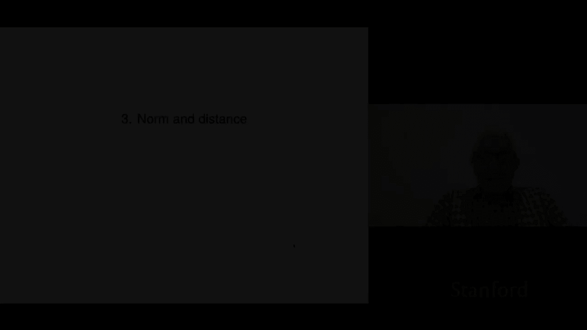
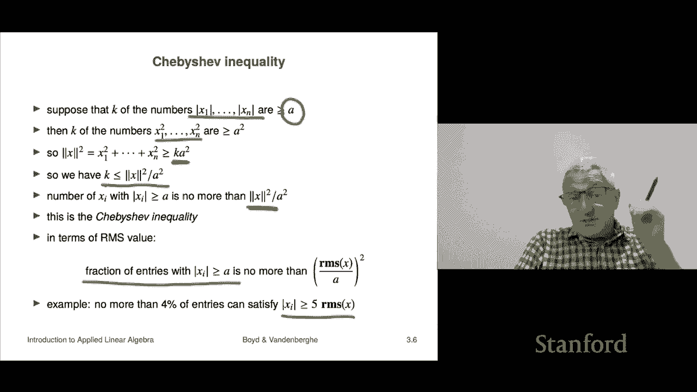

# 9：L3.1 - 范数与距离 📏

在本节课中，我们将学习向量范数的概念，它是衡量向量“长度”或“大小”的一种方式。从范数出发，我们还将探讨向量之间的距离。这些概念是线性代数乃至更广泛数学和工程领域的基础工具。

---

## 1️⃣ 什么是范数？

范数，特别是我们即将讨论的**欧几里得范数**，是向量长度的一种度量。它本质上是向量绝对值概念在多维空间中的推广。

对于一个 n 维向量 **x**，其范数记作 **||x||**，计算公式如下：

**||x|| = √(x₁² + x₂² + ... + xₙ²)**

这个公式可以理解为向量各分量平方和的平方根。它也可以写作向量与自身内积的平方根：**||x|| = √(xᵀx)**。

当 n=1 时，向量退化为标量，其范数就是该标量的绝对值。因此，范数确实是绝对值在多维空间中的自然延伸。

**示例**：计算向量 **x = [1, 0, 1]ᵀ** 的范数。
**||x|| = √(1² + 0² + 1²) = √2 ≈ 1.414**

---

## 2️⃣ 范数的基本性质

范数具有几个非常重要的数学性质，这些性质使其成为一个良好定义的度量工具。

以下是范数的四个核心性质：

*   **齐次性**：对于任意标量 β 和向量 **x**，有 **||βx|| = |β| · ||x||**。这意味着缩放向量会按比例缩放其范数。特别地，**||-x|| = ||x||**。
*   **三角不等式**：对于任意向量 **x** 和 **y**，有 **||x + y|| ≤ ||x|| + ||y||**。这个性质名称的几何意义将在后面解释，它表明“两边之和大于第三边”。
*   **非负性**：对于任意向量 **x**，有 **||x|| ≥ 0**。范数永远是非负的。
*   **正定性**：**||x|| = 0** 当且仅当 **x** 是零向量（所有分量均为 0）。这是由平方和的性质决定的：只有当所有平方项（即所有分量）都为 0 时，其和才可能为 0。

---

## 3️⃣ RMS值：另一种“大小”度量

除了范数，另一个广泛使用的度量是**均方根值**。RMS 值在工程领域尤为常见，它提供了向量分量“典型”大小的直观感觉。

对于一个 n 维向量 **x**：
*   其**均方值**为：**(||x||²) / n**
*   其**均方根值**为：**RMS(x) = √(均方值) = ||x|| / √n**

**为什么使用 RMS 值？**
考虑一个所有分量都为 1 的 n 维向量 **1**。其范数是 **√n**，这个值会随着向量维度 n 的增长而增长。然而，其 RMS 值始终是 **1**，这更直观地反映了每个分量的大小都是 1。因此，RMS 值在比较不同维度向量的大小时特别有用。

---

## 4️⃣ 分块向量的范数

当向量由多个子向量“堆叠”而成时，其范数的计算有简便方法。

假设有一个由三个子向量 **a**, **b**, **c** 堆叠而成的向量 **x = [a; b; c]**。那么，该向量的范数平方满足以下关系：

**||x||² = ||a||² + ||b||² + ||c||²**

这意味着，堆叠向量的范数平方等于其各组成部分范数的平方和。这个性质可以推广到任意数量的子向量，在后续课程中会非常有用。

---

## 5️⃣ 切比雪夫不等式

切比雪夫不等式是一个重要的概率论和统计学结论，在线性代数中，它为我们提供了向量分量分布的一个界限。

该不等式表述如下：对于向量 **x** 和任意正数 **a**，满足 **|xᵢ| ≥ a** 的分量数量 **k** 不会超过 **||x||² / a²**。

用更直观的 RMS 值来表述：
**满足 |xᵢ| ≥ a 的分量比例 ≤ (RMS(x) / a)²**

**这个不等式告诉我们什么？**
它量化了向量中“异常大”的分量数量。例如，如果取 **a = 5 * RMS(x)**，那么不等式表明，绝对值超过 5 倍 RMS 值的分量比例不会超过 **(1/5)² = 4%**。这从数学上支持了 RMS 值可以代表向量分量“典型”大小的观点——虽然可能存在比典型值大得多的分量，但它们的数量会受到严格限制。

---

## 总结

本节课我们一起学习了向量的核心度量工具：
1.  **范数**：定义了向量的长度，是绝对值的高维推广，具有齐次性、三角不等式、非负性和正定性。
2.  **RMS值**：通过 **||x|| / √n** 计算，提供了与向量维度无关的“典型”大小度量，便于比较不同长度的向量。
3.  **分块向量范数**：堆叠向量的范数平方等于各子向量范数的平方和。
4.  **切比雪夫不等式**：为向量中大幅偏离 RMS 值的分量数量设定了一个上限，强化了 RMS 值的“典型”意义。

理解范数是理解向量空间几何和后续距离、夹角等概念的基础。