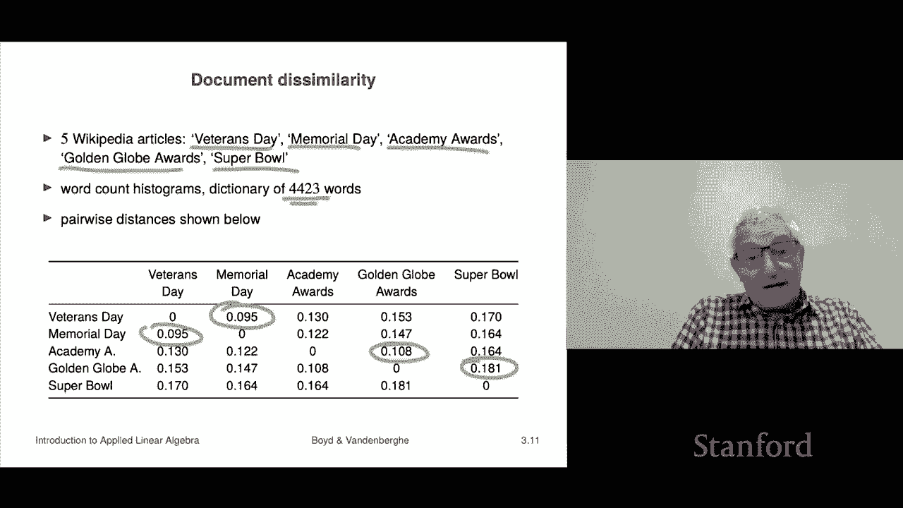

# 10：L3.2 - 距离度量 📏

在本节课中，我们将要学习向量之间的距离概念。这个概念直接源于范数的思想，而范数大致可以理解为向量的长度。

## 距离的定义 📐

上一节我们介绍了范数，本节中我们来看看如何用它来定义距离。

如果我有两个向量，假设它们代表两个位置，那么它们之间的欧几里得距离就是向量差的范数。距离函数可以写作：

**公式：** `distance(A, B) = ||A - B||`

例如，点A和点B之间的向量差（B - A）用蓝色箭头表示，其范数就是A与B之间的距离。这与我们在代数课上学到的普通距离概念一致，对于一维、二维和三维空间都是相同的。

有时人们也会看A和B之间的均方根偏差，但这本质上就是距离除以平方根。因此，我们自动得到了距离的概念。

这里的新意在于，我们现在可以讨论100维向量之间的距离。虽然无法直观想象100维空间，但我们可以计算并谈论它。

## 三角不等式 🔺

现在，我们来看看三角不等式，并解释它名字的由来。

考虑三个位置A、B和C，它们都是向量。三角形的边长定义如下：
*   A与B之间的边长是 `||A - B||`
*   B与C之间的边长是 `||B - C||`
*   A与C之间的边长是 `||A - C||`

我们将应用三角不等式。首先，通过加B减B，我们有 `A - C = (A - B) + (B - C)`。然后应用范数的三角不等式：**和的范数小于等于范数的和**。

**公式：** `||A - C|| = ||(A - B) + (B - C)|| ≤ ||A - B|| + ||B - C||`

这个不等式表明，三角形任意一边的长度小于或等于其他两边长度之和。这正是范数三角不等式名称的由来。

## 特征距离与最近邻 🔍

即使范数是一个简单的概念，我们已经能看到它非常有用。下面介绍最近邻的概念。

如果你有两个特征向量，它们差值的范数（即它们之间的距离）被称为特征距离。这意味着我们可以谈论两个特征向量是“接近”还是“远离”。

回想一下回归分析中的简单例子，第一个分量是房屋面积，第二个是卧室数量。两个“接近”的房子很可能拥有相似的卧室数量和平方英尺数，其特征距离就小。反之，一个一居室的小房子与一个六居室的大房子之间特征距离就大。这是一种非几何意义上的距离概念。

这引出了最近邻的想法。如果我有一个向量列表 `Z1, Z2, ..., Zm`，以及另一个查询向量 `X`，那么在这个列表中，与 `X` 最接近的那个向量就被称为 `X` 的最近邻。

例如，在下图中，`X` 与六个 `Z` 向量在一起，其中 `Z3` 距离 `X` 最近，因此 `Z3` 是 `X` 的最近邻。

你可能会问这有什么用。实际上，即使在基础的机器学习和数据分析中，这也是一个非常强大的概念。

## 实例分析：维基百科文章 📚

让我们看一个例子，希望能让你初步了解这个概念的神奇之处。

我们将使用词频直方图作为特征向量。我们选取了五篇维基百科文章，并有一个包含4423个单词的词典。

以下是处理步骤：
1.  对于每一篇维基百科文章，我们统计词典中每个单词在文章中出现的次数。
2.  这样，每篇文章就对应一个4423维的向量，向量的每个元素代表一个特定单词的出现次数。

接下来，我们计算这五篇文章向量之间的两两距离。

观察这个距离矩阵，我们可以提出一些问题：

*   **对角线**：任何文章与自身的距离都是0，因为 `||向量 - 自身|| = 0`。
*   **对称性**：距离矩阵是对称的，例如“退伍军人节”到“阵亡将士纪念日”的距离与反过来是相同的。

现在，让我们深入分析：

**问题一：哪两篇文章最接近？**
扫描矩阵，距离最小的配对是“退伍军人节”和“阵亡将士纪念日”（距离0.095）。这合理吗？是的，这两篇文章都是描述假日的，内容上确实密切相关。

**问题二：第二接近的配对是哪两个？**
是“奥斯卡金像奖”和“金球奖”（距离0.130）。这两者都是关于娱乐奖项的。

**问题三：哪两篇文章距离最远？**
似乎是“金球奖”和“超级碗”（距离0.192）。它们在主题上确实相差甚远。

这个简单的例子展示了令人惊讶的一点：我们只是粗暴地统计了单词出现次数，完全忽略了文章的语义、句子结构和段落，但计算出的距离却能反映出文章主题的相似性（如两个假日文章相近，两个奖项文章相近）。

## 概念的应用前景 🚀

我们可以将这个概念扩展到更宏大的场景。例如，不是分析5篇文章，而是分析5000篇。当有一篇新文章时，我们可以询问：“它的最近邻（或前三名最近邻）是哪几篇？”这常用于文档分类、信息检索等。

这个概念的应用前景非常广阔。以下是几个设想：

*   **医疗诊断**：一位新病人进入急诊室，我们收集他的特征向量（包含症状、检测结果等，可能长达100或1000维）。然后，将这个向量与过去五年所有病人的特征向量数据库进行比较，找出“最近邻”（即病情最相似的过往病例）。医生可以查看这些相似病例的后续发展（例如，某病例在第二天出现了败血症），从而对新病人采取预防性措施（如提前使用抗生素）。
*   **金融交易**：客户想购买一种特定债券，但市场上没有完全相同的在售。我们可以创建债券的特征向量（包含发行方、利率、期限等信息），然后在所有可交易债券中寻找“相似债券”并推荐给客户。

这些例子表明，仅仅使用特征向量和距离这两个简单的概念，就已经能够催生出许多强大的实际应用。

## 总结 📝

本节课中我们一起学习了：
1.  **向量距离**：定义为两向量之差的范数 `||A - B||`。
2.  **三角不等式**：`||A - C|| ≤ ||A - B|| + ||B - C||`，它保证了距离度量的合理性。
3.  **特征距离与最近邻**：在高维特征空间中，距离可以衡量样本的相似性，最近邻是与查询样本最相似的样本。
4.  **实例与应用**：通过维基百科文章的词频例子，我们看到了距离度量如何从简单的计数中揭示语义关联，并展望了其在医疗、金融等领域的巨大应用潜力。

距离度量是连接数据与洞察力的基础桥梁，尽管其数学形式简单，却为更复杂的机器学习算法奠定了坚实的基石。