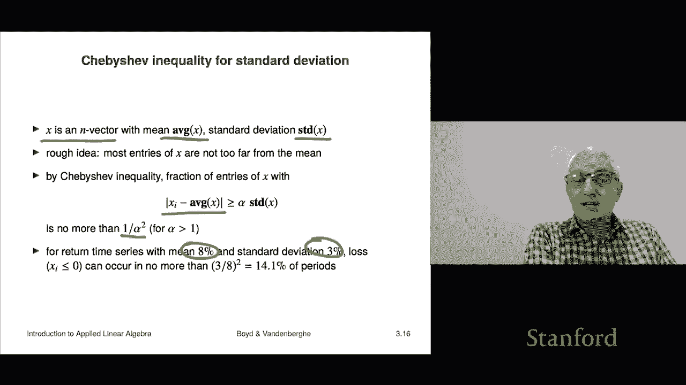

# 11：L3.3 - 方差与标准差 📊

在本节课中，我们将学习两个非常重要的统计概念：**方差**与**标准差**。它们不仅在统计学中至关重要，也与我们之前讨论的向量概念紧密相关。我们将从向量的角度来理解它们。

## 向量的平均值 📈

上一节我们介绍了向量的基本运算，本节中我们来看看如何计算一个向量的平均值。

对于一个 n 维向量 **X**，其平均值是向量中所有元素的算术平均。用公式可以表示为：

**平均值 = (1^T * X) / n**

其中，**1** 是一个所有元素都为 1 的 n 维向量，**1^T * X** 表示向量 **X** 所有元素的和，再除以元素个数 **n**，就得到了平均值。

## 去中心化向量 🔄

理解了平均值后，我们可以引入一个关键概念：**去中心化向量**。

去中心化向量是指，从原始向量 **X** 的每一个元素中减去其平均值。我们通常用 **X̃** 来表示这个去中心化向量。其计算公式为：

**X̃ = X - (平均值 * 1)**

由于我们减去了平均值，因此去中心化向量 **X̃** 的平均值必然为 0。这个概念是理解标准差的基础。

## 标准差 📏

现在，我们可以正式定义**标准差**了。

标准差本质上就是**去中心化向量**的**均方根值**。它衡量了向量中各个元素偏离其平均值的“典型”程度。其公式如下：

**标准差 = RMS(X̃) = ||X̃|| / √n**

将 **X̃** 代入，完整的公式为：

**标准差 = √[ (1/n) * Σ (Xi - 平均值)² ]**

如果标准差的值较小，说明数据点都紧密围绕在平均值周围；如果值较大，则说明数据点分布得比较分散。

## 标准差的特性 🎯

以下是标准差的一些重要特性：

*   **标准差为零**：当且仅当向量 **X** 是一个常数向量（即所有元素都相同）时，其标准差为零。这很直观，因为所有值都等于平均值，没有任何偏离。
*   **常用符号**：在统计学和应用数学中，平均值常用希腊字母 **μ** 表示，标准差常用 **σ** 表示。
*   **基本关系式**：一个向量的**均方根值的平方**，等于其**平均值的平方**加上**标准差的平方**。即：
    **RMS(X)² = (平均值)² + (标准差)²**
    这个公式的推导是练习内积性质的好机会。

## 在金融中的应用：风险与回报 💰

标准差和平均值在金融领域有非常直接和重要的应用，尤其是在分析投资回报的时间序列数据时。

假设向量 **X** 代表一项投资在 n 个时间段内的回报率序列。

*   **平均值**：代表该投资的**平均回报率**，通常简称为“回报”。投资者自然希望平均回报率越高越好。
*   **标准差**：代表回报率偏离平均值的波动程度，在金融中被解释为**风险**。波动越大，风险越高，投资者通常希望风险越低越好。

通过计算不同投资产品的平均回报和标准差，我们可以将它们绘制在一张“风险-回报”图上。理想的投资位于图的**左上角**（高回报、低风险），而位于**右下角**（低回报、高风险）的投资则缺乏吸引力，甚至可以被其他投资“支配”。

## 切比雪夫不等式与标准差 📊

我们之前学过的切比雪夫不等式，也可以用标准差来重新表述，这使其含义更加直观。

对于一个向量 **X**，其平均值为 **μ**，标准差为 **σ**。切比雪夫不等式指出：

**偏离平均值超过 k 个标准差的元素比例，不超过 1/k²。**

用公式表示即：**比例( |Xi - μ| ≥ kσ ) ≤ 1/k²**，其中 k > 1。

例如，对于一个平均回报为 8%、标准差为 3% 的投资回报序列，根据该不等式，出现亏损（回报率 ≤ 0%）的时期比例不会超过 (8%/3%)² 的倒数，即大约 14%。这为评估风险提供了一个理论上的上限。

---

本节课中我们一起学习了方差与标准差的核心概念。我们了解到，标准差是衡量数据波动性的关键指标，它源于去中心化向量的均方根值。通过金融中“风险-回报”分析的实例，我们看到了标准差在实际中的强大应用。最后，切比雪夫不等式为我们理解数据分布与标准差的关系提供了有力的理论工具。