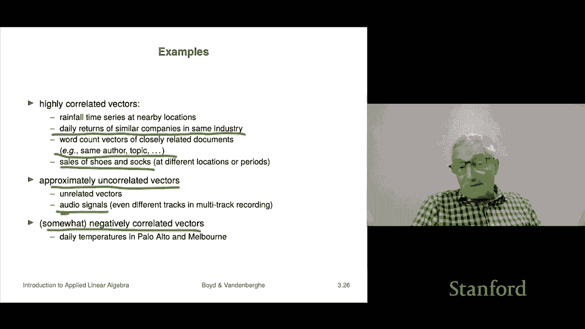

# 12：L3.4 - 向量角度 📐

在本节课中，我们将学习如何定义任意维度向量之间的角度。我们将从柯西-施瓦茨不等式入手，推导出三角不等式，并最终利用这些工具来定义和计算向量间的夹角。这个概念不仅适用于二维和三维空间，也适用于像1000维这样的高维空间，非常有趣。

---

## 柯西-施瓦茨不等式与三角不等式 🔗

我们从一个重要的不等式开始，它被称为柯西-施瓦茨不等式。该不等式指出，对于任意两个 n 维向量 **a** 和 **b**，其内积的绝对值小于或等于它们范数的乘积。

用公式表示如下：
\[
|\mathbf{a}^T \mathbf{b}| \leq \|\mathbf{a}\| \ \|\mathbf{b}\|
\]

如果用分量形式写出，即：
\[
\left| \sum_{i=1}^{n} a_i b_i \right| \leq \sqrt{\sum_{i=1}^{n} a_i^2} \ \sqrt{\sum_{i=1}^{n} b_i^2}
\]

一旦我们有了柯西-施瓦茨不等式，就可以用它来证明三角不等式。让我们看看这是如何推导的。

向量和的范数平方可以展开计算：
\[
\|\mathbf{a} + \mathbf{b}\|^2 = (\mathbf{a} + \mathbf{b})^T (\mathbf{a} + \mathbf{b}) = \|\mathbf{a}\|^2 + 2\mathbf{a}^T\mathbf{b} + \|\mathbf{b}\|^2
\]

现在，我们利用柯西-施瓦茨不等式，将中间项 \(\mathbf{a}^T\mathbf{b}\) 替换为它的上界：
\[
\|\mathbf{a} + \mathbf{b}\|^2 \leq \|\mathbf{a}\|^2 + 2\|\mathbf{a}\|\|\mathbf{b}\| + \|\mathbf{b}\|^2 = (\|\mathbf{a}\| + \|\mathbf{b}\|)^2
\]

对不等式两边同时取平方根，就得到了三角不等式：
\[
\|\mathbf{a} + \mathbf{b}\| \leq \|\mathbf{a}\| + \|\mathbf{b}\|
\]

因此，柯西-施瓦茨不等式是推导三角不等式的关键。

---

## 向量夹角的定义 📐

上一节我们介绍了柯西-施瓦茨不等式，本节中我们来看看如何用它来定义向量间的夹角。

对于两个非零向量 **a** 和 **b**，根据柯西-施瓦茨不等式，比值 \(\frac{\mathbf{a}^T \mathbf{b}}{\|\mathbf{a}\| \|\mathbf{b}\|}\) 的取值范围在 -1 到 1 之间。

这意味着我们可以取这个比值的反余弦值，并将结果定义为向量 **a** 和 **b** 之间的夹角 \(\theta\)：
\[
\theta = \arccos\left( \frac{\mathbf{a}^T \mathbf{b}}{\|\mathbf{a}\| \|\mathbf{b}\|} \right)
\]

夹角 \(\theta\) 的取值范围是 0 到 \(\pi\) 弧度（或 0 到 180 度）。这个定义与二维和三维几何中的夹角公式完全一致，但它可以推广到任意维度，例如100维的向量。

这个夹角是衡量两个向量方向差异的一种方式。角度越小，表示向量方向越接近；角度越大，表示方向差异越大。

---

## 夹角的分类与应用 📏

基于夹角的大小，我们可以对向量关系进行分类。以下是几种常见情况：

*   **正交**：如果 \(\theta = \pi/2\)（90度），则 \(\mathbf{a}^T \mathbf{b} = 0\)。我们称向量 **a** 与 **b** 正交，记作 \(\mathbf{a} \perp \mathbf{b}\)。
*   **同向**：如果 \(\theta = 0\)，则 \(\mathbf{a}^T \mathbf{b} = \|\mathbf{a}\|\|\mathbf{b}\|\)。这意味着两个向量方向完全相同。
*   **反向**：如果 \(\theta = \pi\)（180度），则 \(\mathbf{a}^T \mathbf{b} = -\|\mathbf{a}\|\|\mathbf{b}\|\)。这意味着两个向量方向完全相反。
*   **锐角**：如果 \(0 < \theta < \pi/2\)，则内积为正。
*   **钝角**：如果 \(\pi/2 < \theta < \pi\)，则内积为负。

夹角的一个有趣应用是计算球面距离。假设在一个半径为 \(R\) 的球面上有两点 **a** 和 **b**，它们之间的直线距离（穿过球体）是 \(\|\mathbf{a} - \mathbf{b}\|\)，而沿着球面的最短路径（大圆弧长）则是 \(R \theta\)，其中 \(\theta\) 是两点与球心连线的夹角（以弧度为单位）。

---

## 实例：文档相似度分析 📄

夹角的概念可以用于衡量高维数据的相似性，例如文档。我们可以将文档表示为词频向量（每个维度代表一个词的出现次数），然后计算向量间的夹角来评估文档内容的相似度。

以下是一个分析五个维基百科页面（词频向量维度约4500）的例子，我们计算了每对页面之间的夹角（以度为单位）：

| 页面 | 退伍军人节 | 阵亡将士纪念日 | 奥斯卡金像奖 | 金球奖 | 超级碗 |
| :--- | :---: | :---: | :---: | :---: | :---: |
| **退伍军人节** | 0.0° | **29.2°** | 67.8° | 69.4° | 87.0° |
| **阵亡将士纪念日** | 29.2° | 0.0° | 69.7° | 71.5° | 87.5° |
| **奥斯卡金像奖** | 67.8° | 69.7° | 0.0° | **24.2°** | 86.1° |
| **金球奖** | 69.4° | 71.5° | 24.2° | 0.0° | 86.0° |
| **超级碗** | 87.0° | 87.5° | 86.1° | 86.0° | 0.0° |

观察结果：
*   夹角最小的两对是“奥斯卡金像奖”与“金球奖”（24.2°），以及“退伍军人节”与“阵亡将士纪念日”（29.2°）。这符合直觉，因为它们主题相近。
*   由于词频向量所有分量非负，其内积也非负，因此夹角都在0到90度之间。
*   “超级碗”与其他页面的夹角都很大（约86-87度），表明其内容与其他主题差异显著。如果夹角达到90度，则意味着两篇文档没有共同的词汇。

这个例子表明，通过计算高维向量的夹角，我们可以量化并比较文档（或其他特征数据）之间的相似性。

---

## 相关系数：去中心化向量的夹角 📈

最后，我们介绍一个与夹角密切相关的概念——相关系数。这在统计学和数据分析中非常常见。

给定两个向量 **a** 和 **b**，我们先对它们进行“去中心化”处理，即减去各自的平均值，得到新向量 \(\tilde{\mathbf{a}}\) 和 \(\tilde{\mathbf{b}}\)。

这两个去中心化向量的相关系数 \(\rho\) 定义为：
\[
\rho = \frac{\tilde{\mathbf{a}}^T \tilde{\mathbf{b}}}{\|\tilde{\mathbf{a}}\| \ \|\tilde{\mathbf{b}}\|} = \cos \theta_{\tilde{a}\tilde{b}}
\]

其中 \(\theta_{\tilde{a}\tilde{b}}\) 是去中心化向量间的夹角。因此，相关系数本质上就是去中心化向量夹角的余弦值。

相关系数的含义：
*   \(\rho \approx 0\)：向量不相关（去中心化后正交）。
*   \(\rho \approx 1\)：高度正相关。当 **a** 的值高于其均值时，**b** 的值也倾向于高于其均值。
*   \(\rho \approx -1\)：高度负相关。当 **a** 的值高于其均值时，**b** 的值倾向于低于其均值。

实际例子：
*   **高度正相关**：相邻城市（如帕洛阿尔托和门洛帕克）的日降雨量时间序列；同一行业两家相似公司的股票日收益率；同一主题或作者的两篇文档的词频向量。
*   **高度负相关**：分处南北半球的两个城市（如帕洛阿尔托和墨尔本）的日气温时间序列。
*   **近似不相关**：两个毫无关系的长时间序列，如波尔多的日最高气温与亚马逊雨林的日降雨量；两段随机录制的音频信号。

---

## 课程总结 🎯

在本节课中，我们一起学习了：
1.  **柯西-施瓦茨不等式**：它给出了向量内积与范数之间关系的基本界限。
2.  **三角不等式**：由柯西-施瓦茨不等式推导而来，描述了向量和范数的性质。
3.  **向量夹角的定义**：利用内积和范数，我们将二维/三维空间中的夹角概念推广到了任意高维空间。
4.  **夹角的分类与应用**：包括正交、同向、反向等概念，以及球面距离的计算。
5.  **文档相似度分析实例**：展示了如何用夹角量化高维数据（如文档）的相似性。
6.  **相关系数**：理解了它是去中心化向量夹角的余弦值，用于衡量两个数据序列之间的线性相关程度。

这些工具为我们理解和分析高维向量空间中的数据关系提供了强大的数学基础。