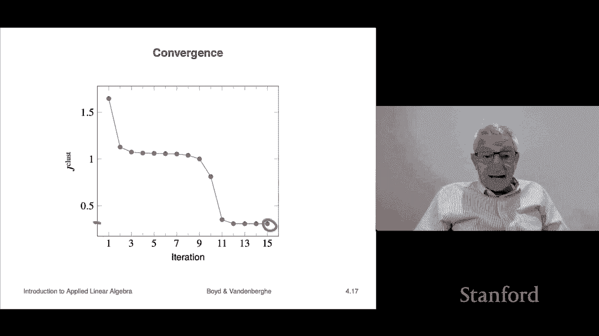

# 13：L4.1 - K均值聚类 🎯

在本节课中，我们将学习一种称为“聚类”的数据分析方法。聚类是一种将大量数据点（向量）自动分组的技术，即使我们目前只掌握了向量的基本概念（如范数和距离），也能实现有趣且实用的应用。

## 概述 📋

聚类分析的目标是，给定一组 N 个向量（记为 x₁ 到 x_N），将它们划分成 K 个不同的组或“簇”。这些组内的向量应该彼此“接近”。我们将通过一个称为 **K均值** 的经典算法来实现这一目标，该算法仅依赖于向量间距离的计算。

## 聚类的应用场景 🌍

以下是聚类技术的一些典型应用场景，展示了其广泛的实用性：

*   **文档分类**：每个向量可以代表一篇文档的词频直方图。通过聚类，可以将主题相似的文档自动归为一类，即使向量本身并不理解文本的语义。
*   **患者分群**：在医院数据中，每个向量代表一位患者，其分量可以编码年龄、性别、血压、症状、检测结果等多种属性。聚类有助于发现具有相似健康状况的患者群体。
*   **客户细分**：在市场营销中，每个向量对应一位客户，包含其购买历史、地理位置、年龄等信息。聚类可以将客户划分为不同的群体，以便进行精准营销。
*   **图像颜色压缩**：在图像处理中，每个像素的 RGB 值（红、绿、蓝强度）构成一个三维向量。通过将所有像素的颜色向量聚类为较少的类别（例如100种颜色），可以用类别编号代替具体的 RGB 值，从而实现高效的图像压缩。
*   **金融部门识别**：在金融领域，每个向量代表一家公司，其分量可以包括股票回报率、市值、市盈率、所属行业等信息。聚类可以自动发现业务模式相似的公司群体，即“金融板块”。

## 聚类的数学描述与目标 📐

为了形式化地描述和评估一个聚类结果，我们需要引入一些符号和优化目标。

### 符号定义

假设我们有 N 个向量。一种描述聚类的方式是定义 K 个集合 G₁, G₂, ..., G_K，每个 G_j 包含了被分配到第 j 个簇的向量的索引。例如，G₁ = {1, 4} 表示第1个和第4个向量属于第一个簇。

另一种等价的描述方式是使用一个长度为 N 的分配向量 **c**。其中，c_i 的值表示第 i 个向量 x_i 被分配到的簇的编号。例如，若 c₁ = 1, c₄ = 1，则同样表示 x₁ 和 x₄ 属于第一个簇。

此外，我们为每个簇 j 定义一个 **代表向量 z_j**。它代表了该簇的中心或典型特征。

### 聚类目标函数

一个好的聚类应该使同一个簇内的向量都离它们的代表向量很近。因此，我们定义以下聚类目标函数 **J_clust**：

`J_clust = (1/N) * Σ_{i=1}^{N} ||x_i - z_{c_i}||²`

这个公式计算了所有向量到其所属簇的代表向量的**距离平方的均值**。我们的目标就是通过选择最佳的簇分配（c_i）和代表向量（z_j），来**最小化 J_clust** 的值。J_clust 越小，说明聚类效果越好。

## K均值算法 🔄

K均值算法是一种通过迭代优化来近似求解上述最小化问题的启发式方法。它的核心思想是交替优化两个子问题。

### 算法步骤

K均值算法包含两个核心步骤，并交替执行直到结果稳定：

1.  **分配步骤**：固定所有簇的代表向量 z_j。对于每一个数据向量 x_i，将其分配到**距离最近**的代表向量所在的簇。即，更新 c_i 为：
    `c_i = argmin_j ||x_i - z_j||`
    这一步保证了在给定代表向量的情况下，J_clust 最小。

2.  **更新步骤**：固定所有向量的簇分配 c_i。对于每一个簇 j，将其代表向量 z_j 更新为该簇内所有向量的**平均值（质心）**。即：
    `z_j = (1/|G_j|) * Σ_{i in G_j} x_i`
    这一步保证了在给定簇分配的情况下，J_clust 最小。

### 算法流程与特性

完整的K均值算法流程如下：
*   **初始化**：随机选择 K 个点作为初始簇代表（或随机分配向量到 K 个簇）。
*   **循环**：重复执行“分配步骤”和“更新步骤”。
*   **终止**：当簇的分配不再发生变化时，算法停止。

K均值算法有两个重要特性：
*   **目标函数单调下降**：每一次迭代（无论是分配还是更新步骤）都会降低或至少不增加 J_clust 的值。
*   **收敛性**：算法保证会在有限步内停止，因为可能的分配方案是有限的，且目标函数持续下降。
*   **局部最优**：算法最终会收敛到一个局部最优解，但不一定是全局最优解。最终的聚类结果可能依赖于初始代表向量的选择。

因此，实践中常采用多次运行K均值算法（使用不同的随机初始化），并选取最终 J_clust 值最小的那次结果作为最终聚类方案。

## 算法演示与收敛过程 📉

让我们通过一个二维数据集的例子，直观感受K均值算法的运行过程。

上一节我们介绍了算法的理论步骤，本节中我们来看看它在实际数据上是如何迭代的。

下图展示了算法从初始状态到最终收敛的迭代过程。初始时，随机选择了三个点作为簇代表（红、蓝、绿色方块），所有数据点根据距离最近的原则被分配颜色（迭代0）。随后，算法开始交替执行更新质心和重新分配的操作。

*   **迭代1**：计算各颜色点的平均值，得到新的质心位置（方块移动了）。根据新质心重新分配点的颜色，聚类开始形成。
*   **后续迭代**：随着迭代进行，质心位置和点所属的簇不断被优化调整。
*   **最终迭代**：当点的簇归属不再变化时，算法停止，我们得到了最终的三个聚类。

同时，我们可以绘制目标函数 J_clust 随迭代次数变化的曲线。通常，这条曲线会快速下降，然后逐渐趋于平缓，直到不再变化，这标志着算法收敛。

## 总结 🎓

本节课我们一起学习了聚类的基本概念和K均值这一经典聚类算法。
*   我们了解了聚类的目标是将相似的数据点分组，并看到了其在文档、医疗、市场、图像和金融等多个领域的应用。
*   我们定义了形式化的聚类目标函数 J_clust，即最小化所有点到其簇中心的平均距离平方。
*   我们详细讲解了K均值算法，它通过交替执行“分配向量到最近质心”和“更新质心为簇内均值”两个步骤来优化目标函数。
*   我们认识到K均值算法高效、简单，但可能收敛到局部最优解，因此实践中常需要多次随机初始化以获得更好的结果。

尽管K均值算法只依赖于向量距离这一基本概念，但它仍然是数据科学中一个非常强大且广泛使用的工具。