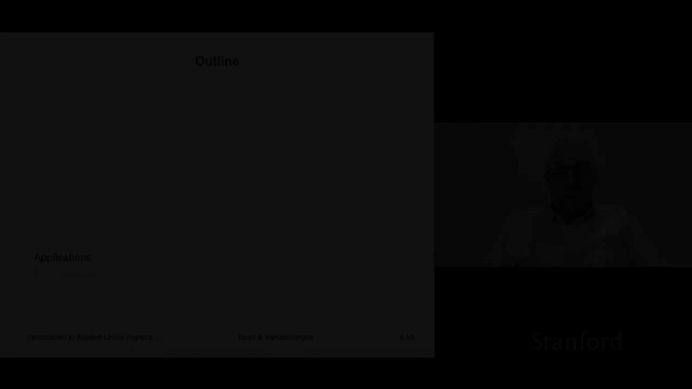
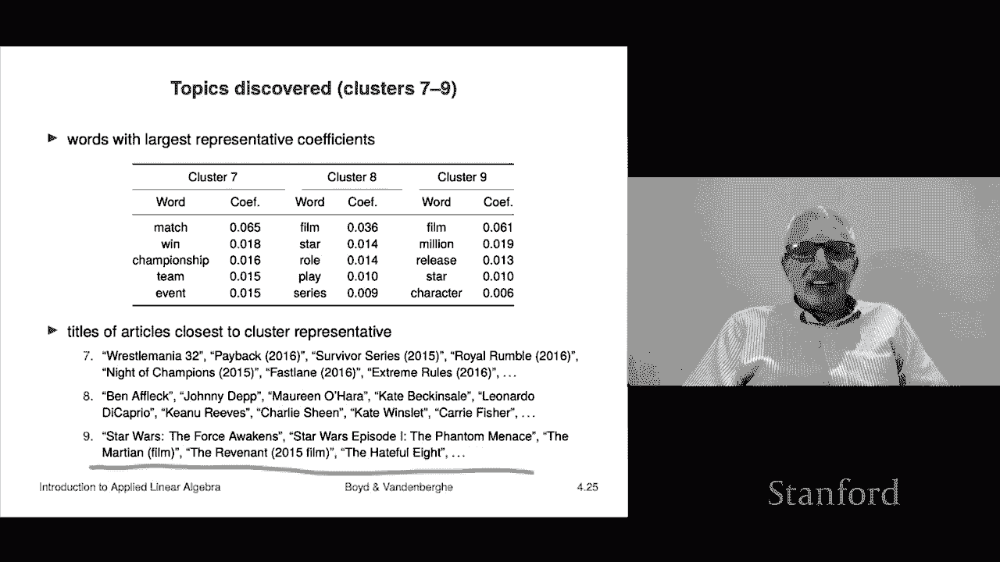

# 14：L4.2 - K均值聚类应用 📊

在本节课中，我们将学习K均值聚类算法的实际应用。我们将通过分析两个真实数据集——手写数字图像和维基百科文章——来展示K均值算法如何在不理解数据具体含义的情况下，仅基于向量和距离，发现数据中隐藏的结构和模式。

---

## 🖼️ 手写数字图像聚类

上一节我们介绍了K均值算法的基本原理，本节中我们来看看它在图像数据上的应用。我们将使用著名的MNIST数据集，该数据集包含60,000张28x28像素的手写数字灰度图像。每张图像可以表示为一个长度为784的向量，其中每个元素代表一个像素的灰度强度（我们将其归一化到0到1之间，0代表黑色）。

K均值算法对这些数据“一无所知”。它不知道这些向量代表图像，更不知道它们是数字。它仅仅看到一堆介于0和1之间的数字向量。

我们运行K均值算法，将60,000个向量聚类成20个组，并进行了20次不同初始化的尝试以寻找较好的结果。

以下是算法收敛过程的示例（图中展示了其中3次运行）：
*   红色曲线代表找到的目标函数值最差的聚类。
*   蓝色曲线代表找到的目标函数值最好的聚类。
*   这直观地表明K均值是一个启发式算法，可能无法找到全局最优解，但通常能找到足够好的近似解。

算法收敛速度很快，大约在25次迭代内完成。

运行结束后，我们得到了20个聚类中心（即代表向量）。每个中心是所有属于该聚类的图像向量的平均值。令人惊讶的是，这些中心向量可视化后，看起来非常像清晰的数字原型。

例如，其中一个聚类中心看起来像数字“0”，另一个像“1”，还有一个像“5”。算法仅仅通过分析像素灰度值的向量，就自发地将不同手写数字的图像大致区分开来。

这个实验的关键启示在于：K均值算法在完全不了解数据背景（如图像、数字概念）的情况下，仅基于向量间的数值距离，就成功发现了数据中存在的自然类别（即不同的数字）。

---

## 维基百科文章主题发现 📚

接下来，我们看一个更贴近实际应用的例子：从文档集合中自动发现主题。我们使用了500篇维基百科文章和一个包含约4,400个单词的词典。

我们采用了一种非常简单的“词袋”模型来表示每篇文章：统计词典中每个单词在文章中出现的频率，形成一个长度为4,400的向量（词频直方图）。这个表示方法非常“笨拙”，它完全忽略了单词的顺序、句法、段落结构和语义，仅仅保留了单词的计数信息。

同样，K均值算法对这些向量背后的语言含义毫无概念。我们设定将500篇文章聚类成9个主题。

我们再次运行K均值算法20次，并选择目标函数值最小（即最好）的那次聚类结果。随后，我们得到了9个聚类中心向量，每个向量代表一个“主题”的典型词频分布。

为了理解每个聚类代表什么主题，我们可以查看每个中心向量中数值最高的几个单词（即在该主题文章中最常出现的词）。

以下是其中三个聚类的分析：

**聚类一分析**
该聚类的中心向量中，权重最高的单词是：
*   fight（战斗）
*   win（获胜）
*   event（事件）
*   champion（冠军）
*   fighter（斗士）

这些单词显然与“搏击体育”相关。为了验证，我们可以找出距离这个中心最近的几篇原始文章，它们的标题是：“Floyd Mayweather Jr.”, “Kimbo Slice”等，这证实了该主题确实是关于拳击等格斗运动的。

**聚类二分析**
该聚类的中心向量中，权重最高的单词是：
*   holiday（假日）
*   celebrate（庆祝）
*   festival（节日）
*   celebration（庆典）
*   calendar（日历）

这些单词与“节日庆祝”相关。最近的文章标题包括：“Halloween”, “Diwali”, “Hanukkah”，验证了这是一个关于节日的主题。

**聚类三分析**
该聚类的中心向量中，权重最高的单词是：
*   United（联合）
*   family（家庭）
*   party（政党）
*   president（总统）
*   government（政府）

这些单词暗示了“政治与历史”主题。最近的文章包括关于“Frederick Douglass”, “Fidel Castro”等人物的页面。

我们称这个过程为“主题发现”。K均值算法仅基于词频向量，成功地将维基百科文章分成了我们人类可以理解的、有意义的主题类别，如音乐、体育、电视、电影等。

这个结果令人印象深刻，因为算法在完全不懂英语、无视所有语言结构的情况下，仅仅通过数学计算就揭示了文档集合的潜在主题结构。

此外，这个模型可以用于自动化分类。当有一篇新的维基百科文章时，我们可以计算其词频向量，然后判断它与哪个聚类中心最接近，从而自动将其归入某个已发现的主题中。

---

## 课程总结 💎

本节课中我们一起学习了K均值聚类算法的两个经典应用。

首先，我们看到了它在MNIST手写数字数据集上的表现。算法在不理解图像和数字概念的情况下，成功地将不同数字的图像聚类在一起，生成了有代表性的数字原型图像。

其次，我们探索了它在文本主题发现中的应用。通过简单的“词袋”模型将文章表示为词频向量，K均值算法成功地从500篇维基百科文章中自动发现了诸如“体育搏击”、“节日庆祝”、“政治历史”等有意义的主题，展示了仅从简单的数值特征中提取高级见解的强大能力。

这两个案例共同揭示了一个重要主题：在许多机器学习应用中，即使从看似过于简单、丢失了大量信息（如图像的二维结构、语言的语法语义）的数据表示出发，通过像K均值这样的算法，仍然能够获得有意义且有用的结果。