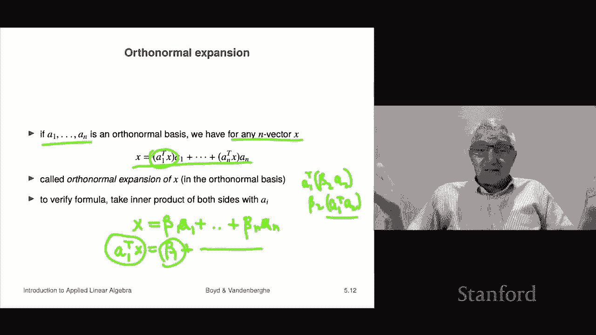

# 15：L5.1 - 线性无关 📚

在本节课中，我们将要学习线性代数中一个核心且抽象的概念——线性无关。虽然这个概念目前看起来可能不那么有趣，但好消息是，它将是贯穿本书后续内容的重要基础。随着学习的深入，其重要性会逐渐显现。本节课首先描述线性无关的含义，然后讨论一个密切相关且非常重要的概念——基。

## 线性相关与线性无关 🔍

首先，我们来定义什么是线性相关。

一个包含 K 个 n 维向量的集合 {a₁, a₂, ..., aₖ} 被称为**线性相关**，如果存在一组**不全为零**的系数 β₁, β₂, ..., βₖ，使得以下线性组合等于零向量：

**β₁a₁ + β₂a₂ + ... + βₖaₖ = 0**

这里的关键是系数不能全为零，即至少有一个 βᵢ ≠ 0。这意味着集合中至少有一个向量可以表示为其他向量的线性组合。在许多应用场景中，这表示该向量是“冗余”的。

在数学表述上，我们应说“这个向量集合是线性相关的”。虽然口语中常说“这些向量线性相关”，但严格来说，集合是单数。

### 线性相关的例子

以下是线性相关的一些具体例子：

*   **单向量集合**：仅包含一个向量 a₁ 的集合。它线性相关当且仅当 a₁ 是零向量。因为如果 a₁ = 0，我们可以取 β₁ = 2（或其他非零数），得到 2 * 0 = 0。
*   **双向量集合**：包含两个向量 a₁ 和 a₂ 的集合。它们线性相关当且仅当其中一个向量是另一个的标量倍数，几何上意味着它们位于同一条直线上。
*   **多向量集合**：对于两个以上的向量，没有简单的直观判断条件。我们稍后会学习一种算法，用于计算并判断任意向量集合是否线性相关。

例如，考虑以下三个向量：
a₁ = [1; 2; 3], a₂ = [4; 5; 6], a₃ = [7; 8; 9]
可以验证，存在一组非零系数 (1, 2, -3)，使得：
**1*a₁ + 2*a₂ + (-3)*a₃ = 0**
因此，这个三向量集合是线性相关的。这意味着其中任何一个向量（例如 a₂）都可以表示为其他向量的线性组合：
**a₂ = (-1/2)*a₁ + (3/2)*a₃**

在不同的应用领域，线性相关可能有其他名称。例如在金融中，如果现金流向量线性相关，可能被称为“复制”了某项现金流。

## 线性无关的定义 ✅

如果一个向量集合不是线性相关的，那么它就是**线性无关**的。这才是我们真正需要的核心概念。

一个向量集合 {a₁, a₂, ..., aₖ} 是**线性无关**的，当且仅当：使得线性组合 **β₁a₁ + β₂a₂ + ... + βₖaₖ = 0** 成立的**唯一**一组系数是 **β₁ = β₂ = ... = βₖ = 0**。

换句话说，你无法用一组不全为零的系数将这些向量组合成零向量。这也等价于：集合中没有任何一个向量可以表示为其他向量的线性组合。

一个经典的例子是 n 维标准单位向量 e₁, e₂, ..., eₙ 的集合。它们是线性无关的，因为要使它们的线性组合为零向量，每个向量前的系数必须为零。

## 线性无关的重要性：唯一表示法 🎯

线性无关概念的第一个重要提示是其有用性。假设一个向量 **x** 是一组线性无关向量 {a₁, a₂, ..., aₖ} 的线性组合：
**x = β₁a₁ + β₂a₂ + ... + βₖaₖ**

那么，系数 β₁, β₂, ..., βₖ 是**唯一**的。也就是说，如果 **x** 有另一种表示法 **x = γ₁a₁ + γ₂a₂ + ... + γₖaₖ**，那么必然有 **β₁ = γ₁, β₂ = γ₂, ..., βₖ = γₖ**。

这意味着，原则上我们可以从向量 **x** 本身推导出这些系数（具体方法后续会学）。证明很简单：将两个表达式相减，得到 **(β₁-γ₁)a₁ + ... + (βₖ-γₖ)aₖ = 0**。由于向量组线性无关，所有系数差必须为零，即 βᵢ = γᵢ。

## 基的概念 🏗️

上一节我们看到了线性无关如何带来唯一表示法，这自然引出了“基”这个超级重要的概念。

首先是一个关键定理（有时被称为线性代数基本定理）：在 n 维空间中，一组线性无关的向量最多有 n 个。等价地说，任意 n+1 个或更多的 n 维向量必定是线性相关的。这被称为**独立维数不等式**。

基于此，我们定义**基**：如果一组 n 个 n 维向量 {a₁, a₂, ..., aₙ} 是线性无关的，那么它被称为空间的一组**基**。

这意味着：**任何** n 维向量 **b** 都可以被**唯一地**表示为这组基向量的线性组合：
**b = β₁a₁ + β₂a₂ + ... + βₙaₙ**
这个表达式被称为向量 **b** 在基 {a₁, a₂, ..., aₙ} 下的**展开**。

一个最显然的例子是标准单位向量 e₁, e₂, ..., eₙ，它们构成一组基（称为标准基）。向量 **b** 在标准基下的展开就是：
**b = b₁e₁ + b₂e₂ + ... + bₙeₙ**
这看起来平凡，但正是基概念的体现。

## 正交与标准正交向量 📐

现在，我们来看一类性质特别好的向量——标准正交向量，它们在本书后续内容中也将扮演重要角色。

一组向量 {a₁, a₂, ..., aₖ} 被称为：
*   **相互正交**：如果其中任意两个不同向量的内积为零，即对于所有 i ≠ j，有 **aᵢᵀaⱼ = 0**。
*   **归一化**：如果每个向量的范数（长度）都为 1，即 **||aᵢ|| = 1**。
*   **标准正交**：如果它们同时满足正交和归一化两个条件。

标准正交条件可以用内积简洁地表达：对于集合中的向量，
**aᵢᵀaⱼ = 1** (如果 i = j)
**aᵢᵀaⱼ = 0** (如果 i ≠ j)

标准正交向量组一定是线性无关的（简单的计算即可证明）。根据独立维数不等式，在 n 维空间中，你不可能有超过 n 个标准正交向量。当恰好有 n 个标准正交的 n 维向量时，它们被称为一组**标准正交基**。

### 例子

*   **标准单位向量**：e₁, e₂, ..., eₙ 就是一组标准正交基。
*   **三维空间中的一组标准正交基**：例如：
    a₁ = [0; 0; -1]
    a₂ = [1/√2; 1/√2; 0]
    a₃ = [1/√2; -1/√2; 0]
    可以验证，它们两两正交，且每个长度均为 1。

## 标准正交展开式 ✨

最后，我们来看标准正交基的一个美妙性质。假设 {a₁, a₂, ..., aₙ} 是一组标准正交基。那么，对于任何 n 维向量 **x**，它在基下的展开式具有非常简单的形式：

**x = (a₁ᵀx) a₁ + (a₂ᵀx) a₂ + ... + (aₙᵀx) aₙ**

这被称为 **x** 的标准正交展开。系数 βᵢ 正好就是 **x** 与对应基向量 aᵢ 的内积。

推导很简单：因为 {aᵢ} 是基，所以 **x** 有展开式 **x = Σ βᵢ aᵢ**。将等式两边同时与 aⱼ 做内积：
左边：**aⱼᵀx**
右边：**Σ βᵢ (aⱼᵀaᵢ)**
由于标准正交性，当 i = j 时，**aⱼᵀaᵢ = 1**；当 i ≠ j 时，**aⱼᵀaᵢ = 0**。因此右边只剩下 **βⱼ * 1**。
所以 **aⱼᵀx = βⱼ**，即系数 βⱼ 等于内积 **aⱼᵀx**。

## 总结 📝

本节课我们一起学习了线性代数的核心基础概念：
1.  **线性相关/无关**：定义了向量集合中是否存在“冗余”信息。
2.  **唯一表示法**：线性无关性保证了向量在给定组下的线性组合系数是唯一的。
3.  **基**：一组能唯一表示空间中所有向量的线性无关向量，是描述空间的“坐标系”。
4.  **标准正交向量与基**：具有内积为零和长度为1的良好性质的向量，其构成的基使得向量的展开系数计算变得极其简单（就是内积）。

虽然这些概念初看可能抽象，但它们构成了后续所有线性代数应用的基石。随着课程深入，你会越来越熟悉并体会到它们的威力。