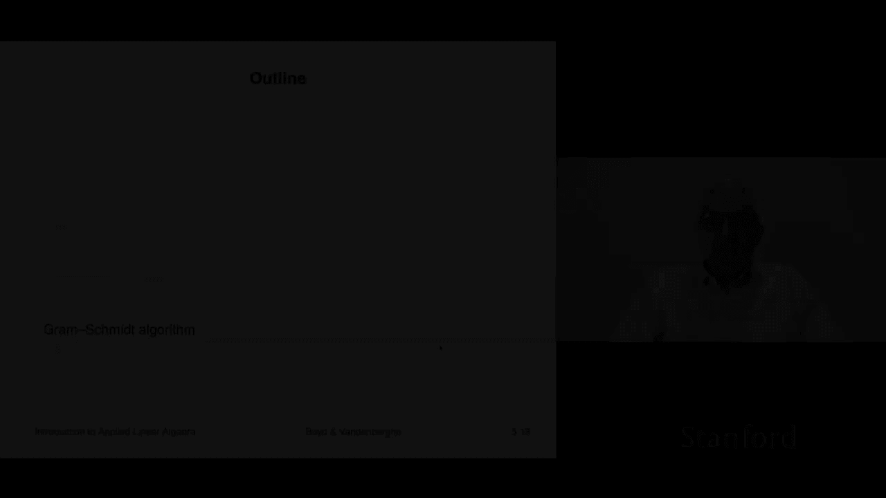
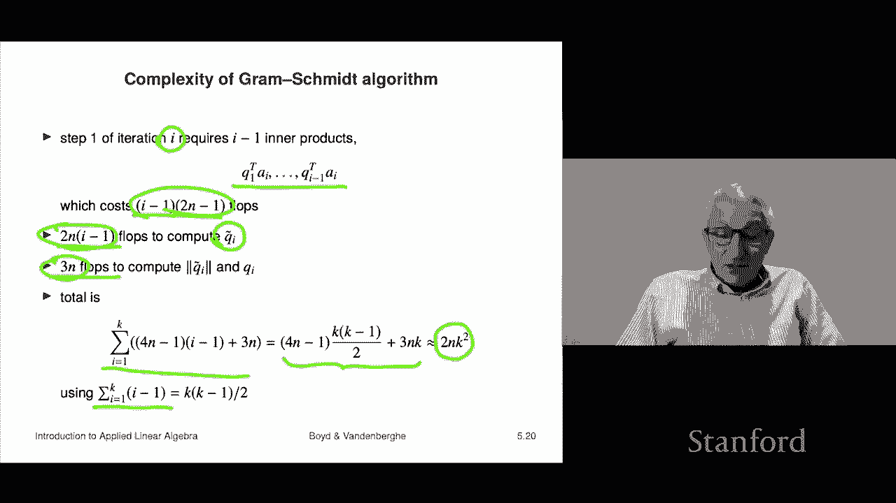

# 16：L5.2 - Gram-Schmidt 正交化 🧮




在本节课中，我们将学习一个非常著名的算法——Gram-Schmidt 正交化算法。该算法以两位数学家 Gram 和 Schmidt 的名字命名。我们将探讨它与线性独立性的关系，并了解其基本工作原理。虽然目前看来它可能有些抽象，但后续课程中我们将看到它在许多实际应用中的巨大价值。

## 算法概述

Gram-Schmidt 算法的主要目的是检测一组向量是线性相关还是线性独立。它逐个处理向量，最终生成一组正交归一化的向量。如果算法提前终止，则表明输入向量是线性相关的。

## 算法步骤详解

以下是 Gram-Schmidt 算法的具体步骤。

给定一组向量 **a₁, a₂, ..., aₖ**，算法将生成一组正交归一化向量 **q₁, q₂, ..., qₖ**。

**初始化**：算法开始时，没有已处理的正交向量。

**迭代过程**：对于第 i 个向量 **aᵢ**，执行以下操作。

1.  **正交化**：计算中间向量 **q̃ᵢ**。
    ```
    q̃ᵢ = aᵢ - (q₁ᵀaᵢ)q₁ - (q₂ᵀaᵢ)q₂ - ... - (qᵢ₋₁ᵀaᵢ)qᵢ₋₁
    ```
    这一步从 **aᵢ** 中减去其在所有已生成正交向量 **q₁** 到 **qᵢ₋₁** 方向上的投影，以确保 **q̃ᵢ** 与它们正交。

2.  **检查零向量**：判断 **q̃ᵢ** 是否为零向量。
    *   如果 **q̃ᵢ = 0**，则算法终止。这表明 **aᵢ** 是前面向量 **a₁** 到 **aᵢ₋₁** 的线性组合，因此原向量组线性相关。
    *   如果 **q̃ᵢ ≠ 0**，则继续下一步。

3.  **归一化**：将 **q̃ᵢ** 除以其范数，得到单位长度的正交向量 **qᵢ**。
    ```
    qᵢ = q̃ᵢ / ||q̃ᵢ||
    ```

如果算法处理完所有 k 个向量均未提前终止，则表明原向量组是线性独立的，并且成功生成了一组正交归一化向量 **q₁, q₂, ..., qₖ**。

## 算法示例

为了更好地理解，我们通过一个具体例子来演示算法的执行过程。

假设有两个二维向量 **a₁** 和 **a₂**。下图中的灰色圆圈表示所有范数为1的向量（单位圆）。


**第一步：处理 a₁**

*   由于没有之前的正交向量，所以 **q̃₁ = a₁**。
*   **q̃₁** 不为零，因此进行归一化：**q₁ = a₁ / ||a₁||**。
*   结果 **q₁** 是一个位于单位圆上的绿色向量（范数为1）。


**第二步：处理 a₂**

*   从 **a₂** 中减去其在 **q₁** 方向上的投影：**q̃₂ = a₂ - (q₁ᵀa₂)q₁**。图中红色向量即为 **q̃₂**。
*   可以验证，**q̃₂** 与 **q₁** 正交。
*   **q̃₂** 不为零，因此进行归一化：**q₂ = q̃₂ / ||q̃₂||**。
*   最终得到两个绿色的正交归一化向量 **q₁** 和 **q₂**。



通过这个简单的例子，我们直观地看到了 Gram-Schmidt 算法如何将任意两个向量转化为一组正交归一化的向量。

## 算法性质分析

上一节我们通过例子直观感受了算法，本节我们来分析它的一些重要数学性质。

**正交归一性**：算法输出的向量 **q₁, q₂, ..., qₖ** 是正交归一化的。这是因为在每一步的正交化过程中，我们精确地减去了 **aᵢ** 在所有先前 **q** 向量方向上的分量，确保了 **q̃ᵢ** 与它们正交。随后的归一化步骤保持了正交性，同时将范数变为1。

**线性组合关系**：
*   如果算法未提前终止，那么每个输入向量 **aᵢ** 都可以表示为 **q₁** 到 **qᵢ** 的线性组合。具体地：
    ```
    aᵢ = ||q̃ᵢ|| * qᵢ + Σ_{j=1}^{i-1} (qⱼᵀaᵢ) * qⱼ
    ```
*   反之，每个输出向量 **qᵢ** 也是输入向量 **a₁** 到 **aᵢ** 的线性组合（可通过归纳法证明）。

**提前终止的意义**：如果算法在第 j 步因 **q̃ⱼ = 0** 而终止，根据上述线性组合关系，这意味着 **aⱼ** 是 **a₁** 到 **aⱼ₋₁** 的线性组合。这正是向量组线性相关的定义。

## 算法复杂度

了解算法的计算成本对于评估其效率很重要。我们来估算一下 Gram-Schmidt 算法的浮点运算次数。

在第 i 次迭代中，需要计算：
1.  **(i-1)** 次内积，每次内积约需 **2n - 1** 次浮点运算。
2.  从 **aᵢ** 中减去 (i-1) 个向量的线性组合，约需 **2n(i-1)** 次浮点运算。
3.  计算 **q̃ᵢ** 的范数并进行归一化，约需 **3n** 次浮点运算。

将以上对所有 i 从 1 到 k 求和，并利用公式 **Σ_{i=1}^{k} (i-1) = k(k-1)/2**，可以得到总运算量的近似表达式。在复杂度分析中，我们通常只保留最高阶项（主导项）。因此，Gram-Schmidt 算法的复杂度约为：

```
~ 2nk² 次浮点运算
```

这表明算法的计算量**与向量维度 n 成线性关系**，但**与向量数量 k 的平方成正比**。当 k 较大时，计算成本会显著增加。

## 总结


本节课我们一起学习了 Gram-Schmidt 正交化算法。我们首先了解了该算法的基本目的——判断向量组的线性独立性并生成正交归一化向量。接着，我们逐步剖析了算法的三个核心步骤：正交化、零向量检查和归一化。通过一个二维向量的具体示例，我们直观地观察了算法的执行过程。然后，我们分析了算法输出的正交归一性以及输入输出向量之间的线性组合关系，并解释了算法提前终止与线性相关的联系。最后，我们讨论了算法的计算复杂度，得出其主要与向量数量的平方成正比的结论。虽然目前这个算法看起来有些理论化，但它是后续许多重要应用（如QR分解、最小二乘法等）的基础。