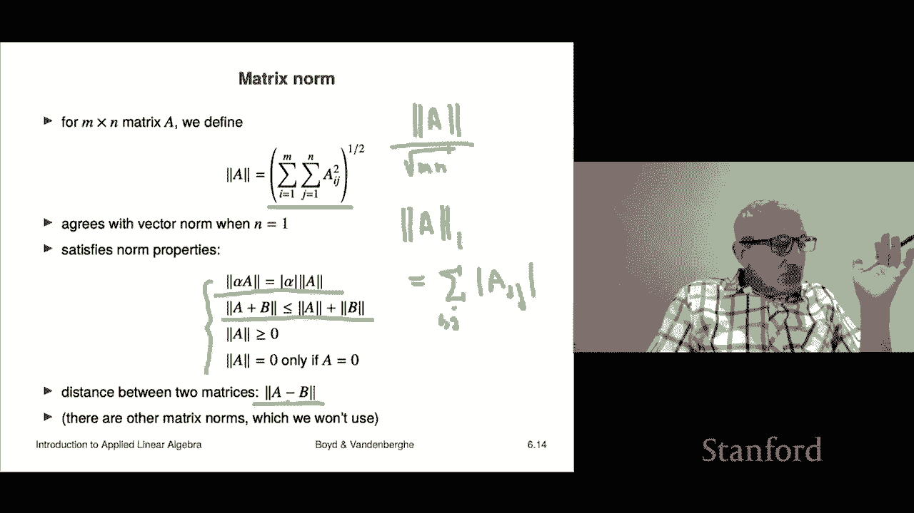

# 17：L6.1 - 矩阵标记与表示 📘


在本节课中，我们将开始学习本书的第二部分——矩阵。第一部分我们学习了向量，第三部分将涉及最小二乘法。现在，我们将从矩阵的基本记法和术语开始。

## 矩阵的基本概念 📐

矩阵是一个写在方括号内的矩形数字阵列。有时人们也会使用圆括号，但方括号是标准记法。矩阵的尺寸由行数乘以列数决定。例如，一个具有三行四列的矩阵被称为 3×4 矩阵。

矩阵内部的数字称为元素、系数或条目。我们通过行索引和列索引来引用它们。在标准数学记法中，索引从 1 开始。如果我们将一个矩阵称为 **B**，那么 **B<sub>ij</sub>** 指的是第 i 行、第 j 列的元素。例如，如果 **B<sub>23</sub>** = -0.1，则表示矩阵 **B** 中第 2 行第 3 列的元素是 -0.1。

两个矩阵相等的条件是：首先，它们必须具有相同的尺寸；其次，所有对应位置的元素必须相等。

## 矩阵的形状分类 🔲

对于一个 **m × n** 的矩阵 **A**（即 **m** 行 **n** 列），我们可以根据其形状进行分类：
*   **高矩阵**：行数多于列数（m > n）。
*   **宽矩阵**：列数多于行数（n > m）。
*   **方阵**：行数与列数相等（m = n）。

向量是矩阵的特殊情况。一个 **n** 维列向量可以看作一个 **n × 1** 的矩阵。一个 **1 × 1** 的矩阵就是一个标量。需要特别注意，**列向量**（如 `[2; -1]`）和**行向量**（如 `[2, -1]`）是不同的，在本课程中我们会严格区分这两种记法。

## 矩阵的列、行与分块 🧩

对于一个 **m × n** 的矩阵 **A**，其第 **j** 列是一个 **m** 维列向量，记作 **a<sub>j</sub>**。其第 **i** 行是一个 **n** 维行向量，记作 **b<sub>i</sub><sup>T</sup>**。

我们可以使用冒号记法表示索引范围，例如 **p:q** 表示从 p 到 q 的整数序列。这可以用来提取子矩阵。

分块矩阵是指由更小的矩阵（子矩阵）组合而成的大矩阵。组合时，水平拼接的子矩阵必须具有相同的行数，垂直堆叠的子矩阵必须具有相同的列数。例如，矩阵 **A** 可以表示为：
```
A = [ B  C ]
    [ D  E ]
```
其中 **B** 和 **C** 的行数必须相同，**B** 和 **D** 的列数必须相同，依此类推。

一个矩阵可以按列分块写作 **A = [a<sub>1</sub> a<sub>2</sub> ... a<sub>n</sub>]**，其中每个 **a<sub>j</sub>** 是一个列向量。这通常用于存储一系列向量。同样，矩阵也可以按行分块表示。

## 矩阵的应用实例 💡

矩阵在许多领域都有广泛应用，以下是一些简单例子：

*   **图像**：一张灰度图像可以表示为一个矩阵，其中每个元素代表一个像素的亮度值。
*   **数据表**：矩阵 **A<sub>ij</sub>** 可以表示第 **i** 个地点在第 **j** 天的降雨量。此时，矩阵的一列代表所有地点在某一天的降雨量（一个向量），一行代表某个地点在所有日期的降雨量（一个时间序列）。
*   **资产收益**：矩阵 **R<sub>ij</sub>** 可以表示第 **i** 个资产在第 **j** 个交易日的收益率。一列是单个资产的时间序列，一行是所有资产在某个交易日的收益率。
*   **特征矩阵**：在数据科学中，特征矩阵 **X** 的每一列 **x<sub>j</sub>** 代表一个实体（如客户）的特征向量，**X<sub>ij</sub>** 是第 **i** 个特征在第 **j** 个实体上的取值。
*   **图与关系**：一个有向图（关系）可以用邻接矩阵 **A** 表示。如果存在一条从节点 **j** 指向节点 **i** 的边，则 **A<sub>ij</sub> = 1**，否则为 **0**。

## ⭐ 特殊矩阵

*   **零矩阵**：所有元素均为 0 的矩阵，记作 **0**（可能带下标标明尺寸）。
*   **单位矩阵**：方阵，其主对角线元素均为 1，其余元素为 0，记作 **I**。例如，2×2 单位矩阵为：
    ```
    I = [1 0]
        [0 1]
    ```
*   **稀疏矩阵**：大多数元素为零的矩阵（如零矩阵、单位矩阵）。稀疏矩阵可以更高效地存储和计算。
*   **对角矩阵**：方阵，非对角线元素均为 0，记作 **diag(a<sub>1</sub>, ..., a<sub>n</sub>)**。
*   **三角矩阵**：
    *   **下三角矩阵**：主对角线以上的元素均为 0。
    *   **上三角矩阵**：主对角线以下的元素均为 0。
    *   一个矩阵如果同时是上三角和下三角矩阵，那么它就是对角矩阵。

## 矩阵基本运算 🔄

*   **转置**：矩阵 **A** 的转置记作 **A<sup>T</sup>**，通过交换行和列得到。`(A<sup>T</sup>)<sup>T</sup> = A`。列向量的转置是行向量，反之亦然。
*   **加法、减法与标量乘法**：对于同尺寸矩阵，加减法对应元素相加减。标量乘法是矩阵每个元素乘以该标量。这些运算满足结合律、交换律和分配律等性质。
*   **矩阵范数**：用于衡量矩阵的“大小”。我们主要使用 **Frobenius 范数**，定义为所有元素平方和的平方根：
    `||A|| = sqrt(Σ<sub>i</sub> Σ<sub>j</sub> A<sub>ij</sub><sup>2</sup>)`
    当 **A** 是向量时，这与向量的欧几里得范数一致。基于范数，可以定义两个矩阵之间的距离，例如 `||A - B||`。

## 总结 📝




本节课我们一起学习了矩阵的基础知识。我们介绍了矩阵的定义、记法、形状分类以及如何将其视为列向量或行向量的集合。我们还探讨了分块矩阵的概念，并列举了矩阵在图像、数据、金融和图论中的多种应用实例。最后，我们学习了零矩阵、单位矩阵、对角矩阵等特殊矩阵，以及矩阵的转置、加法、标量乘法和范数等基本运算。这些概念是后续学习更复杂矩阵运算和应用的基础。