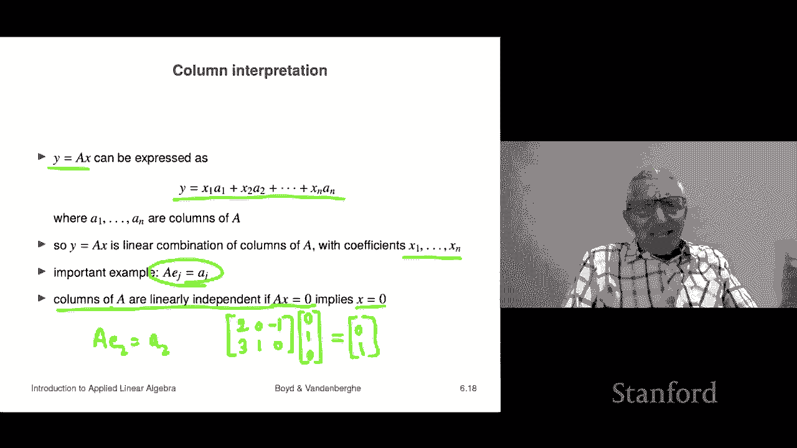

# 18：L6.2 - 矩阵向量乘法 📘


在本节课中，我们将要学习矩阵向量乘法。这是一种非常重要的运算，它将贯穿整个课程和教材。我们将从基本定义开始，逐步探讨其多种解释方式，并通过具体例子帮助理解。

## 概述

矩阵向量乘法是线性代数中的核心运算之一。它涉及一个 **m × n** 矩阵 **A** 和一个 **n** 维向量 **x** 的乘法，结果是一个 **m** 维向量 **y**。其运算规则是：结果向量 **y** 的第 **i** 个元素，等于矩阵 **A** 的第 **i** 行与向量 **x** 的内积。

用公式表示如下：
如果 **A** 是一个 **m × n** 矩阵，**x** 是一个 **n** 维向量，那么 **y = A x** 是一个 **m** 维向量，其中：
**y_i = a_i1 * x_1 + a_i2 * x_2 + ... + a_in * x_n**

## 基本运算规则

上一节我们介绍了矩阵向量乘法的基本概念。本节中，我们来看看具体的运算规则和维度匹配要求。

进行矩阵向量乘法时，矩阵的列数必须与向量的维度相匹配。即，若 **A** 是 **m × n** 矩阵，则 **x** 必须是 **n** 维向量，结果 **y** 将是 **m** 维向量。

以下是计算步骤：
1.  确认矩阵 **A** 的列数与向量 **x** 的维度相同。
2.  结果向量 **y** 的每个元素 **y_i**，通过计算矩阵 **A** 的第 **i** 行与向量 **x** 的点积得到。

让我们通过一个例子来巩固理解。

## 示例计算

假设我们有一个 **2 × 3** 的矩阵 **A** 和一个 **3** 维向量 **x**：
```
A = [ [0, 2, 1],
      [1, -1, 0] ]
x = [1, 1, -1]^T
```
计算 **y = A x**：
*   结果 **y** 将是一个 **2** 维向量。
*   **y_1** = (0 * 1) + (2 * 1) + (1 * -1) = 0 + 2 - 1 = 1
*   **y_2** = (1 * 1) + (-1 * 1) + (0 * -1) = 1 - 1 + 0 = 0
因此，**y = [1, 0]^T**。

## 行视角解释

理解了基本计算后，我们可以从不同角度来解读矩阵向量乘法。首先，从行的视角来看。

矩阵向量乘法可以看作是依次取矩阵的每一行，与向量 **x** 做内积。如果我们将矩阵 **A** 的每一行记为行向量 **b_i^T**，那么运算可以表示为：
**y = [ b_1^T • x, b_2^T • x, ..., b_m^T • x ]^T**
其中 **•** 表示内积运算。

以下是一个重要的特例：
*   当 **x** 是全1向量（即所有元素都为1）时，**A x** 的结果就是矩阵 **A** 的**各行元素之和**。
例如：
```
A = [ [0, 1, -1],
      [2, 0, 1] ]
1 = [1, 1, 1]^T
A * 1 = [ (0+1-1), (2+0+1) ]^T = [0, 3]^T
```
结果向量的第一个元素0是第一行的和，第二个元素3是第二行的和。

## 列视角解释

除了行视角，列视角为我们提供了另一种深刻的理解方式，它关联了我们之前学过的线性组合概念。

矩阵向量乘法 **y = A x** 也可以解释为：结果向量 **y** 是矩阵 **A** 的各列向量的线性组合，组合系数由向量 **x** 的元素给出。
如果 **a_1, a_2, ..., a_n** 是矩阵 **A** 的列向量，那么：
**y = x_1 * a_1 + x_2 * a_2 + ... + x_n * a_n**

以下是一个关键的例子：
*   用矩阵 **A** 乘以第 **j** 个单位向量 **e_j**（即第 **j** 个元素为1，其余为0的向量），结果恰好是矩阵 **A** 的第 **j** 列。
用公式表示：**A * e_j = a_j**

让我们验证一下：
```
A = [ [0, -1, 3],
      [1, 0, 2] ]
e_2 = [0, 1, 0]^T
A * e_2 = [ (0*0 + -1*1 + 3*0), (1*0 + 0*1 + 2*0) ]^T = [-1, 0]^T
```
结果 **[-1, 0]^T** 正是矩阵 **A** 的第二列。

## 与线性独立性的关联

最后，我们来看看矩阵向量乘法如何用简洁的矩阵符号来表达线性独立性这一重要概念。

一组向量线性独立，意味着它们的任何线性组合等于零向量时，所有系数必须为零。用矩阵向量乘法的语言可以紧凑地表述为：
矩阵 **A** 的列向量是线性独立的，当且仅当方程 **A x = 0** 的唯一解是 **x = 0**。

这可以做一个类比：对于数字，如果 **a * x = 0** 且 **a ≠ 0**，那么必然有 **x = 0**。矩阵的线性独立性条件 **A x = 0 ⇒ x = 0** 在某种意义上类似于“矩阵 **A** 可以被‘消去’”，这暗示了 **A** 的列向量之间没有冗余的依赖关系。我们将在后续课程中深入探讨这一思想。

## 总结




本节课中我们一起学习了矩阵向量乘法。
我们首先学习了其基本定义和计算规则，即用矩阵的每一行与向量做内积。
接着，我们从**行视角**将其理解为一系列内积运算，从**列视角**将其理解为列向量的线性组合，并看到了乘以单位向量可以选取特定列的例子。
最后，我们了解了如何用 **A x = 0** 这一简洁的矩阵方程来刻画列向量的线性独立性。
掌握矩阵向量乘法的这些多种视角，是理解后续更复杂线性代数概念的基础。