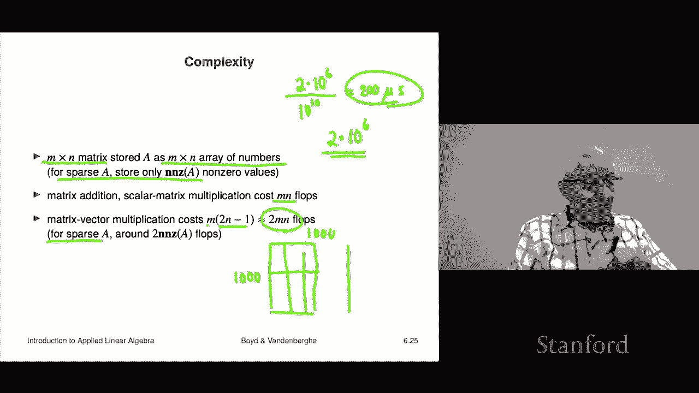

# 19：L6.3 - 矩阵向量乘法示例 🧮


在本节课中，我们将通过一系列具体的例子来学习矩阵向量乘法。这些例子将帮助我们理解矩阵向量乘法在不同领域（如数据处理、金融、特征评分等）的实际应用，并建立从矩阵形式到其实际功能的双向理解能力。

---

## 概述

矩阵向量乘法是线性代数中的核心运算。本节我们将看到，这个看似抽象的运算能简洁地描述许多实际问题，例如计算投资组合收益、对数据进行去均值处理、计算时间序列的连续差值等。理解这些例子，有助于我们将来看到一个新矩阵时，能快速推断其功能。

---

## 基础示例

首先，我们来看两个非常基础的例子，它们展示了矩阵向量乘法的边界情况。

*   **零矩阵**：任何向量与零矩阵相乘，结果都是零向量。
    *   公式：`0 * x = 0`
    *   这里，`0` 是零矩阵，`x` 是向量，结果 `0` 是零向量。

*   **单位矩阵**：任何向量与单位矩阵相乘，得到向量本身。单位矩阵是一个方阵，其主对角线元素为1，其余元素为0。
    *   公式：`I * x = x`
    *   例如，一个4x4的单位矩阵乘以向量 `[x1, x2, x3, x4]`，结果仍然是 `[x1, x2, x3, x4]`。单位矩阵的作用类似于数字1。

---

## 内积的矩阵表示

在向量部分的课程中，我们将两个向量 `a` 和 `b` 的内积写作 `a^T * b`。现在我们可以用矩阵向量乘法的视角来理解这个记号。

*   `a^T` 将一个 `n` 维列向量转置为 `1 x n` 的行向量。
*   这个行向量与 `n` 维列向量 `b` 进行矩阵乘法，结果是一个 `1 x 1` 的矩阵，我们将其视为一个标量（数字）。
*   因此，内积的记号 `a^T * b` 与矩阵向量乘法的规则完全一致。

---

## 应用示例：数据预处理

现在，我们来看一些更有实际意义的例子。第一个例子是关于数据预处理中的“去均值”操作。

### 去均值矩阵

对一个向量 `x` 进行去均值操作，意味着计算 `x` 所有元素的平均值，然后从每个元素中减去这个平均值。这可以通过一个特定的矩阵 `A` 与 `x` 相乘来实现。

设 `x` 是一个 `n` 维向量。去均值操作 `x_tilde = x - avg(x)` 等价于 `x_tilde = A * x`，其中矩阵 `A` 定义为：
`A = I - (1/n) * 11^T`
（这里 `I` 是单位矩阵，`1` 是全1向量）。

**它的作用**：矩阵 `A` 乘以向量 `x`，会生成一个新的向量，其每个元素都是原向量对应元素减去所有元素的平均值。这个矩阵常被称为“去均值矩阵”。

**双向理解**：我们应该培养这样的能力：看到一个矩阵（如去均值矩阵），能说出它的功能；反之，听到一个功能（如“去均值”），能构想出对应的矩阵形式。

---

### 差分矩阵

另一个常见的矩阵是差分矩阵 `D`，它非常稀疏（大部分元素为0）。

对于一个 `n` 维向量 `x`，`(n-1) x n` 的差分矩阵 `D` 定义为：
```
D = [-1,  1,  0, ...,  0]
    [ 0, -1,  1, ...,  0]
    ...
    [ 0,  0, ..., -1,  1]
```

**它的作用**：`D * x` 的结果是一个 `(n-1)` 维向量，其第 `i` 个元素是 `x_{i+1} - x_i`。也就是说，它计算了向量中连续元素之间的差值。

**应用场景**：如果 `x` 代表一个时间序列（例如每日降雨量），那么 `D*x` 就表示每日的变化量。正数表示增加，负数表示减少。这在信号处理、金融分析中非常有用。

---

#### 狄利克雷能量

基于差分矩阵，我们可以定义一个称为“狄利克雷能量”的量，它是 `D*x` 的范数平方：
`Energy = ||D*x||^2 = sum_{i=2}^{n} (x_i - x_{i-1})^2`

**它的含义**：狄利克雷能量衡量了时间序列 `x` 的“波动性”或“崎岖程度”。
*   如果 `x` 是常数向量（所有元素相同），能量为0。
*   如果 `x` 剧烈上下波动（如 `[+10, -10, +10, ...]`），能量会很高。

---

## 应用示例：金融分析

在金融领域，矩阵向量乘法可以优雅地描述投资组合的收益计算。

*   **设定**：设 `R` 是一个 `T x n` 的资产收益矩阵。
    *   行（`T`）代表连续的时间段（如交易日）。
    *   列（`n`）代表不同的资产（资产池）。
    *   因此，`R_{ij}` 表示在第 `i` 个时间段，资产 `j` 的收益率。
*   **投资组合**：用一个 `n` 维向量 `w` 表示一个投资组合，其元素 `w_j` 代表投资在资产 `j` 上的权重。权重之和通常为1（表示100%配置），且允许负权重（代表做空）。
*   **组合收益**：投资组合在整个时间序列上的收益率向量，可以通过简单的矩阵乘法得到：
    `portfolio_returns = R * w`
    *   结果是一个 `T` 维向量，第 `i` 个元素代表投资组合在第 `i` 个时间段的收益率。

**示例**：假设有3个交易日，2种资产，收益矩阵 `R` 和投资组合权重 `w = [0.5, 0.5]`（等权重投资）。
```
R = [ 0.02, -0.01 ]
    [ 0.03,  0.01 ]
    [-0.04,  0.01 ]

R * w = [ (0.02*0.5 + (-0.01)*0.5) ] = [ 0.005 ]
        [ (0.03*0.5 +  0.01 *0.5) ]   = [ 0.02  ]
        [ (-0.04*0.5 + 0.01 *0.5) ]   = [ -0.015]
```
结果向量 `[0.005, 0.02, -0.015]` 就是该投资组合在这三天的日收益率序列。

**进一步分析**：得到 `portfolio_returns` 后，我们可以计算其平均值（组合的平均回报）和标准差（组合的风险），从而对不同投资组合 `w` 进行评价和比较。

---

## 应用示例：特征评分系统

矩阵向量乘法也可用于构建评分系统，例如信用评分。

*   **设定**：设 `X` 是一个 `N x n` 的特征矩阵，用于描述 `N` 个个体（如申请人）。
    *   每一列代表一个个体，是一个 `n` 维特征向量（例如：年收入、负债比、历史违约次数等）。
*   **权重向量**：设 `w` 是一个 `n` 维权重向量，表示每个特征在总分中的重要程度。
*   **评分计算**：所有个体的评分可以通过以下运算得到：
    `scores = X^T * w`
    *   **注意维度检查**：`X^T` 是 `n x N`，`w` 是 `n x 1`，结果 `scores` 是 `N x 1`。直接写 `X * w` 是维度不匹配的，这是需要养成的“语法检查”习惯。
    *   实际上，第 `i` 个个体的评分就是其特征向量 `x_i` 与权重向量 `w` 的内积：`score_i = x_i^T * w`。

**可解释性**：权重 `w_j` 的大小和正负直接解释了特征 `j` 的影响。例如，如果“近5年破产记录”是一个取值为0或1的特征，我们预期其对应的权重为很大的负数，因为破产记录会显著降低信用评分。

---

## 通用解释：输入-输出系统

矩阵向量乘法可以抽象地理解为一种**输入-输出**系统或**映射**。

*   **公式**：`y = A * x`
*   **解释**：
    *   `x` 被视为**输入**或**动作**。
    *   `y` 被视为**输出**或**结果**。
    *   矩阵 `A` 定义了从输入到输出的映射规则。
*   **矩阵元素的意义**：`A_{ij}` 这个数值，表示第 `j` 个输入 `x_j` 对第 `i` 个输出 `y_i` 的影响因子。
    *   如果 `A_{ij} = 0`，则 `y_i` 不依赖于 `x_j`。
    *   如果 `A_{ij}` 是大的正数，则 `x_j` 增加会显著提高 `y_i`。
    *   如果 `A_{ij}` 是大的负数，则 `x_j` 增加会显著降低 `y_i`。
*   **特殊结构**：如果矩阵 `A` 是下三角矩阵（即主对角线上方元素全为0），则意味着输出 `y_i` 只依赖于输入 `x_1, x_2, ..., x_i`。在时间序列背景下，这体现了**因果性**——当前的输出只依赖于当前及过去的输入，而不依赖于未来的输入。

---

## 计算复杂度分析

最后，我们粗略估算一下矩阵运算的计算成本（以浮点运算次数 FLOPs 衡量）。

1.  **矩阵存储**：
    *   **稠密矩阵**：存储为一个 `m x n` 的数组。
    *   **稀疏矩阵**：通常只存储非零元素的位置和值（例如使用坐标列表）。
2.  **基本运算成本**：
    *   **矩阵加法**：`C = A + B` 需要 `m*n` 次加法。≈ `mn` FLOPs。
    *   **标量乘矩阵**：`B = α * A` 需要 `m*n` 次乘法。≈ `mn` FLOPs。
    *   **矩阵转置**：`B = A^T` 理论上需要 `0` 次浮点运算，因为它只涉及数据移动。但这不代表没有时间开销。
3.  **矩阵向量乘法**：
    *   **稠密矩阵**：`y = A * x`（`A` 为 `m x n`）。
        *   计算每个 `y_i` 需要计算一个 `n` 维内积，约 `2n` 次运算（`n` 次乘，`n` 次加）。
        *   总共约 `2 * m * n` FLOPs。
    *   **稀疏矩阵**：成本与非零元素数量成正比，远低于 `2mn`。
4.  **实例估算**：
    *   假设有一个 `1000 x 1000` 的资产收益矩阵 `R`（1000天，1000种资产）和一个 `1000` 维的投资组合权重 `w`。
    *   计算 `R * w` 需要约 `2 * 10^6` FLOPs。
    *   在一台每秒能进行 `10^10` FLOPs（100亿次）的笔记本电脑上，此计算大约需要 `2 * 10^{-4}` 秒，即 **200微秒**。
    *   这意味着，一秒钟内可以评估超过5000个不同的投资组合。这展示了矩阵运算在现代计算中的高效性。

---

## 总结




本节课我们一起学习了矩阵向量乘法的多个具体示例。我们从基础的单位矩阵和零矩阵出发，探讨了其在数据去均值、时间序列差分计算中的应用。接着，我们看到了它在金融领域用于计算投资组合收益，在评分系统中用于计算特征加权得分。我们还学习了将矩阵乘法抽象为输入-输出系统的通用解释，并最后分析了其计算复杂度。通过这些例子，我们认识到矩阵向量乘法不仅仅是一个抽象的代数运算，更是一个强大且高效的工具，能够简洁、清晰地描述和解决现实世界中的诸多问题。掌握这些例子，是培养线性代数直觉和应用能力的重要一步。