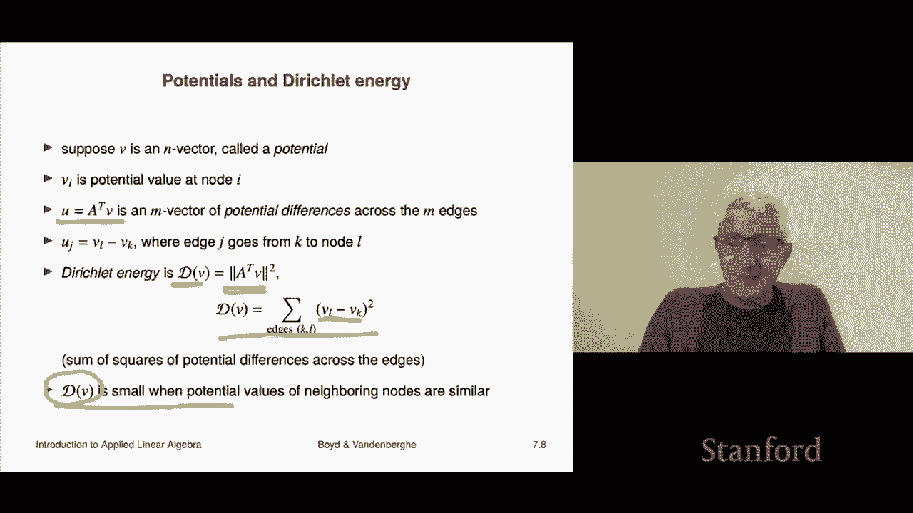

# 21：L7.2 - 关联矩阵 📊

在本节课中，我们将学习一种在众多领域中频繁出现的矩阵——图的关联矩阵。我们将了解其基本定义、结构，并探讨它在描述网络流和节点势能方面的应用。

***

## 关联矩阵的定义 🧠

上一节我们介绍了矩阵的基本概念，本节中我们来看看如何用矩阵来描述一个图。

一个图通常由顶点（或称为节点）和连接顶点的有向边（或称为链接、分支）组成。我们考虑一个有 `n` 个顶点和 `m` 条边的图。

关联矩阵 `A` 是一个 `n` 行 `m` 列的矩阵，它将图的结构信息编码其中。其定义如下：

*   矩阵的行索引 `i` 对应图中的第 `i` 个顶点。
*   矩阵的列索引 `j` 对应图中的第 `j` 条边。
*   矩阵元素 `A[i][j]` 的值由边 `j` 与顶点 `i` 的关系决定：
    *   如果边 `j` **指向** 顶点 `i`，则 `A[i][j] = +1`。
    *   如果边 `j` **从** 顶点 `i` 指出，则 `A[i][j] = -1`。
    *   如果边 `j` 与顶点 `i` 无关，则 `A[i][j] = 0`。

根据定义，每条边连接且仅连接两个顶点（一个起点，一个终点）。因此，关联矩阵的每一列都恰好包含一个 `+1` 和一个 `-1`，其余元素均为 `0`。

***

## 关联矩阵示例 📝

为了更直观地理解，我们来看一个具体的例子。下图展示了一个包含4个顶点和5条边的有向图。

其对应的关联矩阵 `A` 如下所示：

让我们来解读这个矩阵：

*   **列的含义**：每一列描述一条边。例如，第一列 `[ -1, +1, 0, 0 ]^T` 对应边1，它从顶点1（`-1`）出发，指向顶点2（`+1`）。
*   **行的含义**：每一行聚焦于一个顶点，描述了与该顶点相关的所有边。例如，第三行 `[ 0, 0, +1, -1, -1 ]` 对应顶点3。其中的 `+1` 表示边3指向该顶点（流入），`-1` 表示边4和边5从该顶点指出（流出），`0` 表示边1和边2与该顶点无关。

***

## 关联矩阵与网络流 🌊

在理解了关联矩阵的结构后，我们来看看它在描述网络流时的应用。

在许多场景中（如交通、电力、物流网络），图可以表示一个网络，边上的数值 `x_j` 可以表示流量（如车流、电流、货物流）。我们定义一个流量向量 `x`，它是一个 `m` 维向量，`x_j` 表示边 `j` 上的流量。通常约定：`x_j > 0` 表示流量方向与边的方向一致；`x_j < 0` 则表示流量方向与边的方向相反。

当我们用关联矩阵 `A` 左乘流量向量 `x` 时，会发生一件非常有趣的事情：

`y = A * x`

结果 `y` 是一个 `n` 维向量。它的第 `i` 个分量 `y_i` 等于流入顶点 `i` 的总流量减去流出顶点 `i` 的总流量，即顶点 `i` 的**净流入流量**。

例如，在上图的例子中，对于顶点2，计算 `y_2`：
`y_2 = (来自边1的流入 x1) - (从边3的流出 x3) = x1 - x3`

***

## ⚖️ 流量守恒与环流

基于上述理解，一个非常重要的方程是：

`A * x = 0`

这个方程被称为**流量守恒**方程。它意味着对于图中的每一个顶点，流入的总流量等于流出的总流量，净流量为零。在电路理论中，这对应于基尔霍夫电流定律。

满足 `A * x = 0` 的流量向量 `x` 被称为一个**环流**。环流在图中形成闭合的循环。例如，在我们的示例图中，一个可能的环流是：`x = [1, 0, 1, 1, 0]^T`，它对应着沿路径 2 -> 3 -> 1 -> 2 的循环流动。

***

## 关联矩阵的转置与节点势能 🔋

除了描述流量，关联矩阵的转置 `A^T` 也有重要的物理意义。

现在我们引入一个 `n` 维向量 `v`，称为**势能向量**（或电势向量）。`v_i` 表示顶点 `i` 的势能值（如电压、高度、压力）。

当我们用 `A^T` 左乘势能向量 `v` 时：

`d = A^T * v`

结果 `d` 是一个 `m` 维向量。它的第 `j` 个分量 `d_j` 恰好等于边 `j` 两端顶点之间的势能差。在电路中，这就是边（元件）两端的电压降。

***

## Dirichlet 能量 📏

与势能相关的一个有趣概念是 **Dirichlet 能量**，其定义为：

`D(v) = || A^T * v ||^2 = Σ_{(i,j)是边} (v_i - v_j)^2`

这个公式对所有边求和，计算每条边两端势能差的平方和。

Dirichlet 能量衡量了势能 `v` 在整个图上的“平滑”或“起伏”程度：
*   当 `v` 是常数向量（所有顶点势能相同）时，`D(v) = 0`。
*   `D(v)` 的值越小，说明势能 `v` 在图上的变化越平缓；值越大，则说明变化越剧烈。

这个概念在图像处理、机器学习等领域有广泛应用。

***

## 课程总结 🎯

本节课中我们一起学习了图的关联矩阵。

我们首先定义了关联矩阵 `A`，它用 `+1`、`-1` 和 `0` 精确描述了图中顶点与边的关系。接着，我们探讨了它的两种核心应用：
1.  **描述网络流**：`A * x` 计算了每个节点的净流量，方程 `A * x = 0` 对应着流量守恒定律和环流。
2.  **描述节点势能**：`A^T * v` 计算了每条边上的势能差，由此引出的 Dirichlet 能量 `|| A^T * v ||^2` 可以衡量势能在图上的平滑程度。

关联矩阵是连接图论与线性代数的一个强大工具，在电路分析、网络优化、数据科学等众多领域都发挥着基础性作用。

