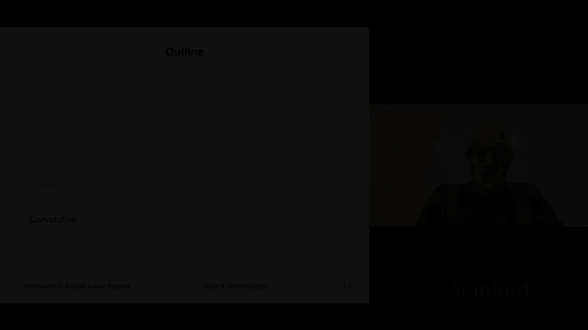
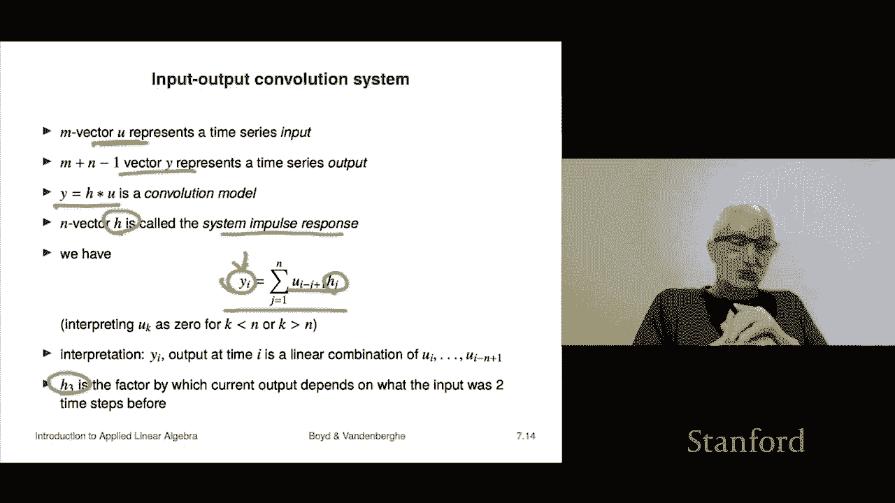

# 22：L7.3 - 卷积与矩阵 📘

在本节课中，我们将要学习**卷积**的概念。卷积是一种在概率论、信号处理等多个领域都会出现的数学运算，理解它非常重要。

## 卷积的定义 📖

上一节我们介绍了卷积的基本概念，本节中我们来看看它的具体定义。

给定一个 **N** 维向量 **A** 和一个 **M** 维向量 **B**，它们的卷积（用星号 `*` 表示）是一个 **N+M-1** 维的向量 **C**。向量 **C** 的每个元素 **C_k** 由以下公式给出：

**C_k = Σ_{i+j=k+1} A_i * B_j**

这个公式的含义是：对于 **C** 的第 **k** 个元素，我们需要将所有满足 **i + j = k + 1** 条件的 **A_i** 和 **B_j** 相乘，然后将这些乘积相加。

## 一个具体例子 🔍

为了更好地理解，让我们看一个具体的例子。假设 **A** 是一个4维向量，**B** 是一个3维向量。

以下是计算卷积 **C = A * B** 的步骤：
*   **C₁** 是 **i+j=2** 的所有乘积之和，只有 **A₁B₁** 一种组合。
*   **C₂** 是 **i+j=3** 的所有乘积之和，有 **A₁B₂** 和 **A₂B₁** 两种组合。
*   **C₃** 是 **i+j=4** 的所有乘积之和，有 **A₁B₃**、**A₂B₂** 和 **A₃B₁** 三种组合。
*   以此类推，直到计算出所有 **N+M-1** 个元素。

## 卷积与多项式乘法 🧮

看到这里，你可能会觉得卷积的规则很复杂。但实际上，卷积有一个非常直观的解释：**它就是多项式乘法**。

我们可以把向量 **A** 看作是多项式 **P(x)** 的系数，把向量 **B** 看作是多项式 **Q(x)** 的系数。那么，两个多项式相乘得到的新多项式 **R(x) = P(x) * Q(x)**，其系数向量恰好就是 **A** 和 **B** 的卷积结果 **C**。

这个解释让卷积的许多性质变得显而易见。例如：
*   **交换律**：`A * B = B * A`，因为多项式乘法满足交换律。
*   **结合律**：`(A * B) * C = A * (B * C)`，因为多项式乘法满足结合律。
*   **零元性质**：只有当 **A** 或 **B** 为零向量时，卷积结果才为零向量。

## 卷积的矩阵表示 🧱

上一节我们看到了卷积与多项式乘法的关系，本节中我们来看看如何用矩阵来表示卷积运算。

卷积运算 **C = A * B** 可以写成矩阵向量乘法的形式：**C = T(B) * A**。其中，**T(B)** 是一个特殊的矩阵，称为 **托普利茨矩阵**。

托普利茨矩阵的特点是：**矩阵的每条对角线上的元素都相同**。对于一个给定的向量 **B**，我们可以构造出对应的 **T(B)** 矩阵，用它乘以向量 **A**，就能得到卷积结果 **C**。

## 卷积的实际应用 🌐

理解了卷积的基本原理后，我们来看看它在现实世界中的两个重要应用场景。

### 时间序列平滑

在时间序列分析中，卷积常被用来进行平滑处理。例如，如果我们有一个表示每日股价的向量 **X**，用一个元素均为 `1/3` 的3维向量 **A** 与之进行卷积，得到的新序列 **Y** 就是**3日移动平均线**。

以下是其效果：
*   每个 **Y_k** 都是 **X** 中连续三个值的平均值。
*   这能有效平滑掉数据中的短期波动和噪声，让长期趋势更清晰。
*   在金融、经济学中，5日、20日、200日移动平均线是非常常用的分析工具。

### 线性时不变系统

在系统理论与信号处理中，卷积是描述**线性时不变系统**输入输出关系的核心模型。

考虑一个系统，其输入时间序列为 **U**，输出时间序列为 **Y**。对于许多物理系统（如电路、机械结构、热传导），其输出可以表示为输入与一个特定向量 **H** 的卷积：**Y = H * U**。

以下是相关概念：
*   **H** 被称为系统的**冲激响应**或**卷积核**。
*   这个公式表明，系统在**当前时刻**的输出，是**过去多个时刻**的输入经过加权（权重由 **H** 决定）后的叠加。
*   这种模型在控制工程、信号处理、图像处理等领域无处不在。

## 总结 📝

本节课中我们一起学习了卷积运算。我们从其定义公式出发，通过具体例子理解了计算过程。更重要的是，我们掌握了卷积的核心本质——**多项式乘法**，这解释了它的交换律和结合律等性质。我们还学习了如何用**托普利茨矩阵**来表示卷积运算。最后，我们探讨了卷积在两个重要领域的应用：**时间序列的平滑处理**（如移动平均）和**线性时不变系统的建模**。卷积是一个连接代数、系统理论和数据处理的关键概念。