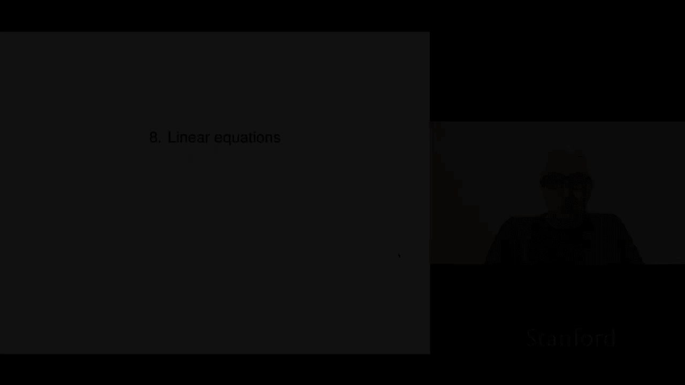
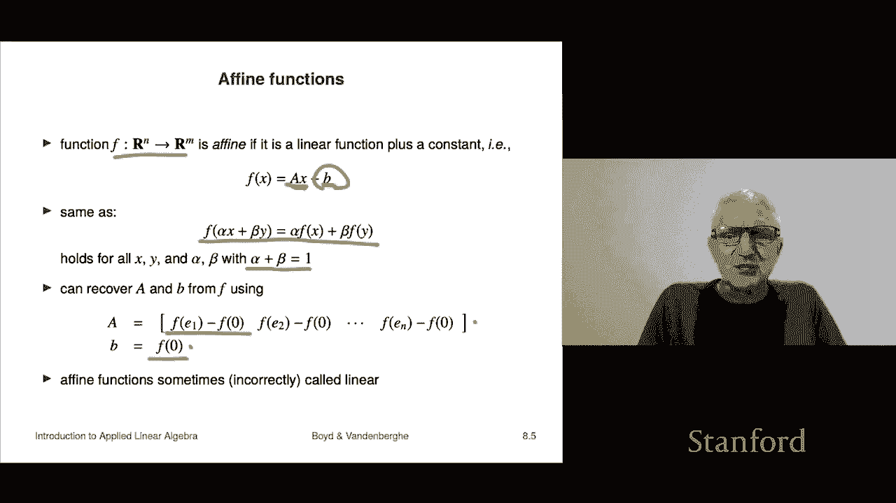

# 23：L8.1 - 线性函数 📘

在本节课中，我们将学习线性函数的核心概念。线性函数是一种将向量映射到向量的特殊函数，它在数学和许多应用领域中都非常重要。我们将从定义开始，探讨其性质，并通过具体例子来加深理解。

## 线性函数定义 📖

线性函数是一种映射，它将一个 n 维向量转换为一个 m 维向量。这种映射关系可以表示为 **F: Rⁿ → Rᵐ**。这意味着函数 F 接受一个 n 维向量作为输入，并输出一个 m 维向量。

我们可以用多种方式表示这个函数。例如，可以将其写为 **f(x) = [f₁(x), f₂(x), ..., fₘ(x)]**，其中每个 fᵢ(x) 都是函数的一个分量。或者，我们也可以明确写出输入向量的各个分量，即 **f(x₁, x₂, ..., xₙ)**。

## 叠加性质 🔍

线性函数的核心特征是满足**叠加性质**。对于任意 n 维向量 **x** 和 **y**，以及任意标量 **α** 和 **β**，如果函数 F 满足以下等式，则它是线性的：

**F(αx + βy) = αF(x) + βF(y)**

这个性质表明，先对输入向量进行线性组合再应用函数，与先应用函数再对结果进行线性组合，得到的结果是相同的。换句话说，线性函数与线性组合运算是可交换的。

上一节我们介绍了线性函数的定义，本节中我们来看看如何验证一个函数是否满足叠加性质。我们需要对等式两边进行语法检查，确保所有运算（如标量乘法、向量加法）在维度上都是合法的。

## 矩阵向量乘法：典型的线性函数 🧮

一个最典型且重要的线性函数是矩阵向量乘法。给定一个 m×n 矩阵 **A**，我们可以定义一个函数 **f(x) = Ax**。这个函数将 Rⁿ 映射到 Rᵐ。

我们可以验证它满足叠加性质：
**f(αx + βy) = A(αx + βy) = αAx + βAy = αf(x) + βf(y)**

事实上，任何线性函数都可以表示为矩阵向量乘法的形式。矩阵 **A** 的列向量就是函数在标准基向量 **e₁, e₂, ..., eₙ** 上的输出值，即 **A = [f(e₁) f(e₂) ... f(eₙ)]**。

这个性质有重要的应用价值。例如，如果我们知道一个映射是线性的，那么只需要通过 n 次实验（对每个基向量应用函数）就能确定整个矩阵 A。之后，对于任意输入向量，我们只需进行矩阵乘法就能得到结果，而无需再次进行实验。

## 线性函数示例 📊

以下是识别和理解线性函数的一些具体例子。

以下是反转函数的例子。该函数将一个向量 **x = [x₁, x₂, ..., xₙ]** 的顺序完全颠倒，输出 **f(x) = [xₙ, xₙ₋₁, ..., x₁]**。这是一个线性函数，其对应的矩阵 A 是一个“反转矩阵”，其第 i 行是第 (n-i+1) 个单位向量。

以下是累加和函数的例子。该函数计算输入向量的累积和，即 **f(x) = [x₁, x₁+x₂, x₁+x₂+x₃, ..., Σxᵢ]**。这也是一个线性函数，其对应的矩阵 A 是一个下三角矩阵，所有下三角元素均为 1。这个函数在金融分析中很有用，例如，将现金流向量转换为累积现金流向量。

## ➕ 仿射函数

仿射函数与线性函数密切相关，它是线性函数加上一个常数项。一个函数 **F: Rⁿ → Rᵐ** 是仿射的，如果它可以写成 **F(x) = Ax + b** 的形式，其中 **A** 是一个 m×n 矩阵，**b** 是一个 m 维向量。

仿射函数满足一个受限的叠加性质：仅当系数 **α** 和 **β** 满足 **α + β = 1** 时，等式 **F(αx + βy) = αF(x) + βF(y)** 才成立。这种线性组合通常被称为“混合”。

与线性函数类似，任何仿射函数都可以通过计算 **F(0)** 和 **F(e₁), F(e₂), ..., F(eₙ)** 来唯一确定矩阵 A 和向量 b。需要注意的是，在日常用语中，人们有时会不严格地将仿射函数也称为“线性”函数。

## 课程总结 🎯

本节课中我们一起学习了线性函数的核心内容。我们首先定义了从 Rⁿ 到 Rᵐ 的线性函数，并深入探讨了其关键的叠加性质。我们了解到，矩阵向量乘法是线性函数的典型代表，并且任何线性函数都可以用矩阵来表示。通过反转函数和累加和函数的例子，我们练习了如何识别和用矩阵描述线性函数。最后，我们介绍了仿射函数作为线性函数的推广，它是线性函数加上一个常数偏移。掌握这些概念是理解更复杂线性代数主题的基础。