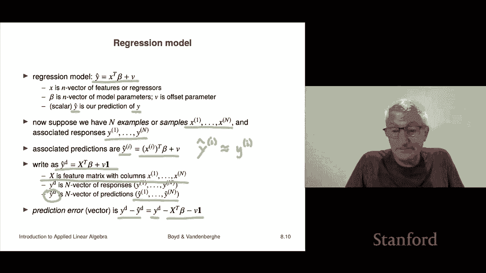

# 24：L8.2 - 线性函数模型 📘

在本节课中，我们将学习线性函数模型。线性模型是许多应用领域的基础，它们用于近似描述输入向量与输出向量之间的关系。我们将探讨线性模型在不同场景下的应用，包括经济学、微积分以及统计学中的回归模型。

---

## 线性模型的应用场景 📈

在许多应用中，输入向量与输出向量之间的关系通常可以近似为线性关系。这种近似有时非常精确，有时则适用于特定范围。

*   在某些领域，如电磁学或声学，线性近似可以达到极高的精度。
*   在飞机动力学中，对于常规飞行范围内的速度和角度变化，力和力矩的关系可以很好地用线性模型近似。
*   在计量经济学模型中，线性近似可能误差较大，但仍然非常有用，例如能预测变化方向（正负号）就具有价值。

---

## 示例一：经济学中的价格需求弹性模型 🛒

上一节我们介绍了线性模型的普遍性，本节中我们来看看一个具体的经济学例子。

我们假设市场中有 `n` 种商品或服务。商品的市场价格构成一个 `n` 维向量 `p`，需求量构成另一个 `n` 维向量 `d`。

我们关注价格和需求的**相对变化**。对于第 `i` 种商品，其价格相对变化 `δp_i` 定义为：
`δp_i = (p_i_new - p_i) / p_i`
这表示价格的百分比变化（例如，`+0.1` 表示价格上涨 10%）。

同样，需求的相对变化 `δd_i` 定义为：
`δd_i = (d_i_new - d_i) / d_i`

价格与需求之间的关系由一个称为**弹性矩阵** `E` 的 `n×n` 矩阵来描述。模型公式为：
`δd = E * δp`

这个矩阵的每个元素都具有明确的经济学解释：

以下是弹性矩阵 `E` 中元素的含义：
*   `E_11 = -0.3`：如果商品1的价格上涨1%，则商品1的需求预计下降0.3%。这反映了商品自身的价格弹性。
*   `E_12 = +0.1`：如果商品2的价格上涨1%，则商品1的需求预计上升0.1%。这表明商品1和商品2是**替代品**。
*   `E_23 = -0.05`：如果商品3的价格上涨1%，则商品2的需求预计下降0.05%。这表明商品2和商品3是**互补品**。

这个线性模型对于小的价格变化预测效果很好，被广泛用于分析定价策略对需求的影响，进而评估利润和供应链规划。

---

## ∫ 示例二：微积分中的一阶泰勒近似

线性模型的另一个重要来源是微积分。对于可微函数，一阶泰勒展开提供了在局部最佳的线性近似。

假设有一个可微函数 `f: R^n → R^m`。在点 `z` 附近，函数 `f` 的一阶泰勒近似 `f̂` 可以表示为：
`f̂(x) = f(z) + Df(z) * (x - z)`

其中：
*   `Df(z)` 是一个 `m×n` 矩阵，称为在点 `z` 处的**导数矩阵**或**雅可比矩阵**。
*   其第 `i` 行是第 `i` 个分量函数 `f_i` 在点 `z` 处的梯度向量的转置。
*   矩阵的第 `(i, j)` 个元素是偏导数 `∂f_i / ∂x_j` 在点 `z` 处的值。

我们可以将这个近似写成标准仿射函数的形式：
`f̂(x) = (Df(z)) * x + (f(z) - Df(z)*z)`
这里，`A = Df(z)`，`b = f(z) - Df(z)*z`。因此，一阶泰勒展开是产生仿射函数的一个通用方法。

---

## 示例三：统计学与机器学习中的回归模型 📊

最后，我们来看线性模型在统计学和机器学习预测中的核心应用——回归模型。

基本的线性回归模型形式如下：
`ŷ = x^T * β + v`
其中：
*   `x` 是一个 `n` 维向量，代表特征或回归变量。
*   `β` 是一个 `n` 维向量，代表模型参数（权重）。
*   `v` 是一个标量，代表偏移参数（截距）。
*   `ŷ` 是预测的标量输出，旨在近似真实观测值 `y`。

当我们拥有一个包含 `N` 个样本的数据集时，情况如下：
*   我们有特征向量 `x_1, ..., x_N`。
*   以及对应的真实响应值 `y_1, ..., y_N`。

对于每个样本，我们可以计算其预测值：
`ŷ_i = x_i^T * β + v`

为了进行整体分析，我们可以将数据**堆叠**成矩阵和向量形式：
*   定义真实响应向量 `y_data = (y_1, ..., y_N)`。
*   定义特征矩阵 `X`，其第 `i` 列是特征向量 `x_i`（注意：有些领域习惯将 `x_i` 作为行向量，此时矩阵为 `X^T`，原理相同）。
*   则所有样本的预测向量可以简洁地表示为：
    `ŷ_data = X^T * β + v * 1`
    其中 `1` 是一个所有元素为1的 `N` 维向量。

预测误差向量定义为：
`e = y_data - ŷ_data`
误差的均方根值（RMS）可以用来衡量模型在整个数据集上的预测精度。例如，RMS误差为0.1意味着模型的预测平均来看偏差约为±0.1。

> **请注意**：本节课我们主要关注如何解释和理解一个给定的回归模型。如何从数据中**拟合**出最优的参数 `β` 和 `v`（即“训练模型”），将是本课程后续章节的重点内容。

---

## 总结 📝

本节课中我们一起学习了线性函数模型及其在多个领域的应用：
1.  在经济学中，我们使用**弹性矩阵** `E` 构建了 `δd = E * δp` 模型，来分析价格变动对需求的线性影响。
2.  在微积分中，函数的一阶泰勒展开 `f̂(x) = f(z) + Df(z)*(x-z)` 提供了在局部最有效的线性近似。
3.  在统计学和机器学习中，线性回归模型 `ŷ = x^T * β + v` 是进行预测的基础工具，我们可以将数据集堆叠后用矩阵向量形式 `ŷ_data = X^T * β + v * 1` 统一表示。

这些线性模型虽然简单，但因其可解释性强、数学处理方便，成为理解和分析复杂系统关系的重要起点。