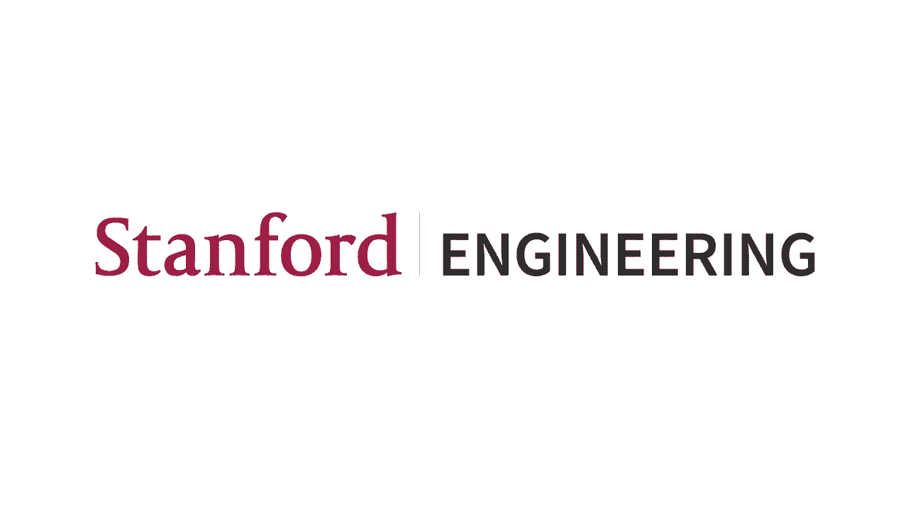
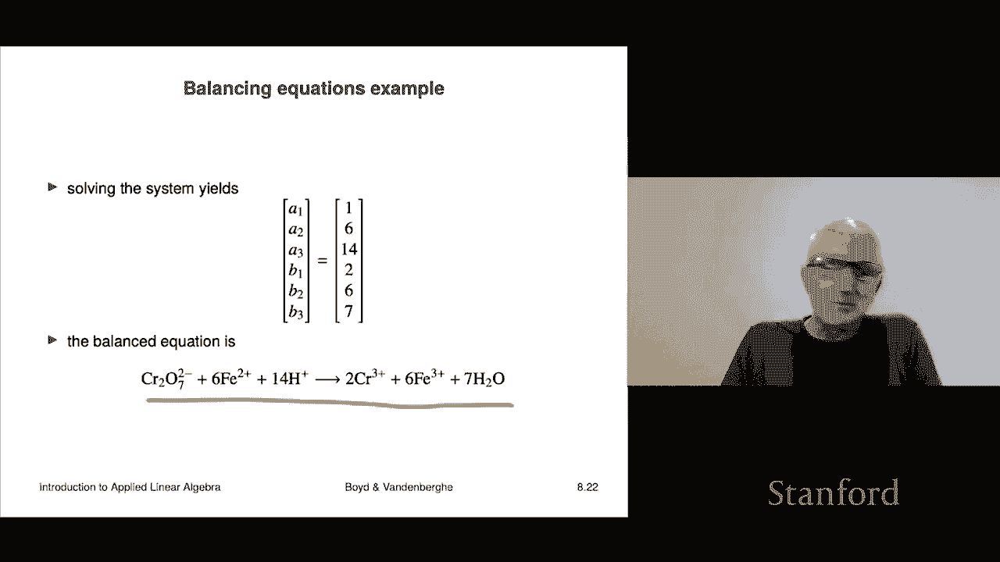
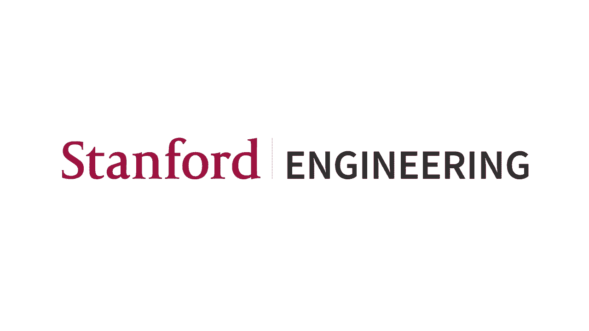

# 25：L8.3 - 线性方程组 📘

在本节课中，我们将要学习线性方程组，或者更准确地说，是线性方程组系统。我们将看到，使用矩阵和向量符号可以非常方便地表示这些系统。

## 概述

线性方程组是数学和许多应用科学中的基础概念。它涉及多个线性方程，每个方程包含多个变量。通过矩阵表示法，我们可以将复杂的方程组简化为一个紧凑的形式，从而更容易进行分析和求解。

## 线性方程组的矩阵表示

一个线性方程组包含 `M` 个方程和 `n` 个变量。变量通常记为 `x₁, x₂, ..., xₙ`。每个方程的形式如下：

**A₁₁x₁ + A₁₂x₂ + ... + A₁ₙxₙ = b₁**

这里，`Aᵢⱼ` 是系数，`bᵢ` 是常数项。

如果我们把所有变量 `x₁` 到 `xₙ` 收集成一个向量 **x**，这个向量被称为方程组的**未知数向量**或**变量向量**。

系数 `Aᵢⱼ` 可以排列成一个 `M × n` 的矩阵 **A**，这个矩阵被称为方程组的**系数矩阵**。

同样地，常数项 `b₁` 到 `bₘ` 可以收集成一个向量 **b**，这个向量传统上被称为**右侧向量**。

于是，整个线性方程组可以非常简洁地用矩阵向量形式表示为：

**A x = b**

这个表示法非常强大。例如，一个包含 5000 个变量和 3000 个方程的庞大系统，也可以用这四个字符 **A x = b** 来概括。这与单个标量方程 `a x = b` 在形式上相似，但求解方法完全不同。标量方程的解是 `x = b / a`，而矩阵方程的解则需要更复杂的方法，我们将在课程后续部分学习。

## 线性方程组的分类

根据系数矩阵 **A** 的维度，我们可以对线性方程组进行分类：

以下是三种主要类型：

1.  **欠定系统**：当 `M < n` 时，即方程数量少于变量数量。系数矩阵 **A** 是一个“宽”矩阵（列数多于行数）。
2.  **方阵系统**：当 `M = n` 时，即方程数量等于变量数量。系数矩阵 **A** 是一个方阵。
3.  **超定系统**：当 `M > n` 时，即方程数量多于变量数量。系数矩阵 **A** 是一个“高”矩阵（行数多于列数）。

这些名称的含义在后续学习中会变得更加清晰。

## 解的概念

一个向量 **x** 如果满足 **A x = b**，即它同时满足所有 `M` 个方程，那么它就被称为该线性方程组的**解**。

根据系数矩阵 **A** 和右侧向量 **b** 的不同，一个线性方程组可能有零个解、恰好一个解，或者无穷多个解。在本课程结束时，我们将能够完整地分析这些情况，更重要的是，我们将学会如何实际计算解（尤其是在解唯一的情况下）。

## 应用实例：配平化学方程式

为了展示线性方程组在实际问题中的应用，我们来看一个来自化学的例子：配平化学方程式。

一个化学反应涉及 `P` 种反应物和 `Q` 种生成物。化学反应式通常写作：
**a₁R₁ + ... + aₚRₚ → b₁P₁ + ... + b_qP_q**
这表示消耗 `a₁` 个单位分子 `R₁`，...，`aₚ` 个单位分子 `Rₚ`，生成 `b₁` 个单位分子 `P₁`，...，`b_q` 个单位分子 `P_q`。系数 `aᵢ` 和 `bⱼ` 通常是正整数。

化学反应必须遵循**质量守恒定律**，即每种原子在反应前后的总数必须相等。这就是“配平”方程式的含义。

### 建立数学模型

假设反应涉及 `M` 种原子。

我们定义一个 `M × P` 的**反应物矩阵 R**，其中 `Rᵢⱼ` 表示在第 `j` 种反应物分子中，第 `i` 种原子的数量。

定义反应物系数向量 **a** = `[a₁, ..., aₚ]ᵀ`。

那么，**R a** 的结果是一个 `M` 维向量，其第 `i` 个分量表示所有反应物中第 `i` 种原子的总数。

类似地，我们定义一个 `M × Q` 的**生成物矩阵 P**，以及生成物系数向量 **b** = `[b₁, ..., b_q]ᵀ`。

那么，**P b** 表示所有生成物中各种原子的总数。

质量守恒定律要求：**R a = P b**

为了将其转化为标准的线性方程组形式 **A x = b**（注意此处的 **b** 是常数项向量，与生成物系数向量 **b** 不同），我们进行如下操作：

1.  将守恒式改写为：**R a - P b = 0**
2.  使用分块矩阵将其表示为：
    **[R | -P] * [a; b] = 0**
    这里 `[a; b]` 表示将向量 **a** 和 **b** 上下堆叠成一个长向量，`[R | -P]` 表示将矩阵 **R** 和 `-P` 左右拼接。
3.  然而，**a = 0, b = 0** 总是上述方程的一个解（即不进行任何反应），但这没有意义。为了找到一个非零解，我们需要额外设定一个条件。通常，我们可以指定第一种反应物的系数 `a₁ = 1`。
4.  将条件 `a₁ = 1` 也写成一个方程：**e₁ᵀ a = 1**，其中 **e₁** 是第一个元素为1，其余为0的单位向量。
5.  最终，我们将质量守恒方程和这个附加方程组合起来，得到一个 `(M+1)` 个方程、`(P+Q)` 个变量的线性方程组：
    **[[R, -P]; [e₁ᵀ, 0ᵀ]] * [a; b] = [0; 1]**
    这就是标准的 **A x = b** 形式。

### 具体例子：水的电解

水的电解反应为：**? H₂O → ? H₂ + ? O₂**
我们需要找到系数 `x, y, z` 使得：**x H₂O → y H₂ + z O₂**

设原子种类为氢(H)和氧(O)，则：
*   反应物矩阵 **R** (H₂O): H原子数=2， O原子数=1。所以 **R** = `[2, 1]ᵀ`（这里P=1）。
*   生成物矩阵 **P** (H₂, O₂): 对于H₂: H=2, O=0；对于O₂: H=0, O=2。所以 **P** = `[[2, 0], [1, 2]]`。
*   设 **a** = `[x]`, **b** = `[y; z]`。
*   质量守恒：**R a = P b** -> `[2; 1] * x = [[2, 0]; [1, 2]] * [y; z]`
*   展开得方程组：
    *   对于H原子：`2x = 2y + 0z` -> `2x = 2y`
    *   对于O原子：`1x = 0y + 2z` -> `x = 2z`
*   我们还需要设定一个系数，令 `x = 1`（即1份水分子）。
*   代入方程：由 `2*1 = 2y` 得 `y=1`；由 `1 = 2z` 得 `z=0.5`。
*   为了得到整数系数，将所有系数乘以2：`x=2, y=2, z=1`。
*   因此，配平后的方程式为：**2 H₂O → 2 H₂ + O₂**

### 更复杂的例子

考虑一个更复杂的氧化还原反应（如图）：
**? Cr₂O₇²⁻ + ? Fe²⁺ + ? H⁺ → ? Cr³⁺ + ? Fe³⁺ + ? H₂O**

这里涉及铬(Cr)、氧(O)、铁(Fe)、氢(H)四种原子以及电荷。我们可以按照上述通用方法，构建一个6×6的线性方程组（5种原子/电荷 + 1个设定条件）。求解该方程组（我们将在后续课程中学到方法），即可得到配平的系数：**1, 6, 14, 2, 6, 7**。

因此，配平后的方程式为：
**Cr₂O₇²⁻ + 6Fe²⁺ + 14H⁺ → 2Cr³⁺ + 6Fe³⁺ + 7H₂O**

## 总结

本节课我们一起学习了线性方程组的基本概念。我们首先介绍了如何用矩阵向量形式 **A x = b** 来简洁地表示一个线性方程组系统。接着，我们根据方程与变量数量的关系，将系统分为欠定、方阵和超定三类。然后，我们探讨了“解”的定义以及解可能存在的不同情况（无解、唯一解、无穷多解）。最后，我们通过“配平化学方程式”这一具体应用实例，详细展示了如何将一个实际问题建模并转化为线性方程组 **A x = b** 的形式。这个例子充分说明了线性方程组在化学、物理、工程、经济学等众多领域的广泛应用。在接下来的课程中，我们将重点学习如何求解这些方程组。