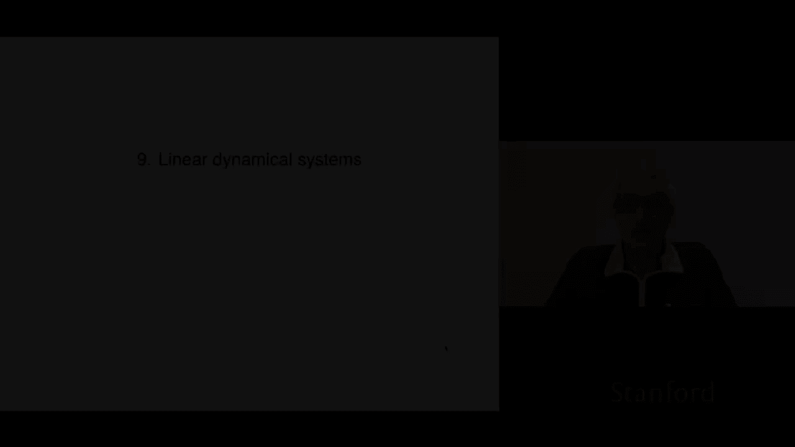
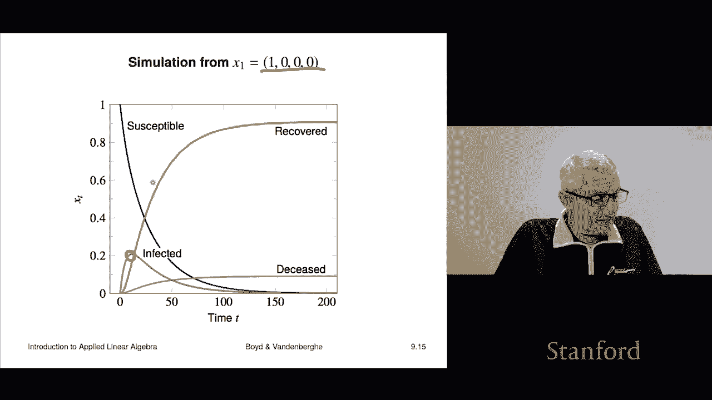

# 26：L9 - 动态系统 🚀

在本节课中，我们将学习线性动态系统。这是一个在许多领域都有广泛应用的重要概念，其核心本质仅涉及我们已经掌握的矩阵向量乘法。

## 什么是线性动态系统？

上一节我们介绍了课程主题，本节中我们来看看线性动态系统的具体定义。

我们有一个由 n 维向量组成的序列，记作 **x₁, x₂, x₃, ...**。下标 t 通常表示时间或周期，例如天、小时或金融中的交易日。**xₜ** 被称为在时间 t 的**状态**，整个序列被称为**状态轨迹**。

如果 t 表示当前时间，那么：
*   **xₜ** 是当前状态。
*   **xₜ₋₁** 是前一个状态。
*   **xₜ₊₁** 是下一个状态。

状态 **xₜ** 可以代表许多事物，例如人口年龄分布、经济产出或机械系统中的位置和速度。

线性动态系统遵循一种特殊形式，它表示下一个状态是通过当前状态乘以一个矩阵得到的：

**xₜ₊₁ = Aₜ xₜ**

其中 **Aₜ** 是一个 n×n 矩阵，通常称为**动态矩阵**或**更新矩阵**。其元素 **Aₜᵢⱼ** 表示当前状态的第 j 个分量对下一个状态第 i 个分量的影响程度。

在许多情况下，矩阵 A 不随时间变化，此时系统被称为**线性时不变动态系统**。其公式简化为：

**xₜ₊₁ = A xₜ**

这可以解释为一种递归关系。通过反复进行矩阵向量乘法，我们可以模拟系统状态的未来演化。

以下是动态系统的一些常见变体：

*   **带输入和偏移的系统**：公式为 **xₜ₊₁ = Aₜ xₜ + Bₜ uₜ + cₜ**。其中 **uₜ** 是输入（如控制信号），**Bₜ** 是输入矩阵，**cₜ** 是偏移量。
*   **K阶马尔可夫模型**：公式为 **xₜ₊₁ = A₁ xₜ + A₂ xₜ₋₁ + ... + Aₖ xₜ₋ₖ₊₁**。这表明下一个状态依赖于当前及之前多个时刻的状态，K 被称为系统的**记忆长度**。

状态的定义是：它是过去信息的**摘要**，足以预测未来。在基本线性动态系统中，**xₜ** 本身就是状态。在 K 阶马尔可夫模型中，状态是 **xₜ, xₜ₋₁, ..., xₜ₋ₖ₊₁** 的集合。

## 实例一：人口动态学 👥

了解了基本概念后，我们来看一个实际应用：人口动态学模型。这是一个简化但能揭示核心思想的例子。

我们设定时间 t 以**年**为单位。状态 **xₜ** 是一个 100 维向量，代表一个国家的人口年龄分布：

**xₜ = (xₜ₁, xₜ₂, ..., xₜ₁₀₀)ᵀ**

其中 **xₜᵢ** 表示在第 t 年，年龄为 i-1 岁的人口数量（i=1 对应 0 岁，i=100 对应 99 岁）。为简化，假设无人能活过 99 岁。

要计算总人口，可使用向量内积：**1ᵀ xₜ**。要计算特定年龄区间（如 70 岁及以上）的人口，可构造一个选择向量 **c**（前 70 个元素为 0，后 30 个元素为 1），然后计算 **cᵀ xₜ**。

我们需要找到动态矩阵 **A**，使得 **xₜ₊₁ = A xₜ**。这需要定义出生率和死亡率。

*   **出生率向量 b**：bᵢ 表示一个 i-1 岁个体在一年内平均生育的子女数。
*   **死亡率向量 d**：dᵢ 表示 i-1 岁个体在一年内死亡的比例（d₁₀₀ = 1）。

根据这些定义，可以推导出矩阵 **A**：

1.  下一年 0 岁人口数 = 本年度总出生数 = **bᵀ xₜ**。因此，**A** 的第一行就是 **bᵀ**。
2.  下一年 i 岁人口数（i=1,...,99） = 本年度 i-1 岁人口数 × (1 - 死亡率 dᵢ)。因此，**A** 的第 i+1 行在第 i 列有一个元素 (1-dᵢ)，其余为 0。

由此得到的矩阵 **A** 非常稀疏（100×100 中仅 199 个非零元），它被称为**伴随矩阵**。每一行代表如何计算下一年特定年龄的人数，每一列代表当前特定年龄群体对下一年的贡献（顶部是生育贡献，下方是存活贡献）。

假设 **A** 是时不变的，并给定 2010 年（t=1）的初始人口分布 **x₁**，我们可以通过迭代计算 **x₂ = A x₁**, **x₃ = A x₂**, ... 来模拟未来年份的人口分布，例如预测 2020 年的情况。这种模型可用于规划学校、养老设施等。

## 实例二：流行病动力学 🦠

现在，我们来看另一个例子：流行病动力学。当前背景下，这是一个非常相关的话题。

我们介绍一个高度简化的 **SIR 模型**。状态 **xₜ** 是一个 4 维向量，表示在时间 t（例如每天），人群中处于不同健康状态的比例：

**xₜ = [ susceptibleₜ, infectedₜ, recoveredₜ, deceasedₜ ]ᵀ**

*   **易感者**：可能感染疾病。
*   **感染者**：当前患有疾病。
*   **康复者**：曾感染且现已免疫。
*   **死亡者**：因疾病去世。

我们需要定义每天人群状态转移的概率。假设一个简化的每日转移规则：
*   易感者：5% 被感染，95% 保持易感。
*   感染者：1% 死亡，10% 康复并获得免疫，4% 康复但不获得免疫（重新变为易感者），85% 保持感染状态。
*   康复者（免疫）：100% 保持免疫（假设免疫永久）。
*   死亡者：100% 保持死亡状态。

根据这些规则，我们可以构建一个 4×4 的动态矩阵 **A**，使得 **xₜ₊₁ = A xₜ**。矩阵 **A** 的每个元素 **Aᵢⱼ** 表示当前处于状态 j 的人，在下一天转移到状态 i 的比例。

例如：
*   **A₁₁ = 0.95**：今天易感者，明天仍易感的比例。
*   **A₁₂ = 0.04**：今天感染者，明天变为易感者的比例（康复但无免疫）。
*   **A₄₂ = 0.01**：今天感染者，明天死亡的比例。

通过仔细审核矩阵的每个元素，可以确保它准确反映了我们定义的转移规则。

假设初始时刻所有人都是易感者：**x₁ = [1, 0, 0, 0]ᵀ**。通过迭代计算 **xₜ₊₁ = A xₜ**，我们可以模拟疫情的演变。

模拟结果可能显示：感染人数迅速上升，达到峰值（如占人群的 20%），然后由于部分人口死亡或获得免疫（群体免疫效应），感染人数开始下降。康复者（免疫）的比例会逐渐增加。这个简单模型展示了如何用线性动态系统来分析和预测疫情的发展趋势。

---

本节课中我们一起学习了线性动态系统的基本概念。我们了解到，它通过状态向量和动态矩阵来描述系统随时间的变化，核心运算是矩阵向量乘法。我们探讨了人口动态学和流行病动力学两个实例，看到了如何将实际问题建模为 **xₜ₊₁ = A xₜ** 的形式，并通过迭代乘法来模拟系统的未来状态。这种框架是控制理论、经济学、生态学等众多领域的基础。