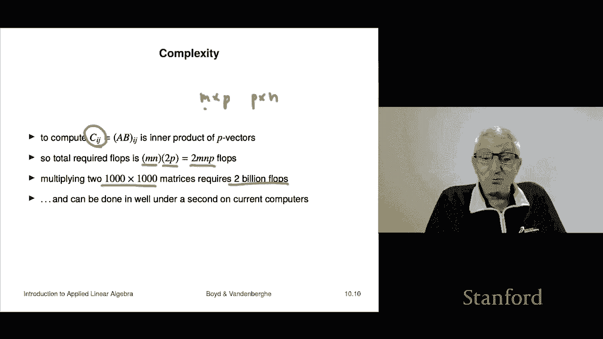

# 27：L10.1 - 矩阵乘法 🧮

在本节课中，我们将学习矩阵乘法的定义、性质、多种解释以及其计算复杂度。矩阵乘法是线性代数中的核心运算，它将两个矩阵组合成一个新的矩阵。

---

## 矩阵乘法的定义

上一节我们介绍了矩阵与向量的乘法，本节中我们来看看两个矩阵之间如何相乘。

如果有一个 **M × P** 的矩阵 **A** 和一个 **P × N** 的矩阵 **B**，并且矩阵 **A** 的列数 **P** 等于矩阵 **B** 的行数 **P**，那么我们可以将 **A** 和 **B** 相乘，得到一个新的 **M × N** 矩阵 **C**，记作 **C = AB**。

矩阵 **C** 的第 **i** 行第 **j** 列元素 **C_ij** 的计算公式如下：

**C_ij = Σ (A_ik * B_kj)**，其中 **k** 从 1 求和到 **P**。

简单来说，要得到 **C** 的第 **(i, j)** 个元素，需要取 **A** 的第 **i** 行和 **B** 的第 **j** 列，计算它们对应元素的乘积之和（即内积）。

---

## 矩阵乘法示例

以下是计算矩阵乘积的步骤说明。

首先，进行语法检查：确保第一个矩阵的列数等于第二个矩阵的行数。例如，一个 **2×3** 的矩阵 **A** 可以乘以一个 **3×2** 的矩阵 **B**，因为中间维度 **3** 匹配。结果 **C** 将是一个 **2×2** 的矩阵。

让我们计算一个具体例子。假设：
**A = [[-1, 3, 2], [1, -1, 0]]**
**B = [[5, -1], [0, -2], [1, 0]]**

计算 **C_11**（结果矩阵第一行第一列）：
取 **A** 的第一行 **[-1, 3, 2]** 和 **B** 的第一列 **[5, 0, 1]**，计算内积：**(-1)*5 + 3*0 + 2*1 = -5 + 0 + 2 = -3**。

计算 **C_22**（结果矩阵第二行第二列）：
取 **A** 的第二行 **[1, -1, 0]** 和 **B** 的第二列 **[-1, -2, 0]**，计算内积：**1*(-1) + (-1)*(-2) + 0*0 = -1 + 2 + 0 = 1**。

按照此规则可以计算出结果矩阵的所有元素。

---

## 作为特例的其他乘法

矩阵乘法是更一般的运算，我们之前学过的几种乘法都可以看作是它的特例。

*   **标量乘法**：标量 **α** 乘以向量 **x**。虽然从维度上看不是标准的矩阵乘法（因为 **α** 是 **1×1**，**x** 是 **n×1**），但如果写成 **xα**（向量在右），则符合矩阵乘法规则。不过，传统上我们总是将标量写在左边。
*   **内积**：两个 **n** 维向量 **a** 和 **b** 的内积 **a^T b**。这里 **a^T** 是 **1×n** 的行向量，**b** 是 **n×1** 的列向量，相乘得到一个 **1×1** 的矩阵（即标量）。
*   **矩阵向量乘法**：矩阵 **A (m×n)** 乘以向量 **x (n×1)**，得到向量 **b (m×1)**。这可以看作是矩阵乘法 **Ax** 的特例。
*   **外积**：两个向量 **a (m×1)** 和 **b (n×1)** 的外积是 **a b^T**。这里 **a** 是 **m×1**，**b^T** 是 **1×n**，相乘得到一个 **m×n** 的矩阵，其元素是 **a_i * b_j**。

---

## 矩阵乘法的性质

了解矩阵乘法的性质对于正确操作矩阵至关重要。以下是其主要性质（假设所有乘法和加法在维度上都合法）：

*   **结合律**：**(AB)C = A(BC)**。这意味着多个矩阵相乘时，乘法的结合顺序不影响结果，我们可以直接写作 **ABC**。
*   **分配律**：**A(B + C) = AB + AC**。注意，这里的 **B** 和 **C** 必须维度相同才能相加。
*   **转置性质**：**(AB)^T = B^T A^T**。乘积的转置等于各自转置后以相反顺序相乘。**切记：(AB)^T ≠ A^T B^T**，后者通常维度不匹配且结果错误。
*   **单位矩阵**：**AI = A** 且 **IA = A**。其中 **I** 是适当维度的单位矩阵（左乘和右乘的 **I** 维度可能不同）。
*   **不可交换性**：这是最关键的一点。**一般情况下，AB ≠ BA**。即使两个乘积都有定义，结果也通常不同。只有当两个矩阵**可交换**时，等式才成立（例如，任意矩阵与同阶单位矩阵相乘）。

---

## 分块矩阵乘法

矩阵乘法可以按分块进行，这有时能简化计算或揭示结构。

假设我们将矩阵 **A** 和 **B** 分块为 **2×2** 的分块矩阵：
**A = [[A, B], [C, D]]**, **B = [[E, F], [G, H]]**
那么它们的乘积 **AB** 可以按照类似标量矩阵的规则计算，但注意块之间的乘法顺序不可交换：
**AB = [[AE+BG, AF+BH], [CE+DG, CF+DH]]**

这要求所有涉及的分块矩阵乘法在维度上都是合法的。

---

## 矩阵乘法的多种解释

矩阵乘法可以从不同角度理解，每种解释在不同场景下都很有用。

### 列视角解释

如果将矩阵 **B** 按列拆分，即 **B = [b1, b2, ..., bn]**，那么乘积 **AB** 可以理解为：
**AB = [A b1, A b2, ..., A bn]**
也就是说，**AB** 的每一列都是矩阵 **A** 乘以 **B** 的对应列。这可以看作是对 **B** 的所有列进行“批量”的矩阵-向量乘法。

这种视角的一个应用是紧凑地表示多个具有相同系数矩阵的线性方程组。方程组 **Ax_i = b_i**（i=1 to k）可以合并写作 **AX = B**，其中 **X** 的列是 **x_i**，**B** 的列是 **b_i**。

### 行-列内积解释

矩阵 **C = AB** 的第 **(i, j)** 元素是 **A** 的第 **i** 行与 **B** 的第 **j** 列的内积。
因此，整个矩阵 **AB** 可以看作是一个矩阵，其元素是所有 **A** 的行向量与所有 **B** 的列向量的内积结果。

### Gram 矩阵

Gram 矩阵是一个非常重要的概念。对于一个 **m×n** 的矩阵 **A**，其列向量为 **a1, a2, ..., an**，则 **A** 的 Gram 矩阵定义为：
**G = A^T A**

根据内积解释，**G** 的第 **(i, j)** 元素就是 **a_i^T a_j**，即列向量 **a_i** 和 **a_j** 的内积。因此：
*   **G** 的对角线元素 **G_ii = ||a_i||^2**，是各列向量范数的平方。
*   **G** 是非对角线元素是不同列向量之间的内积。
*   **G** 是一个对称矩阵，因为 **G^T = (A^T A)^T = A^T (A^T)^T = A^T A = G**。

一个特别重要的情形是当 **A^T A = I**（单位矩阵）时。这意味着：
1.  对角线元素为1：每个列向量的范数都为1（归一化）。
2.  非对角线元素为0：任意两个不同的列向量内积为0（正交）。
满足 **A^T A = I** 的矩阵的列向量组被称为**标准正交组**。

---

## 计算复杂度

最后，我们来了解一下矩阵乘法的计算成本。

按照定义计算两个矩阵 **A (m×p)** 和 **B (p×n)** 的乘积 **C (m×n)**，需要计算 **m*n** 个元素，每个元素是长度为 **p** 的内积。计算一个长度为 **p** 的内积大约需要 **2p** 次浮点运算（乘法和加法）。因此，总的浮点运算量约为：
**浮点运算次数 ≈ 2 * m * p * n**

例如，计算两个 **1000×1000** 的矩阵相乘，大约需要 **2 * 1000 * 1000 * 1000 = 20亿** 次浮点运算。在现代计算机上，这可能在零点几秒内完成，这体现了计算技术的巨大威力。在学习过程中，亲自进行这样规模的计算并体会其速度，是理解现代数值计算的一个有趣环节。

---

## 总结

本节课中我们一起学习了矩阵乘法的核心内容：
1.  **定义与计算**：矩阵乘法的规则是取第一个矩阵的行与第二个矩阵的列做内积。
2.  **特例与性质**：标量乘法、内积、外积等都是矩阵乘法的特例。矩阵乘法满足结合律、分配律和特定的转置规则，但**不满足交换律**。
3.  **多种解释**：我们可以从“列的变换”、行与列的内积集合等角度理解矩阵乘法，并引入了重要的 **Gram 矩阵** **G = A^T A** 及其在描述标准正交组时的作用。
4.  **计算成本**：矩阵乘法的计算复杂度与三个维度的乘积成正比，现代计算机能高效处理大规模矩阵乘法。

理解矩阵乘法是掌握后续线性代数概念和应用的基础。