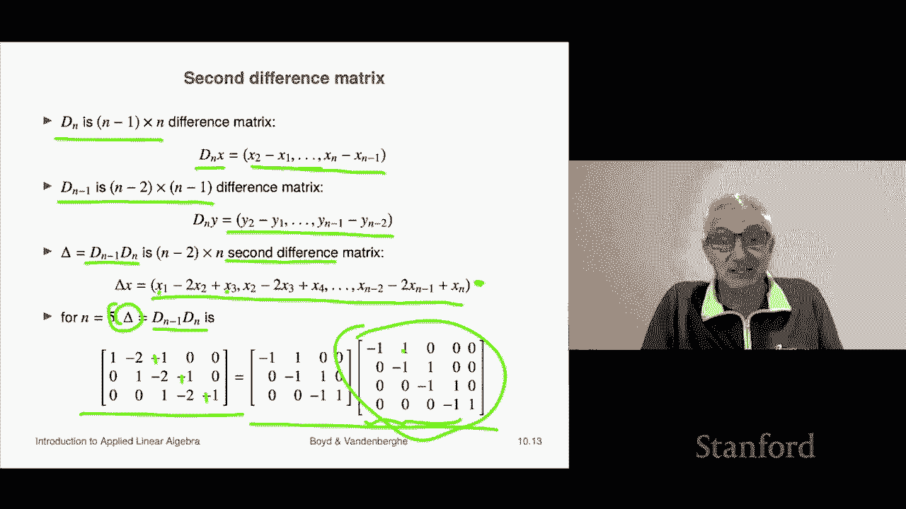

# 28：L10.2 - 矩阵乘法示例 📘

在本节课中，我们将要学习线性函数的复合。我们将看到，这为矩阵乘法提供了另一种解释。

## 线性函数的复合

上一节我们介绍了矩阵乘法的基本概念，本节中我们来看看如何通过线性函数的复合来理解它。

假设 **A** 是一个 `m × p` 的矩阵，**B** 是一个 `p × n` 的矩阵。我们可以计算它们的乘积 **C = A B**。

现在，我们定义两个线性函数：
*   函数 **F** 将 `p` 维向量映射到 `m` 维向量，定义为 **F(u) = A u**。
*   函数 **G** 将 `n` 维向量映射到 `p` 维向量，定义为 **G(v) = B v**。

这两个函数都是线性的，因为它们由矩阵向量乘法定义。

## 复合函数与矩阵乘法

接下来，我们考虑这两个函数的复合。复合函数 **H** 的定义是：**H(x) = F(G(x))**。

让我们解析这个过程：
1.  输入一个 `n` 维向量 **x**。
2.  函数 **G** 作用于 **x**，得到 `p` 维向量 **B x**。
3.  函数 **F** 作用于 **B x**，得到 `m` 维向量 **A (B x)**。

因此，复合函数 **H** 的公式为：
**H(x) = A (B x)**

根据矩阵乘法的结合律，上式等价于：
**H(x) = (A B) x**

这个结果非常精妙：**两个线性函数的复合仍然是线性的，并且其对应的矩阵就是两个函数对应矩阵的乘积**。这为矩阵乘法 **A B** 提供了“函数复合”的解释。

需要注意的一点是，在复合 **F(G(x))** 中，**G** 是先作用的函数，对应矩阵 **B**。而在乘积 **A B** 中，**B** 在书写顺序上位于后面，但在运算逻辑上却是“先”作用于向量的矩阵。理解这一点后，一切就顺理成章了。

## 一个具体示例：差分矩阵

为了加深理解，我们来看一个具体的例子。这个例子涉及我们之前课程中介绍过的差分矩阵。

以下是差分矩阵的核心概念：
*   **Dₙ** 是一个 `(n-1) × n` 的矩阵。当它乘以一个 `n` 维向量时，会计算该向量的“一阶差分”（即相邻元素的差）。
*   **Dₙ₋₁** 是一个 `(n-2) × (n-1)` 的矩阵，功能类似，但维度更小。

现在，让我们考虑它们的复合。我们可以计算矩阵 **Dₙ₋₁ Dₙ**，这将得到一个 `(n-2) × n` 的矩阵。

这个新矩阵的作用是：
1.  先用 **Dₙ** 计算输入向量的“一阶差分”。
2.  再用 **Dₙ₋₁** 对得到的一阶差分结果再次计算差分，即得到“二阶差分”。

因此，矩阵 **Δ = Dₙ₋₁ Dₙ** 被称为**二阶差分矩阵**。它的效果类似于对离散序列求“二阶导数”。

## 以 n=5 为例

让我们以 `n=5` 为例进行具体说明。

首先，`4 × 5` 的一阶差分矩阵 **D₅** 作用于一个5维向量，会得到4个差值（x₂ - x₁， x₃ - x₂， x₄ - x₃， x₅ - x₄）。

然后，`3 × 4` 的差分矩阵 **D₄** 再作用于这个4维的差值向量，最终得到一个3维的二阶差分向量。

通过直接计算矩阵乘积 **D₄ D₅**，我们得到的 `3 × 5` 矩阵，其每一行确实对应着计算原始5维向量的二阶差分（例如，x₁ + x₃ - 2x₂ 这样的形式）。

这个例子清晰地展示了：**对两个差分函数进行复合，等价于将它们的矩阵相乘，结果得到了一个计算高阶差分的新函数**。

## 总结

本节课中我们一起学习了线性函数复合与矩阵乘法的关系。我们了解到：
1.  两个线性函数 **F(x) = A x** 和 **G(x) = B x** 的复合 **H(x) = F(G(x))** 仍然是线性函数。
2.  复合函数 **H** 对应的矩阵，正是两个原函数对应矩阵的乘积 **A B**。这为矩阵乘法提供了“函数复合”这一直观解释。
3.  我们通过差分矩阵的实例验证了这一结论，看到计算一阶差分的函数再复合一次，就得到了计算二阶差分的函数，其对应矩阵正是两个差分矩阵的乘积。

理解这种对应关系，有助于我们从更高、更统一的视角看待线性代数的核心运算。