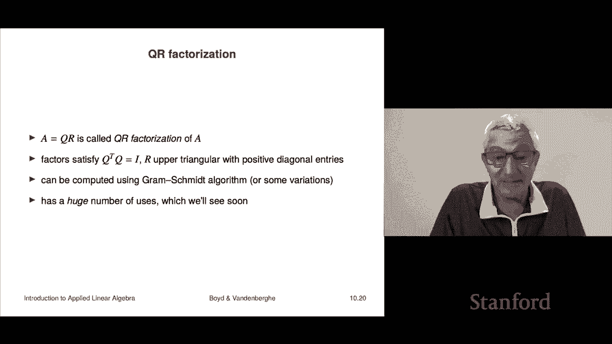

# 29：L10.3 - 矩阵次方与分解 📘

在本节课中，我们将学习矩阵的次方运算及其应用，并了解如何将格拉姆-施密特正交化过程表示为一种简洁的矩阵分解形式。

***

## 矩阵的次方 🧮

上一节我们介绍了矩阵乘法。本节中我们来看看，当一个矩阵是方阵时，我们可以将其与自身相乘，这引出了矩阵次方的概念。

*   只有方阵 `A` 才能进行次方运算，否则无法进行自乘。
*   `A` 的平方定义为 `A² = A × A`。
*   更高次方以此类推，例如 `A³ = A × A × A`。由于矩阵乘法满足结合律，`A³` 也等于 `(A × A) × A` 或 `A × (A × A)`。
*   我们沿用数字的记法，将矩阵的 `k` 次方记为 `Aᵏ`。
*   为了记法统一，我们定义 `A⁰ = I`（单位矩阵）。这类似于数字的 `0` 次方等于 `1`，而单位矩阵 `I` 在矩阵运算中扮演着数字 `1` 的角色。
*   定义了 `A⁰` 后，矩阵次方也满足指数法则：`Aᵏ × Aˡ = Aᵏ⁺ˡ`。
*   在本课程后续部分，我们会学习矩阵的负次方，即逆矩阵 `A⁻¹`。更高级的课程中还会涉及分数次方（如 `A^(1/2)`，即矩阵的平方根），但本课程暂不讨论。目前我们只讨论正次方和零次方（约定为 `I`）。

以下是矩阵次方的一个简单示例：
设矩阵 `A = [[1, -1], [2, 0]]`，则 `A²` 计算如下：
`A² = A × A = [[1, -1], [2, 0]] × [[1, -1], [2, 0]] = [[-1, -1], [2, -2]]`

***

## 🕸️ 邻接矩阵及其次方的意义

矩阵次方有许多有趣的应用。我们来看一个涉及有向图的例子。在之前的课程中，我们通过节点和边来描述有向图。另一种描述方式不使用边列表，而是使用**邻接矩阵**。

*   对于一个有 `n` 个节点的图，其邻接矩阵 `A` 是一个 `n × n` 的矩阵。
*   矩阵元素 `A[i][j]` 的定义为：如果存在一条从节点 `j` 指向节点 `i` 的边，则 `A[i][j] = 1`；否则为 `0`。
    *   注意这里的顺序：`A[i][j]` 对应 `j → i` 的边。有些教材会使用相反的约定（`i → j`），两者仅相差一个转置关系。

以下是一个邻接矩阵的例子，我们可以验证其正确性：
*   若存在边 `3 → 2`，则 `A[2][3]` 应为 `1`。
*   若存在边 `4 → 5`，则 `A[5][4]` 应为 `1`。
*   若不存在边 `2 → 4`，则 `A[4][2]` 应为 `0`。

邻接矩阵的平方 `A²` 具有非常美妙的解释。
*   根据矩阵乘法，`(A²)[i][j] = Σₖ (A[i][k] × A[k][j])`。
*   由于 `A` 的元素非 `0` 即 `1`，乘积 `A[i][k] × A[k][j]` 仅在两项均为 `1` 时才为 `1`。
*   `A[k][j] = 1` 表示存在路径 `j → k`。
*   `A[i][k] = 1` 表示存在路径 `k → i`。
*   因此，`(A²)[i][j]` 的值等于所有满足“从 `j` 到 `k` 再到 `i`”的中间节点 `k` 的数量。这正好是**从节点 `j` 到节点 `i` 的长度为 2 的路径总数**。

更一般地，**邻接矩阵 `A` 的 `L` 次方 `Aᴸ` 中，`(Aᴸ)[i][j]` 的值等于从节点 `j` 到节点 `i` 的长度为 `L` 的路径总数**。
*   当 `L=1` 时，`A` 本身表示长度为 1 的路径（即单条边），这与定义一致。
*   例如，在示例图中，`(A²)[3][4] = 2`，表示从节点 `4` 到节点 `3` 存在两条长度为 2 的路径（一条经过自环 `4→4→3`，另一条经过 `4→5→3`）。

***

## 格拉姆-施密特与 QR 分解 🔧

我们的最后一个主题是展示如何利用强大的矩阵记号，来极其紧凑地描述格拉姆-施密特正交化的结果（而非算法本身）。实际上，格拉姆-施密特过程可以解释为一种矩阵分解，即 **QR 分解**。

假设我们有一个 `n × k` 的矩阵 `A`，其列向量为 `a₁, a₂, ..., aₖ`（均为 `n` 维向量）。如果这些列向量线性无关，那么对它们执行格拉姆-施密特正交化，将得到一组标准正交向量 `q₁, q₂, ..., qₖ`。

*   我们定义一个新的 `n × k` 矩阵 `Q`，其列就是这些标准正交向量 `q₁, ..., qₖ`。
*   `Q` 的列是标准正交的这一事实，可以简洁地表示为：`QᵀQ = I`（`k × k` 的单位矩阵）。这个等式意味着：对角线元素 `qᵢᵀqᵢ = 1`（范数为1），非对角线元素 `qᵢᵀqⱼ = 0`（相互正交）。

从格拉姆-施密特算法的公式 `aᵢ = r₁ᵢq₁ + r₂ᵢq₂ + ... + rᵢᵢqᵢ` 出发（其中 `rᵢᵢ > 0`），我们可以发现：
*   每个 `aᵢ` 都可以表示为 `q₁` 到 `qᵢ` 的线性组合，而不需要 `qᵢ₊₁` 及之后的向量。
*   这意味着，如果我们构造一个 `k × k` 的上三角矩阵 `R`，使其第 `i` 列的元素由上式的系数 `(r₁ᵢ, r₂ᵢ, ..., rᵢᵢ, 0, ..., 0)` 构成，并且对角线元素 `rᵢᵢ > 0`，那么整个变换关系就可以写成矩阵形式：

`A = Q × R`

这就是著名的 **QR 分解**：将矩阵 `A` 分解为一个列标准正交的矩阵 `Q` 和一个上三角矩阵 `R` 的乘积，且 `R` 的对角线元素为正。

**总结一下**：
*   对一组向量（视为矩阵 `A` 的列）执行格拉姆-施密特正交化，等价于对该矩阵进行 QR 分解。
*   格拉姆-施密特是计算 QR 分解的一种算法。在数值计算软件中，你更常听到的是“QR 分解”这个术语。
*   目前，格拉姆-施密特（或 QR 分解）的主要用途是判断一组向量是否线性独立。虽然这个应用在当前阶段可能显得抽象，但在后续课程中，你会发现它在求解线性方程组、最小二乘问题等方面具有极其重要的实际意义。

***

## 本节课总结 📝

在本节课中，我们一起学习了：
1.  **矩阵的次方运算**：定义了方阵的正整数次方和零次方（单位矩阵），并了解了其运算规则。
2.  **邻接矩阵的应用**：将有向图表示为邻接矩阵，并揭示了 `Aᴸ` 的 `(i, j)` 元素表示从节点 `j` 到节点 `i` 的长度为 `L` 的路径数这一深刻含义。
3.  **QR 分解**：将格拉姆-施密特正交化过程表示为矩阵 `A` 分解为列标准正交矩阵 `Q` 和上三角矩阵 `R` 的乘积，即 `A = QR`。这是将算法思想转化为紧凑矩阵表示的一个典范。