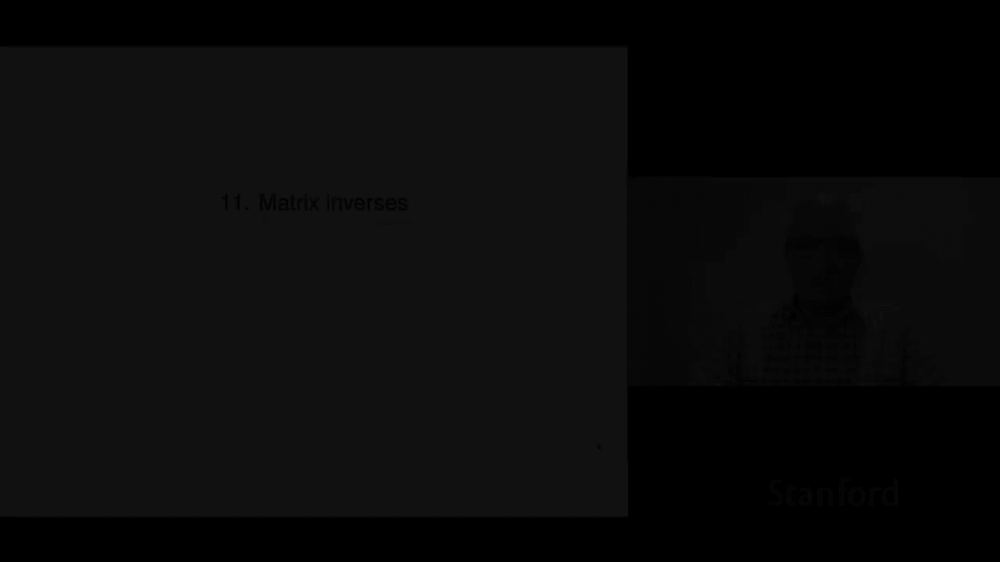
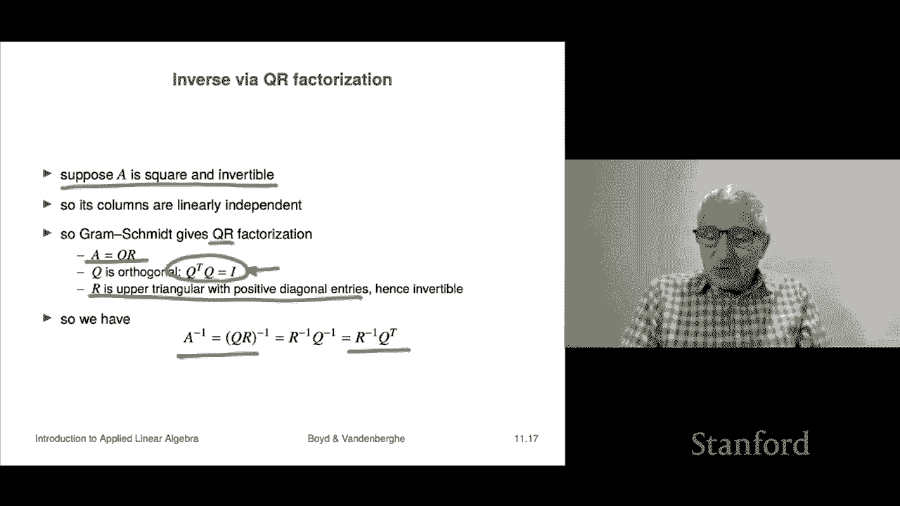

# 30：L11.1 - 逆矩阵 🧮




在本节课中，我们将学习矩阵的逆。这个概念是标量（数字）中“倒数”概念的推广，但矩阵的情况要复杂得多。我们将从介绍左逆和右逆开始，逐步深入到矩阵逆的定义、性质和应用。

## 概述

对于数字，如果 `x * a = 1`，则 `x` 是 `a` 的逆，记作 `x = 1/a`。这仅在 `a ≠ 0` 时成立。对于矩阵，我们也有类似的概念，但情况更复杂。我们将探讨满足 `XA = I` 的矩阵 `X`（称为左逆），以及满足 `AX = I` 的矩阵 `X`（称为右逆）。

## 左逆与列独立性

上一节我们介绍了矩阵逆的类比概念。本节中我们来看看左逆及其与矩阵列独立性的关系。

如果存在矩阵 `X` 使得 `XA = I`，则称 `X` 为矩阵 `A` 的**左逆**。如果矩阵 `A` 有左逆，则称它是**左可逆**的。

以下是关于左逆的一个关键性质：
> 如果矩阵 `A` 有左逆 `C`，则 `A` 的列是线性无关的。

**证明**：为了证明列线性无关，我们考虑方程 `Ax = 0`。假设 `C` 是 `A` 的左逆，即 `CA = I`。我们在方程两边左乘 `C`：
```
C(Ax) = C * 0
(CA)x = 0
Ix = 0
x = 0
```
因此，`Ax = 0` 的唯一解是 `x = 0`，这意味着 `A` 的列线性无关。

这个性质告诉我们，左可逆矩阵必须是**高矩阵或方阵**（即行数 ≥ 列数）。因为如果它是宽矩阵（列数 > 行数），其列必然是线性相关的，从而不可能有左逆。

## 利用左逆求解线性方程组

上一节我们介绍了左逆与列独立性的关系。本节中我们来看看如何利用左逆求解线性方程组。

假设我们有线性方程组 `Ax = b`，并且 `A` 有一个左逆 `C`（这意味着 `A` 是高矩阵或方阵）。我们可以对方程两边左乘 `C`：
```
C(Ax) = Cb
(CA)x = Cb
Ix = Cb
x = Cb
```
这表明，`x = Cb` 是方程组 `Ax = b` 的一个解。这与标量情况类似：对于方程 `a * x = b`，解为 `x = (1/a) * b`，其中 `1/a` 可以看作是 `a` 的“左逆”。

以下是关于左逆求解的一个例子：
考虑矩阵 `A` 和向量 `b`：
```
A = [[1, 2],
     [3, 4],
     [5, 6]]
b = [7, 8, 9]
```
假设 `B` 和 `C` 是 `A` 的两个不同的左逆。计算 `Bb` 和 `Cb`，如果方程组 `Ax = b` 有唯一解，那么两者将得到相同的解 `x`。这是因为解的唯一性决定的，即使左逆不唯一。

## 右逆与行独立性

上一节我们探讨了左逆。本节中我们来看看与之对应的右逆。

如果存在矩阵 `X` 使得 `AX = I`，则称 `X` 为矩阵 `A` 的**右逆**。如果矩阵 `A` 有右逆，则称它是**右可逆**的。

左逆和右逆通过矩阵转置紧密相关。如果 `X` 是 `A` 的右逆（`AX = I`），那么对等式两边转置：
```
(AX)^T = I^T
X^T A^T = I
```
这表明 `X^T` 是 `A^T` 的左逆。因此，`A` 是右可逆的，当且仅当 `A^T` 是左可逆的。而 `A^T` 左可逆意味着 `A^T` 的列线性无关，即 `A` 的**行线性无关**。

这个性质告诉我们，右可逆矩阵必须是**宽矩阵或方阵**（即列数 ≥ 行数）。

## 利用右逆求解线性方程组

上一节我们介绍了右逆。本节中我们来看看如何利用右逆求解线性方程组。

考虑方程组 `Ax = b`，其中 `A` 是方阵或宽矩阵（即行数 ≤ 列数），并且 `A` 有一个右逆 `B`（`AB = I`）。那么 `x = Bb` 是方程组的一个解。

**证明**：
```
A x = A (B b) = (A B) b = I b = b
```
这表明对于任何 `b`，方程组 `Ax = b` 至少有一个解（实际上可能有很多解）。这与左逆情况不同，左逆给出的是超定方程组的（唯一）解，而右逆给出的是欠定方程组的一个（可能不唯一的）特解。

以下是关于右逆求解的一个例子：
考虑 `A` 的转置 `A^T`，以及 `A` 的左逆 `B` 和 `C` 的转置 `B^T` 和 `C^T`，它们都是 `A^T` 的右逆。对于欠定方程组 `A^T x = [1, 2]^T`，用 `B^T` 和 `C^T` 分别右乘 `[1, 2]^T`，可能会得到两个不同的解向量，但验证后会发现它们都满足原方程。

## 矩阵的逆

上一节我们分别讨论了左逆和右逆。本节中我们将两者结合起来，介绍更常见、更简单的**矩阵逆**。

如果一个方阵 `A` 同时具有左逆和右逆，那么这两个逆矩阵是**唯一且相等**的。我们称这个唯一的矩阵为 `A` 的**逆**，记作 `A^{-1}`。它满足：
```
A^{-1} A = I 且 A A^{-1} = I
```
这与数字的逆性质类似：如果 `a ≠ 0`，则存在唯一的 `a^{-1}` 使得 `a^{-1} * a = 1` 且 `a * a^{-1} = 1`。

**证明唯一性**：假设 `X` 是右逆（`AX = I`），`Y` 是左逆（`YA = I`）。那么：
```
X = I X = (Y A) X = Y (A X) = Y I = Y
```
因此 `X = Y`，左逆和右逆是同一个矩阵。

对于可逆矩阵 `A`，其逆的逆是其本身：`(A^{-1})^{-1} = A`。

## 利用逆矩阵求解线性方程组

上一节我们定义了矩阵的逆。本节中我们来看看如何利用逆矩阵求解方阵线性方程组。

假设 `A` 是一个 `n x n` 的可逆方阵，考虑线性方程组 `Ax = b`。那么这个方程组对于任何 `b` 都有**唯一解**，并且解可以由逆矩阵直接给出：
```
x = A^{-1} b
```
这是标量方程 `a x = b` 的解 `x = a^{-1} b` 在矩阵形式下的直接推广。这里，矩阵可逆 (`A^{-1}` 存在) 扮演了标量中 `a ≠ 0` 的角色。

这个简单的公式 `x = A^{-1} b` 是无数应用的基础。例如，在结构工程中，通过建立方程组 `Ax = b` 来模拟桥梁在荷载下的形变，然后通过计算 `x = A^{-1} b` 来求解形变量。

## 可逆性的等价条件

上一节我们看到了逆矩阵在解方程中的应用。本节中我们总结一下方阵可逆的几个等价条件。

对于一个 `n x n` 方阵 `A`，以下陈述是等价的（只要其中一个成立，则其他都成立）：

1.  `A` 是可逆的（即存在 `A^{-1}` 使得 `A^{-1}A = I` 且 `A A^{-1} = I`）。
2.  `A` 的列是线性无关的。
3.  `A` 有左逆。
4.  `A` 的行是线性无关的。
5.  `A` 有右逆。

需要注意的是，对于非方阵，谈论其逆矩阵是没有意义的。如果你写 `A^{-1}` 而 `A` 不是方阵，那在矩阵代数中是不被允许的。

## 逆矩阵的例子与计算

上一节我们列出了可逆的等价条件。本节中我们来看一些具体的逆矩阵例子。

以下是一些常见或简单的逆矩阵：

*   **单位矩阵**：`I` 的逆是它自身，`I^{-1} = I`。
*   **正交矩阵**：如果方阵 `Q` 满足 `Q^T Q = I`（即列是标准正交的），则 `Q` 是可逆的，并且其逆就是它的转置：`Q^{-1} = Q^T`。这也意味着 `Q Q^T = I`。
*   **2x2 矩阵的逆**：对于矩阵 `A = [[a, b], [c, d]]`，其逆存在的条件是 `ad - bc ≠ 0`（这个值称为行列式）。逆矩阵公式为：
    ```
    A^{-1} = (1 / (ad - bc)) * [[d, -b], [-c, a]]
    ```
    建议记住这个公式，它类似于二次方程的求根公式，是一个基础工具。
*   **更大矩阵的逆**：对于更大的矩阵（如3x3, 4x4），存在理论上的逆公式，但极其复杂，不用于实际计算。实际计算逆矩阵有系统的方法。

**一个计算示例**：
考虑矩阵 `A = [[1, 2, 3], [0, 1, 4], [5, 6, 0]]`。可以验证它是可逆的，其逆为：
```
A^{-1} = (1/30) * [[-24, 18, 5], [20, -15, -4], [-5, 4, 1]]
```
可以通过计算 `A^{-1} A` 的 (1,1) 元素来验证：`(-24*1 + 18*0 + 5*5)/30 = (-24 + 0 + 25)/30 = 1/30 * 1 = 1`，符合单位矩阵的要求。

## 逆矩阵的性质

上一节我们看了一些逆矩阵的例子。本节中我们总结一下逆矩阵的一些重要运算性质。

假设所涉及的矩阵都是可逆的方阵，以下性质成立：

1.  **乘积的逆**：`(AB)^{-1} = B^{-1} A^{-1}`。注意顺序相反，这与转置性质 `(AB)^T = B^T A^T` 类似。
2.  **转置的逆**：`(A^T)^{-1} = (A^{-1})^T`。有时也记作 `A^{-T}`。
3.  **矩阵的幂**：对于可逆方阵 `A`，我们可以定义负整数次幂：`A^{-k} = (A^{-1})^k`。结合已有的 `A^0 = I` 和 `A^k`（k为正整数），指数法则依然成立：`A^k * A^l = A^{k+l}`，其中 `k` 和 `l` 可以是任意整数（正、负或零）。

## 三角矩阵的可逆性

上一节我们介绍了逆矩阵的一般性质。本节中我们来看一类特殊矩阵——三角矩阵的可逆性。

一个方阵被称为**下三角矩阵**，如果其主对角线以上的所有元素都为零。类似地，**上三角矩阵**是主对角线以下所有元素为零的方阵。

**重要性质**：一个下三角（或上三角）矩阵是可逆的，**当且仅当**其主对角线上的所有元素都**非零**。

**证明思路（以下三角矩阵 `L` 为例）**：要证明 `L` 可逆，只需证明其列线性无关。考虑方程 `Lx = 0`：
*   第一个方程是 `L_{11} x_1 = 0`。由于 `L_{11} ≠ 0`，推出 `x_1 = 0`。
*   第二个方程是 `L_{21} x_1 + L_{22} x_2 = 0`。由于 `x_1 = 0` 且 `L_{22} ≠ 0`，推出 `x_2 = 0`。
*   以此类推，可以逐步推出所有 `x_i = 0`。因此 `Lx = 0` 只有零解，列线性无关，故 `L` 可逆。

对于上三角矩阵 `R`，其可逆性条件相同（对角线元素非零），因为 `R` 可逆等价于其转置 `R^T`（一个下三角矩阵）可逆。

## 通过 QR 分解求逆

上一节我们讨论了三角矩阵的可逆性。本节中我们将看到如何利用之前学过的 QR 分解来计算矩阵的逆。

假设 `A` 是一个 `n x n` 的可逆方阵。因为可逆意味着列线性无关，我们可以对其列向量应用格拉姆-施密特正交化过程，得到 **QR 分解**：
```
A = Q R
```
其中：
*   `Q` 是一个 `n x n` 的正交矩阵（`Q^T Q = I`，因此 `Q^{-1} = Q^T`）。
*   `R` 是一个 `n x n` 的上三角矩阵，并且由于格拉姆-施密特过程，其对角线元素为正数（因此非零），根据上一节的结论，`R` 是可逆的。

现在，我们可以利用 QR 分解来求 `A` 的逆：
```
A^{-1} = (Q R)^{-1} = R^{-1} Q^{-1} = R^{-1} Q^T
```
因此，问题转化为求上三角矩阵 `R` 的逆 `R^{-1}`。求上三角矩阵的逆有高效的系统方法（如前向/后向替代），这将在后续课程中介绍。这里的关键是，QR 分解将求任意可逆矩阵的逆，转化为了求一个上三角矩阵的逆和一次矩阵乘法。

## 总结




本节课中我们一起学习了矩阵逆的核心概念。我们从标量的倒数出发，引入了矩阵的左逆和右逆，并发现它们分别与矩阵的列独立性和行独立性相关。对于方阵，当左逆和右逆同时存在时，它们相等且唯一，这就是我们通常所说的矩阵逆 `A^{-1}`。逆矩阵使得求解方阵线性方程组 `Ax = b` 变得直接：`x = A^{-1}b`。我们还探讨了可逆的等价条件、逆矩阵的运算性质，以及特殊矩阵（如三角矩阵、正交矩阵）的逆。最后，我们看到了如何通过 QR 分解将求逆问题简化。理解矩阵逆是线性代数及其应用的基石。