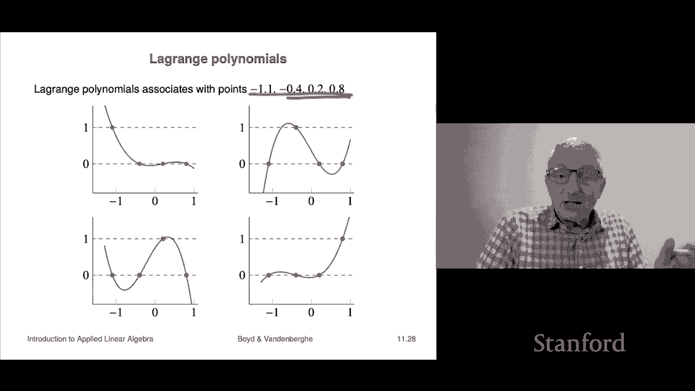

# 31：L11.2 - 求解线性方程组 📐


在本节课中，我们将学习如何求解线性方程组。我们将从一种名为“回代”的方法开始，然后结合QR分解，构建一个完整的求解算法。我们还会探讨其计算复杂度，并了解如何高效地求解多组具有相同系数矩阵的方程组。

---

## 回代法 🔄

上一节我们介绍了上三角矩阵。本节中，我们来看看如何利用上三角矩阵的特性来求解线性方程组。

我们有一个上三角矩阵 **R**，其对角线元素均不为零，这意味着 **R** 是可逆的。我们要解的方程是：
**R x = b**

当然，我们可以通过计算 **x = R⁻¹ b** 来求解。由于 **R** 是上三角矩阵且对角线元素非零，我们可以使用一种更高效的方法——回代法。

让我们将方程以标量形式写出。对于一个上三角矩阵，方程组看起来是这样的：

*   第一个方程：**r₁₁ x₁ + r₁₂ x₂ + ... + r₁ₙ xₙ = b₁**
*   第二个方程：**r₂₂ x₂ + ... + r₂ₙ xₙ = b₂**
*   ...
*   最后一个方程：**rₙₙ xₙ = bₙ**

以下是回代法的具体步骤：

1.  **从最后一个方程开始求解**。由于 **rₙₙ ≠ 0**，我们可以直接解出 **xₙ**：
    **xₙ = bₙ / rₙₙ**

2.  **代入倒数第二个方程求解**。现在我们知道 **xₙ** 的值，倒数第二个方程是：
    **rₙ₋₁ₙ₋₁ xₙ₋₁ + rₙ₋₁ₙ xₙ = bₙ₋₁**
    我们可以将其改写为：
    **xₙ₋₁ = (bₙ₋₁ - rₙ₋₁ₙ xₙ) / rₙ₋₁ₙ₋₁**
    由于 **rₙ₋₁ₙ₋₁ ≠ 0**，我们可以计算出 **xₙ₋₁**。

3.  **继续向后迭代**。知道 **xₙ** 和 **xₙ₋₁** 后，我们可以用同样的方法解出 **xₙ₋₂**，依此类推，直到解出 **x₁**。

这个过程被称为“回代”，因为我们是从最后一个变量开始，逐步向后代入并求解的。

---

## 回代法的计算复杂度 ⚙️

现在我们来分析回代法的计算成本（以浮点运算次数衡量）。

*   求解 **xₙ** 需要 **1** 次运算（除法）。
*   求解 **xₙ₋₁** 需要 **3** 次运算（一次乘法、一次减法、一次除法）。
*   求解 **xₙ₋₂** 需要 **5** 次运算。
*   以此类推。

总运算次数是 **1 + 3 + 5 + ... + (2n-1)**。这是一个著名的恒等式，其和为 **n²**。因此，回代法的计算复杂度是 **O(n²)** 量级，这与矩阵与向量相乘的复杂度相同。

---

## 通过QR分解求解线性方程组 🧩

上一节我们介绍了回代法。本节中，我们来看看如何将其与QR分解结合，求解一般的线性方程组。

对于一个可逆的方阵 **A**，我们要解方程 **A x = b**，即计算 **x = A⁻¹ b**。

由于 **A** 可逆，其列向量线性无关，我们可以对其进行QR分解：
**A = Q R**
其中，**Q** 是正交矩阵（**QᵀQ = I**），**R** 是具有正对角线元素的上三角矩阵（因此可逆）。

那么，**A** 的逆可以表示为：
**A⁻¹ = (Q R)⁻¹ = R⁻¹ Q⁻¹ = R⁻¹ Qᵀ**

因此，解 **x** 可以这样计算：
**x = A⁻¹ b = R⁻¹ (Qᵀ b)**

以下是求解算法的伪代码步骤：

1.  **QR分解**：对矩阵 **A** 进行QR分解，得到 **Q** 和 **R**。
2.  **计算新向量**：计算 **y = Qᵀ b**（这是一个矩阵-向量乘法）。
3.  **回代求解**：解上三角方程组 **R x = y**，使用回代法得到 **x**。

---

## 算法复杂度分析 📊

现在我们来分析上述三步算法的总计算成本。

*   **第一步：QR分解**。对于一个 n×n 矩阵，其复杂度约为 **2n³** 次浮点运算。
*   **第二步：矩阵-向量乘法**。计算 **Qᵀ b** 的复杂度为 **2n²** 次运算。
*   **第三步：回代**。求解 **R x = y** 的复杂度为 **n²** 次运算。

当 **n** 很大时（例如成千上万），**n³** 量级的运算成本远高于 **n²** 量级。因此，总成本主要由QR分解决定，约为 **2n³** 次运算。第二步和第三步的成本可以忽略不计。

这带来了一个令人惊讶的结论：**求解线性方程组的主要成本在于对系数矩阵进行QR分解。**

---

## 求解多组方程组 🚀

上一节我们看到，求解的主要成本是QR分解。本节中，我们来看看这对求解多组方程组意味着什么。

假设我们需要求解 **k** 组具有相同系数矩阵 **A**，但不同右侧向量 **bᵢ** 的方程组：
**A xᵢ = bᵢ**, 对于 i = 1, 2, ..., k

一个“聪明”的方法是：

1.  **只进行一次QR分解**：计算 **A = Q R**。（成本：~2n³）
2.  **对每个右侧向量重复后续步骤**：对于每个 **bᵢ**，计算 **yᵢ = Qᵀ bᵢ**（~2n²）并进行回代 **R xᵢ = yᵢ**（~n²）。

总成本约为：**2n³ + 3k n²**。

只要 **k** 远小于 **n**，那么 **k n²** 项与 **n³** 项相比就微不足道。这意味着，**求解10组（甚至更多）具有相同系数矩阵的方程组，所需时间与求解一组方程组的时间几乎相同！** 因为最耗时的QR分解只需要做一次。

---

## 应用示例：多项式插值 📈

线性方程组求解有广泛的应用。这里我们看一个简单的例子：多项式插值。

假设我们想找到一个三次多项式：
**p(x) = c₁ + c₂ x + c₃ x² + c₄ x³**
使其图像经过四个给定点：**(-1, b₁)**, **(-0.4, b₂)**, **(0.1, b₃)**, **(0.8, b₄)**。

将点的x坐标代入多项式，就得到关于系数 **c₁, c₂, c₃, c₄** 的线性方程组：
**A c = b**
其中矩阵 **A** 是一个范德蒙矩阵：
```
A = [[1, -1, (-1)², (-1)³],
     [1, -0.4, (-0.4)², (-0.4)³],
     [1, 0.1, (0.1)², (0.1)³],
     [1, 0.8, (0.8)², (0.8)³]]
```
向量 **b = [b₁, b₂, b₃, b₄]ᵀ**， **c = [c₁, c₂, c₃, c₄]ᵀ**。

求解 **c = A⁻¹ b** 即可得到多项式系数。矩阵 **A⁻¹** 的列有特殊的几何意义：第 **j** 列对应的多项式，在第 **j** 个插值点取值为1，在其他插值点取值为0。这类多项式被称为**拉格朗日基多项式**。

---

## 总结 🎯

本节课中我们一起学习了：

1.  **回代法**：一种高效求解上三角线性方程组的方法，复杂度为 **O(n²)**。
2.  **QR分解求解法**：通过将矩阵 **A** 分解为 **Q** 和 **R**，将一般线性方程组 **A x = b** 的求解转化为两步：计算 **y = Qᵀ b** 和回代求解 **R x = y**。
3.  **复杂度洞察**：求解的主要成本在于QR分解（~2n³），后续步骤成本（~n²）可忽略。这使得求解多组具有相同系数矩阵的方程组异常高效。
4.  **应用实例**：多项式插值问题可以自然地转化为线性方程组求解。




掌握这些方法，你就能理解并实现高效、稳定的线性方程组数值解法。