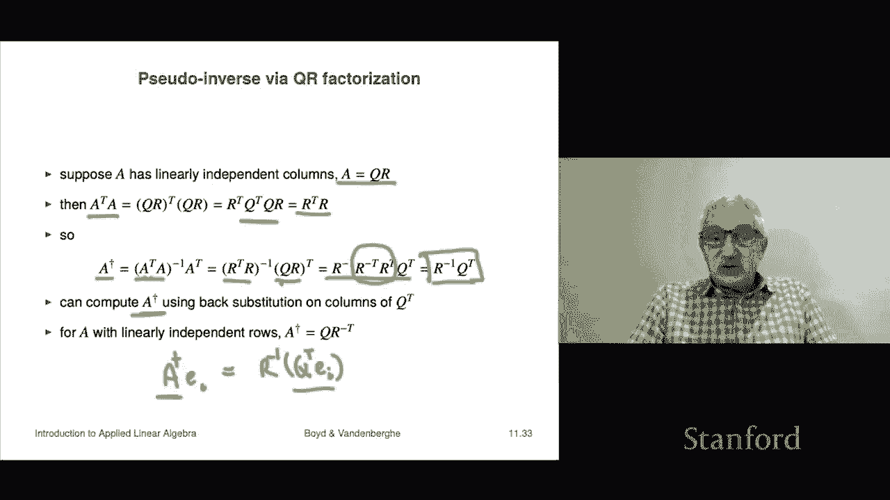

# 32：L11.3 - 矩阵伪逆 📘

在本节课中，我们将学习矩阵伪逆的概念。伪逆是矩阵理论中的一个重要工具，尤其当矩阵不是方阵或不可逆时，它提供了一种“求逆”的推广方法。我们将从格拉姆矩阵与矩阵本身的关系开始，逐步推导出高矩阵和宽矩阵的伪逆公式，并探讨其与QR分解的联系。

---

## 格拉姆矩阵与矩阵的线性无关性 🔗

上一节我们讨论了矩阵的基本性质。本节中，我们来看看矩阵的列线性无关性与其格拉姆矩阵可逆性之间的重要关系。

**定理**：矩阵 **A** 具有线性无关列，当且仅当其格拉姆矩阵 **AᵀA** 可逆。

**证明**：
矩阵 **A** 具有线性无关列，意味着方程 **Ax = 0** 的唯一解是 **x = 0**。我们需要证明 **Ax = 0** 与 **AᵀAx = 0** 等价。

1.  假设 **Ax = 0**。在等式两边左乘 **Aᵀ**，得到 **AᵀAx = Aᵀ0 = 0**。因此，**Ax = 0** 蕴含 **AᵀAx = 0**。
2.  反之，假设 **AᵀAx = 0**。在等式两边左乘 **xᵀ**，得到 **xᵀAᵀAx = 0**。我们可以将其重写为 **(Ax)ᵀ(Ax) = 0**，即向量 **Ax** 的范数平方为零。范数平方为零的唯一可能是向量本身为零向量，因此 **Ax = 0**。

由此，我们建立了 **A** 列线性无关与 **AᵀA** 可逆之间的等价关系。

---

## 高矩阵的伪逆 📏

基于上述关系，我们现在可以定义高矩阵（列数小于行数）的伪逆。

对于一个具有线性无关列的 **m × n** 矩阵 **A**（其中 m ≥ n），其伪逆（记为 **A†**）定义为：

**A† = (AᵀA)⁻¹Aᵀ**

以下是维度检查，确保公式有效：
*   **A** 是 m × n 矩阵。
*   **Aᵀ** 是 n × m 矩阵。
*   **AᵀA** 是 n × n 矩阵（格拉姆矩阵），根据定理它是可逆的。
*   **(AᵀA)⁻¹** 是 n × n 矩阵。
*   因此，**A† = (AᵀA)⁻¹Aᵀ** 是 n × m 矩阵。

**伪逆是左逆**：
我们可以验证 **A†** 是 **A** 的一个左逆：

**A†A = (AᵀA)⁻¹AᵀA = Iₙ**

这证明了如果矩阵 **A** 具有线性无关列，则它至少存在一个左逆，并且我们给出了一个具体的计算公式。

**特殊情况：方阵**：
当 **A** 是 n × n 可逆方阵时，伪逆退化为普通的逆矩阵：

**A† = (AᵀA)⁻¹Aᵀ = A⁻¹(Aᵀ)⁻¹Aᵀ = A⁻¹**

因此，伪逆可以看作是矩阵逆在非方阵情况下的推广。

---

## 宽矩阵的伪逆 📐

类似地，我们可以定义宽矩阵（行数小于列数）的伪逆。

对于一个具有线性无关行的 **m × n** 矩阵 **A**（其中 m ≤ n），其伪逆定义为：

**A† = Aᵀ(AAᵀ)⁻¹**

**伪逆是右逆**：
我们可以验证 **A†** 是 **A** 的一个右逆：

**AA† = AAᵀ(AAᵀ)⁻¹ = Iₘ**

同样，当 **A** 是方阵且可逆时，该公式也退化为 **A⁻¹**。

---

## 伪逆与QR分解 🔢

伪逆的计算可以通过QR分解高效实现。这对于具有线性无关列的高矩阵尤其有用。

设矩阵 **A** 具有线性无关列，其QR分解为 **A = QR**，其中 **Q** 的列是标准正交的，**R** 是上三角矩阵且对角线元素为正。

我们可以将伪逆用 **Q** 和 **R** 表示：

1.  首先计算格拉姆矩阵：**AᵀA = (QR)ᵀ(QR) = RᵀQᵀQR = RᵀR**（因为 **QᵀQ = I**）。
2.  代入伪逆公式：
    **A† = (AᵀA)⁻¹Aᵀ = (RᵀR)⁻¹(QR)ᵀ = R⁻¹(Rᵀ)⁻¹ Rᵀ Qᵀ = R⁻¹Qᵀ**

因此，我们得到了一个简洁的公式：

**A† = R⁻¹Qᵀ**

**计算方法**：
要计算 **A†**，我们可以按列进行：
1.  对 **A** 进行QR分解，得到 **Q** 和 **R**。
2.  对于单位矩阵 **I** 的每一列 **eᵢ**（即欲求 **A†** 的第 i 列），计算 **R⁻¹(Qᵀeᵢ)**。
3.  由于 **R** 是上三角矩阵，**R⁻¹(Qᵀeᵢ)** 可以通过回代法快速求解。

通过这种方式，我们可以高效地计算出整个伪逆矩阵。

---

## 总结 🎯

本节课中我们一起学习了矩阵伪逆的核心内容：

*   我们首先建立了矩阵列线性无关与其格拉姆矩阵可逆之间的等价关系。
*   基于此，我们分别推导了高矩阵和宽矩阵的伪逆公式：
    *   对于列线性无关的高矩阵 **A**，伪逆 **A† = (AᵀA)⁻¹Aᵀ**，它是 **A** 的一个左逆。
    *   对于行线性无关的宽矩阵 **A**，伪逆 **A† = Aᵀ(AAᵀ)⁻¹**，它是 **A** 的一个右逆。
*   我们看到了当矩阵为可逆方阵时，伪逆退化为普通的矩阵逆。
*   最后，我们探讨了伪逆与QR分解的紧密联系，并得到了利用QR分解高效计算伪逆的公式 **A† = R⁻¹Qᵀ**。

伪逆是线性代数中一个非常强大的工具，它使得我们能够处理非方阵或列/行不满秩的情况。在接下来的课程中，我们将看到它在求解近似线性方程组等实际问题中的关键应用。