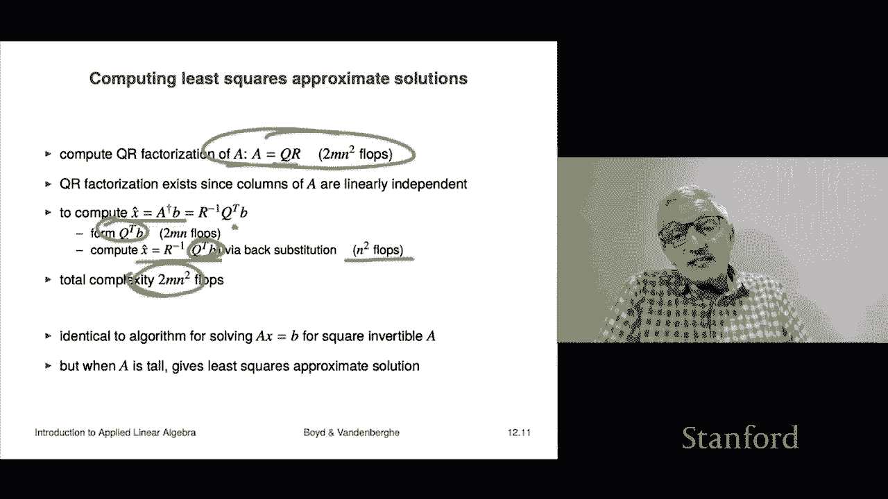

# 33：L12.1 - 最小二乘法 📊


在本节课中，我们将学习最小二乘法。这是一种处理**超定方程组**（即方程数量多于未知数数量）的重要方法。我们将了解其基本概念、几何与代数解释，并学习如何通过公式和计算来求解最小二乘问题。

---

## 最小二乘问题定义

我们从一个 **m × n** 矩阵 **A** 开始，其中 **m > n**。这意味着方程组 **Ax = b** 是超定的。对于大多数右侧向量 **b** 而言，不存在精确解 **x** 使得 **Ax = b** 成立。

因此，我们引入**残差向量 r**：
```
r = Ax - b
```
如果 **r = 0**，则 **x** 是方程组的精确解。但在超定情况下，我们通常无法使残差为零。

我们的目标是选择一个 **x**，使得残差的**范数平方**尽可能小。我们最小化的是**目标函数**：
```
f(x) = ||Ax - b||²
```
这是一个非负标量。我们称 **x̂** 为最小二乘问题的解，如果对于所有其他 **x**，都有：
```
f(x̂) ≤ f(x)
```
即，**x̂** 使得残差的范数平方最小。

> **注意**：**x̂** 通常**不满足** **Ax̂ = b**，它仅仅是使残差最小的近似解。不应称其为“在最小二乘意义下的解”，因为这种说法容易引起混淆。

---

## 最小二乘法的两种解释

上一节我们定义了最小二乘问题，本节中我们来看看它的两种重要解释。

### 列空间解释（几何解释）

令 **a₁, …, aₙ** 为矩阵 **A** 的列向量。那么 **Ax** 就是这些列向量的线性组合：
```
Ax = x₁a₁ + … + xₙaₙ
```
此时，目标函数 `||Ax - b||²` 表示向量 **b** 与 **A** 的列空间（所有列向量线性组合构成的子空间）中某个向量之间的距离平方。

因此，最小二乘问题可以理解为：在 **A** 的列空间的所有向量中，寻找一个最接近 **b** 的向量。解 **x̂** 对应的向量 **Ax̂** 就是这个最接近的点。

### 行空间解释（代数解释）

令 **ã₁ᵀ, …, ãₘᵀ** 为矩阵 **A** 的行向量。那么残差的第 i 个分量可以写为：
```
rᵢ = ãᵢᵀx - bᵢ
```
目标函数则是所有残差分量的平方和：
```
f(x) = (ã₁ᵀx - b₁)² + … + (ãₘᵀx - bₘ)²
```
求解方程组 **Ax = b** 意味着让每一个残差 **rᵢ** 都为零。在超定情况下，这通常无法实现。最小二乘法作为一种折衷方案，试图让所有残差的**平方和**最小化，从而在整体上让所有方程都“尽可能接近”成立。

---

## 一个简单示例

让我们通过一个简单的例子来直观理解最小二乘法。

考虑矩阵 **A** 和向量 **b**：
```
A = [2, 0; 0, 0; 0, 2]
b = [1; 0; -1]
```
方程组 **Ax = b** 无解。如果我们强行令 `x₁ = 1/2`, `x₂ = -1/2` 来满足第一个和第三个方程，那么第二个方程的残差为 -1。

最小二乘法的目标是最小化目标函数：
```
f(x) = (2x₁ - 1)² + (0 - 0)² + (2x₂ + 1)²
```
通过微积分求导（或后文将介绍的方法），可以找到最优解：
```
x̂ = [1/3; -1/3]
```
此时，对应的残差范数平方 `f(x̂) = 2/3`，小于之前尝试得到的 1。向量 **Ax̂ = [2/3; 0; -2/3]** 是列空间中最接近 **b** 的向量。

---

## 最小二乘解的推导与计算

上一节我们通过例子感受了最小二乘法，本节中我们来看看如何系统地求解它。我们假设矩阵 **A** 的列是**线性无关**的。

### 1. 通过微积分推导（正规方程）

目标函数 `f(x) = ||Ax - b||²` 对 **x** 求梯度，并令其为零：
```
∇f(x) = 2Aᵀ(Ax - b) = 0
```
整理后得到著名的**正规方程**：
```
AᵀA x̂ = Aᵀb
```
由于 **A** 列满秩，矩阵 **AᵀA**（格拉姆矩阵）可逆。因此，最小二乘解为：
```
x̂ = (AᵀA)⁻¹ Aᵀb
```
这正是我们之前学过的**伪逆矩阵** **A†** 与 **b** 的乘积：
```
x̂ = A†b
```
当 **A** 是方阵且可逆时，伪逆就是普通的逆，上式退化为精确解 `x = A⁻¹b`。因此，最小二乘解是线性方程组求解的自然推广。

> **编程提示**：在许多数值计算语言（如MATLAB、Python的NumPy）中，常用反斜杠运算符 `x = A \ b` 来统一表示求解线性方程组（当A方阵）或最小二乘问题（当A高矩阵）。这背后通常对应着高效的QR分解算法。

### 2. 直接验证与正交性原理

我们可以直接验证 `x̂ = A†b` 确实是最小解。将任意解 **x** 的残差范数平方进行分解：
```
||Ax - b||² = ||A(x - x̂) + (Ax̂ - b)||²
            = ||A(x - x̂)||² + ||Ax̂ - b||² + 2 * [A(x - x̂)]ᵀ (Ax̂ - b)
```
利用正规方程 `Aᵀ(Ax̂ - b) = 0`，可知上式中最后一项交叉项为零。因此：
```
||Ax - b||² = ||Ax̂ - b||² + ||A(x - x̂)||²
```
由于 `||A(x - x̂)||² ≥ 0`，我们得到对于任意 **x**：
```
||Ax - b||² ≥ ||Ax̂ - b||²
```
这直接证明了 **x̂** 是最小解。同时，等式成立仅当 `A(x - x̂) = 0`，由于 **A** 列满秩，这意味着 `x = x̂`，解是唯一的。

从推导中我们还得到一个关键结论：最优残差向量 `r̂ = Ax̂ - b` 与 **A** 的所有列向量正交（即 `Aᵀ r̂ = 0`）。这被称为**正交性原理**。

### 3. 通过QR分解进行计算

在实际计算中，我们通常通过QR分解来高效稳定地求解最小二乘问题。

首先，对 **A** 进行QR分解（假设列满秩）：
```
A = QR
```
其中 **Q** 是列正交矩阵，**R** 是上三角矩阵。

那么，最小二乘解可以高效地计算如下：
```
x̂ = R⁻¹ Qᵀ b
```
计算步骤为：
1.  计算QR分解 `A = QR` （复杂度约 `2mn²` 浮点运算）。
2.  计算向量 `c = Qᵀb` （复杂度约 `2mn` 浮点运算）。
3.  通过回代法求解上三角系统 `R x̂ = c` （复杂度约 `n²` 浮点运算）。

总计算成本主要由QR分解决定。值得注意的是，这与求解可逆方阵方程组 `Ax = b` 的算法完全一致，体现了数学上的统一性。

---

## 总结

本节课中我们一起学习了最小二乘法。

*   **核心问题**：在方程组 **Ax = b** 超定（无精确解）时，寻找 **x** 最小化残差范数平方 `||Ax - b||²`。
*   **几何意义**：在 **A** 的列空间中寻找最接近 **b** 的点。
*   **代数解**：在 **A** 列满秩的假设下，解由伪逆给出 `x̂ = A†b = (AᵀA)⁻¹Aᵀb`，等价于求解正规方程 `AᵀA x̂ = Aᵀb`。
*   **关键性质**：最优残差与 **A** 的列空间正交（正交性原理）。
*   **计算方法**：通常通过QR分解 `A=QR` 来稳定高效地计算 `x̂ = R⁻¹(Qᵀb)`。




最小二乘法是数据拟合、回归分析、信号处理等众多领域的基石。理解其原理和计算方法至关重要。