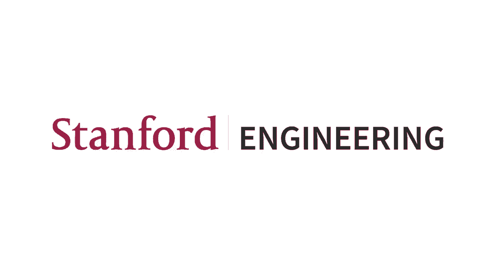
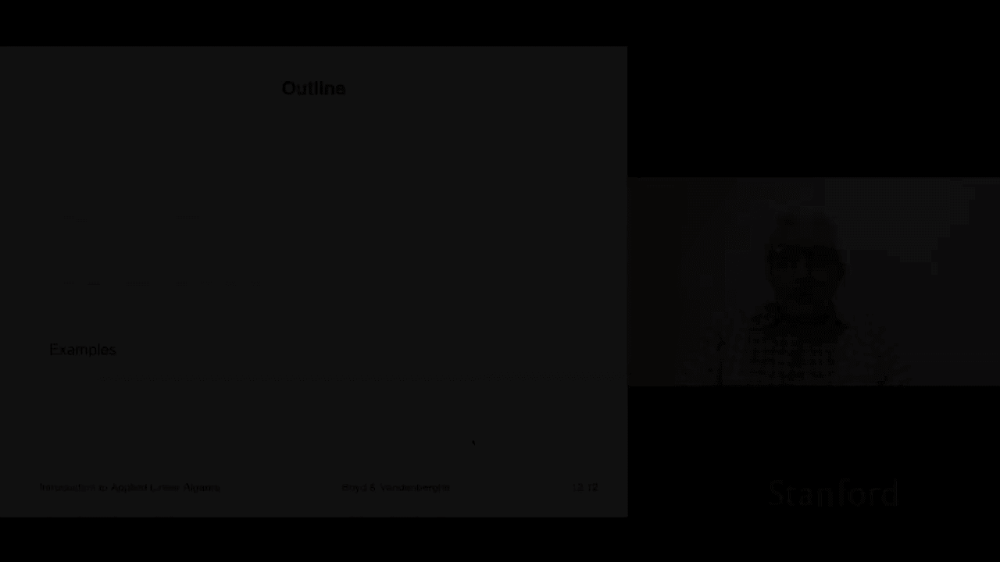
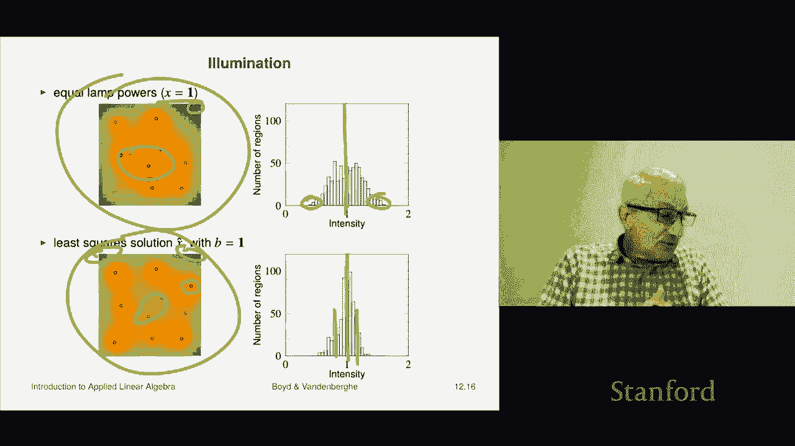
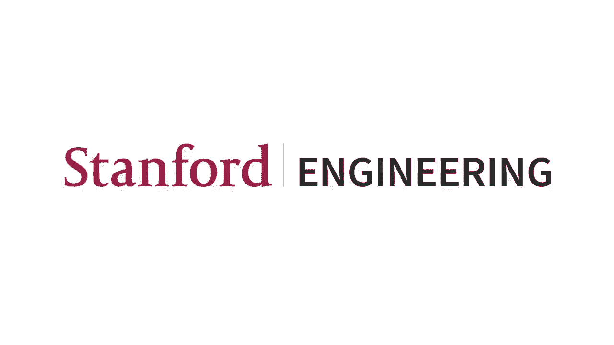

# 34：L12.2 - 最小二乘法应用示例 📊

在本节课中，我们将学习最小二乘法在实际中的两个简单应用。我们将通过广告投放预算分配和区域均匀照明这两个例子，来理解如何将抽象的数学公式转化为解决实际问题的工具。

## 应用一：广告投放预算分配 🛒

上一节我们介绍了最小二乘法的基本概念，本节中我们来看看如何将其应用于广告预算分配。广告商希望将预算分配到不同的广告渠道，以达到对不同人群（即“人口统计群体”）的特定曝光目标。

### 问题建模

假设我们有 `M` 个不同的人口统计群体（例如“18-22岁大学生”、“35-40岁女性”），以及 `N` 个广告投放渠道（例如搜索引擎、杂志、网站）。我们的目标是让每个群体获得特定的曝光次数（即“印象数”）。

*   **目标向量 `v_desired`**：一个 `M` 维向量，表示我们希望每个群体获得的印象数。
*   **花费向量 `s`**：一个 `N` 维向量，表示我们计划在每个广告渠道上花费的金额。
*   **覆盖矩阵 `R`**：一个 `M x N` 的矩阵。矩阵元素 `R_ij` 表示在渠道 `j` 上每花费1美元，能在群体 `i` 中获得多少印象数。

当我们执行矩阵乘法 `v = R * s` 时，得到的结果 `v` 就是一个 `M` 维向量，表示根据我们的花费计划 `s`，实际能在每个群体中获得的印象数。

我们的目标是找到一个花费向量 `s`，使得实际获得的印象数 `v` 尽可能接近目标印象数 `v_desired`。这可以表述为一个最小二乘问题：

**公式：** `minimize ||v_desired - R * s||^2`

其中，`||...||` 表示向量的范数（长度）。通过求解这个最小二乘问题，我们可以得到最优花费计划 `s_hat`。

### 理解矩阵 `R`

在深入计算前，理解矩阵 `R` 的含义至关重要。

*   **矩阵 `R` 的一行**：代表一个特定的人口统计群体。该行向量显示了在每个广告渠道上花费1美元，能从这个群体中获得多少印象数。如果你想专门针对某个群体（例如大学生），你会扫描对应行，找到数值最大的渠道，因为那是针对该群体最“划算”的渠道。
*   **矩阵 `R` 的一列**：代表一个特定的广告渠道。该列向量显示了在该渠道上花费1美元，能触达每个群体多少人。通过查看一列，你可以知道哪个群体是该渠道的主要受众。

### 求解与示例

通过最小二乘法求解，在代码中通常表示为：

**代码：** `s_hat = R \ v_desired`

假设一个简化例子：有10个人口统计群体（M=10）和3个广告渠道（N=3）。目标是为每个群体获得1000（千次）印象。覆盖矩阵 `R` 和求解得到的最优花费 `s_hat` 可能如下所示：

*   `s_hat` 的结果可能显示，大部分预算应投入渠道三，少量投入渠道一和二。
*   实际获得的印象数 `v = R * s_hat` 将非常接近目标值1000，大部分群体的误差在±20%以内。

这个方法的强大之处在于，无论群体数 `M` 和渠道数 `N` 变得多大（例如上万个群体和数百个渠道），求解的代码 `R \ v_desired` 保持不变，可以高效计算出人工无法手动调整的最优方案。

> **注意**：通过标准最小二乘法求得的 `s_hat` 可能包含负值（即“应在某个渠道上获得退款”），这在实际中不可行。解决此问题需要引入额外的约束（如 `s >= 0`），这属于更高级的优化范畴。

## 应用二：区域均匀照明 💡

现在，我们来看最小二乘法的另一个应用：设计灯光功率，使一个区域获得均匀的照明。

### 问题建模

假设我们有一个需要照明的区域（例如房间地面），并将其划分为 `M` 个小区域（像素）。区域上方有 `N` 盏灯，每盏灯的位置和高度可能不同。

*   **目标照明向量 `b`**：一个 `M` 维向量，表示我们希望每个小区域达到的照明强度。为了均匀照明，`b` 的所有元素可以都设为同一个值（例如1）。
*   **灯光功率向量 `x`**：一个 `N` 维向量，表示每盏灯的设置功率。
*   **照明矩阵 `A`**：一个 `M x N` 的矩阵。矩阵元素 `A_ij` 表示当仅打开第 `j` 盏灯且功率为1时，在第 `i` 个小区域产生的照明强度。这个值通常与距离的平方成反比。

当我们执行矩阵乘法 `illumination = A * x` 时，得到的结果就是所有灯共同作用下，每个小区域的实际照明强度。

我们的目标是找到一个灯光功率向量 `x`，使得实际照明强度尽可能接近目标强度 `b`。这同样是一个最小二乘问题：

**公式：** `minimize ||b - A * x||^2`

### 理解矩阵 `A`

同样，理解矩阵 `A` 的物理意义很重要。

*   **矩阵 `A` 的一列**：代表一盏灯。该列向量显示了当这盏灯以单位功率打开时，在整个区域产生的照明分布图。正下方的区域最亮，随着距离增加亮度衰减。
*   **矩阵 `A` 的一行**：代表一个小区域。该行向量显示了所有灯对该区域的“照明效率”。距离该区域近的灯，对应的行元素值较大；距离远的灯，对应的值较小。

### 求解与示例

假设我们将地面划分为25x25=625个区域（M=625），上方有若干盏灯。如果简单地将所有灯设置为相同功率（`x` 为全1向量），得到的照明可能不均匀：区域中央因灯光叠加而过亮，角落则较暗。

通过求解最小二乘问题 `x_hat = A \ b`，我们可以得到优化的功率设置 `x_hat`。结果可能显示：
*   位于区域中央、灯光密集处的灯，其功率应调低。
*   位于边缘、灯光稀疏处的灯，其功率应调高。

应用优化后的 `x_hat`，整个区域的照明均匀性将得到显著改善。照明的直方图分布会更集中地围绕目标强度，误差范围（如从±25%缩小到±10%）大大减小。

## 总结 📝

本节课中我们一起学习了最小二乘法的两个实际应用案例。

1.  **广告预算分配**：我们利用覆盖矩阵 `R`，将花费向量 `s` 映射到各群体印象数 `v`，并通过最小化 `||v_desired - R*s||^2` 来找到最优预算分配方案。
2.  **区域均匀照明**：我们利用照明矩阵 `A`，将灯光功率向量 `x` 映射到各区域照明强度，并通过最小化 `||b - A*x||^2` 来找到使照明最均匀的灯光功率设置。

这两个例子展示了最小二乘法如何将复杂的多变量调整问题，转化为一个可以通过 `矩阵 \ 向量` 这样简洁计算求解的数学问题。其核心思想是**通过线性模型描述系统，并寻找使目标与实际结果之间差距（以平方和衡量）最小的参数**。尽管示例经过简化，但同样的原理可以扩展到海量变量和约束的实际场景中。