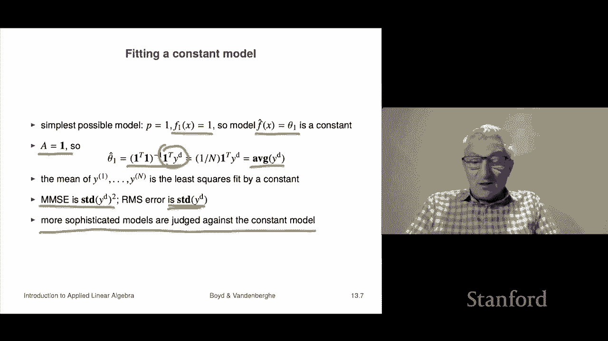

# 35：L13.1 - 最小二乘数据拟合 📊

在本节课中，我们将学习最小二乘数据拟合。这是最小二乘法最重要的应用之一。我们将从一个简单的模型开始，逐步理解如何利用数据来构建预测模型。

## 概述

数据拟合的核心问题是：我们有一个标量结果 `y` 和一个 `n` 维向量 `x`，我们相信它们之间存在某种函数关系，即 `y` 近似等于 `f(x)`。这里的 `x` 通常被称为**自变量**或**特征向量**，`y` 被称为**结果**或**响应变量**。

然而，我们通常并不知道这个真实的函数 `f`。实际上，在许多实际应用中，可能根本不存在一个完美的 `f`。我们的目标是通过一组已知的数据点，构建一个近似的模型 `f̂` 来预测 `y`。

## 数据与模型

我们基于一组数据来构建模型。这组数据包含 `N` 个数据点，每个数据点由自变量 `x⁽ⁱ⁾` 和对应的结果 `y⁽ⁱ⁾` 组成，其中 `i = 1, 2, ..., N`。

我们的模型 `f̂` 将采用一种简单的形式：它是 `p` 个**基函数** `f₁(x), f₂(x), ..., fₚ(x)` 的线性组合。模型参数是系数 `θ₁, θ₂, ..., θₚ`。

**模型公式**：
`f̂(x) = θ₁ f₁(x) + θ₂ f₂(x) + ... + θₚ fₚ(x)`

基函数是我们预先选定的，它们决定了模型的结构。参数 `θ` 则是我们需要通过数据来确定的。

对于已知的数据点 `(x⁽ⁱ⁾, y⁽ⁱ⁾)`，模型的预测值为 `ŷ⁽ⁱ⁾ = f̂(x⁽ⁱ⁾)`。我们当然希望预测值 `ŷ⁽ⁱ⁾` 能尽可能接近真实值 `y⁽ⁱ⁾`。

## 最小二乘拟合

上一节我们介绍了模型的基本形式，本节中我们来看看如何确定最优的参数 `θ`。我们通过最小化**预测误差**来实现。

对于第 `i` 个数据点，其预测误差或**残差** `r⁽ⁱ⁾` 定义为真实值与预测值之差：
`r⁽ⁱ⁾ = y⁽ⁱ⁾ - ŷ⁽ⁱ⁾`

最小二乘数据拟合的目标是：选择参数 `θ`，使得在整个数据集上的**均方根（RMS）预测误差**最小。

**RMS 误差公式**：
`RMS = sqrt( (1/N) * Σ (r⁽ⁱ⁾)² )`

由于平方根是单调函数，最小化 RMS 误差等价于最小化残差的平方和。这可以转化为一个我们熟悉的最小二乘问题。

## 转化为最小二乘问题

为了清晰地展示参数 `θ` 如何影响预测，我们引入矩阵表示法。

首先，我们构造一个 `N × p` 的矩阵 `A`，其元素 `Aᵢⱼ` 是第 `j` 个基函数在第 `i` 个数据点 `x⁽ⁱ⁾` 处的取值：
`Aᵢⱼ = fⱼ(x⁽ⁱ⁾)`

令 `y_d` 为所有真实结果 `y⁽ⁱ⁾` 组成的向量，`ŷ_d` 为所有预测值 `ŷ⁽ⁱ⁾` 组成的向量。那么预测向量可以简洁地表示为：
`ŷ_d = A θ`

残差向量 `r_d = y_d - ŷ_d = y_d - A θ`。我们的目标是最小化残差向量的范数平方：
`minimize || y_d - A θ ||²`

这正是标准的最小二乘问题。假设矩阵 `A` 的列是线性无关的，其最优解为：

**最优参数公式**：
`θ̂ = (Aᵀ A)⁻¹ Aᵀ y_d`

在实际计算中，我们通常使用更稳定的数值方法（如 QR 分解）来求解。在许多编程语言中，这可以简单地写为：
`θ̂ = A \ y_d` （这是代码表示，而非数学公式）

求得最优参数 `θ̂` 后，对应的最小残差平方和 `|| y_d - A θ̂ ||²` 除以 `N`，称为**最小均方误差（MMSE）**。

## 简单示例：常数模型

理解了最小二乘拟合的一般框架后，我们来看一个最简单的例子：常数模型。

我们只使用一个基函数，即 `p = 1`，且 `f₁(x) = 1`。这意味着我们的模型形式为：
`f̂(x) = θ₁ * 1 = θ₁`

换句话说，无论输入 `x` 是什么，模型都预测同一个常数 `θ₁`。

根据前面的公式，此时矩阵 `A` 就是一个所有元素都为 1 的 `N` 维列向量。将其代入最优解公式：

`θ̂₁ = (Aᵀ A)⁻¹ Aᵀ y_d = (N)⁻¹ (Σ y⁽ⁱ⁾) = mean(y_d)`

结果非常直观：最优的常数预测值就是数据 `y` 的**平均值**。

此时，最小的均方误差恰好是数据 `y` 的**方差**，而 RMS 误差就是数据的**标准差**。

这个简单的模型为我们提供了一个重要的**基线**。任何更复杂的模型，其性能都必须与这个仅仅预测平均值的常数模型进行比较。如果一个复杂模型的 RMS 误差只比数据的标准差小一点点，那么它的实际价值可能非常有限。

## 总结

本节课中我们一起学习了最小二乘数据拟合的核心思想。
1.  我们定义了数据拟合问题，即用近似模型 `f̂` 来预测变量 `y`。
2.  我们介绍了使用基函数线性组合的模型形式。
3.  我们将寻找最优参数的问题，转化为最小化预测误差的平方和，即一个最小二乘问题。
4.  我们推导了最优参数 `θ̂` 的矩阵解公式。
5.  我们分析了一个最简单的常数模型案例，发现其最优解就是数据的均值，并且其误差与数据的标准差直接相关，这为评估更复杂模型提供了基准。

理解这个基线模型至关重要，它是衡量任何数据拟合模型性能的起点。