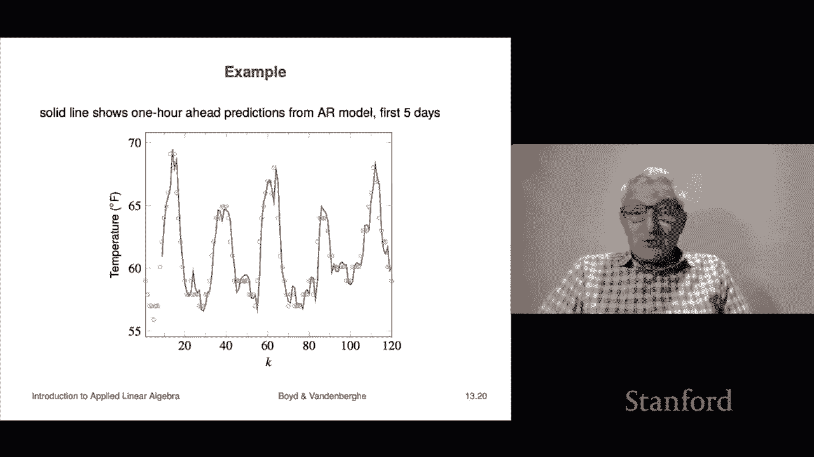

# 36：L13.2 - 单变量函数拟合 📊


在本节课中，我们将学习如何对单变量函数进行拟合。这意味着我们的特征向量或自变量 `X` 是一个标量。我们将从最简单的常数拟合出发，逐步探讨直线拟合、多项式拟合，并了解如何将这些方法应用于时间序列分析等实际问题。

---

## 单变量数据与散点图 🎯

当特征 `X` 的维度为 1 时，我们可以将数据绘制成散点图。例如，横轴是 `X`，纵轴是 `y`，数据点可能呈现为一系列分散的点。当我们创建一个模型函数 `y_hat = f_hat(x)` 时，我们可以为每个 `x` 值计算预测值，从而在图上绘制出一条曲线。在这种情况下，我们不仅可以通过计算均方根误差等指标来评估拟合效果，还可以直观地用肉眼判断拟合的好坏。

---

## 直线拟合 📈

在上一节我们介绍了常数拟合之后，本节我们来看看比它稍复杂一点的模型：直线拟合。这个模型有两个系数，即 `p=2`。

以下是该模型使用的基函数：
*   第一个基函数是常数 1。
*   第二个基函数是 `x`。

因此，模型的形式为：
`f_hat(x) = θ_1 + θ_2 * x`

我们需要确定参数 `θ_1` 和 `θ_2`。与常数模型类似，我们可以构造矩阵 `A`。矩阵 `A` 的行代表不同的数据点，第一列是基函数 `f1` 在这些点上的取值（恒为 1），第二列是 `x` 值本身，即 `[x1, x2, x3, ...]^T`。这是一个 `n x 2` 的矩阵。

我们可以通过计算 `(A^T * A)^-1 * A^T * y` 来得到最优参数 `θ_hat`。对于这个 2x2 的矩阵，我们可以直接推导出解析解。这个解析解具有很好的可解释性，其预测公式如下：

`y_hat = avg(y) + ρ * (std(y) / std(x)) * (x - avg(x))`

其中，`ρ` 是 `x` 和 `y` 的相关系数。公式中 `(x - avg(x)) / std(x)` 部分就是 `x` 的 **z 分数**，它表示 `x` 偏离其均值的标准差倍数。如果 `x` 和 `y` 不相关（`ρ=0`），则整个第二项消失，模型退化为常数模型（即最佳直线是水平的）。如果相关性很高（`ρ` 接近 1），则当 `x` 高于均值时，预测的 `y` 也会倾向于高于其均值。

需要强调的是，推导这个解析解只是为了帮助理解，在实际计算中，它并没有任何优势。在代码中，我们通常直接使用矩阵运算来求解。

以下是在代码中实现直线拟合的典型方式：
```python
# 构造矩阵 A
A = np.column_stack([np.ones_like(x), x])
# 使用最小二乘法求解 θ_hat
theta_hat = np.linalg.lstsq(A, y, rcond=None)[0]
# 或者使用伪逆
theta_hat = np.linalg.pinv(A) @ y
```

因为这个模型的图像是一条直线（更准确地说，是一个仿射函数），所以它被称为直线拟合。有些人也称之为线性拟合，尽管严格来说仿射函数并非线性函数。

---

### 直线拟合示例：市场模型 💹

直线拟合的一个经典应用是金融中的市场模型。在这个模型中，标量 `X` 代表整个市场的日收益率，`y` 代表某个特定资产（例如苹果公司股票）的日收益率。通过收集每日的 `(X, y)` 数据对，我们可以建立一个直线模型来根据市场收益率预测资产收益率。

该模型通常写作以下形式：
`y_hat = r_f + α + β * (x - μ_market)`

其中：
*   `r_f` 是无风险利率（例如美国国债利率，日度下近似为0）。
*   `μ_market` 是市场收益率的均值。
*   `α` 和 `β` 是模型的参数，分别被称为该资产的 **Alpha** 和 **Beta**。

`Beta` 衡量了资产相对于市场波动的敏感度。如果 `Beta=1`，意味着当市场上涨1%时，预计该资产也会上涨约1%。`Alpha` 则代表了超出市场基准的额外收益。尽管有些理论认为 `Alpha` 应为零，但实证中许多对冲基金认为它存在。这个模型本质上就是一个直线拟合。

---

### ⏳ 直线拟合示例：趋势线

直线拟合的另一个重要应用是时间序列的趋势分析。假设 `X_i` 是时间戳，为简化可令 `X_i = i`，这表示我们在等间隔时间点上采样了 `y` 值。用直线模型拟合这样的数据，得到的直线被称为 **趋势线**。模型的斜率 `θ_2` 具有明确的解释：它代表了 `y` 值随时间推移的大致平均变化量（例如，每年石油消费量增加多少百万桶）。

从原始数据中减去趋势线，就得到了 **去趋势化的时间序列**。这个过程可以揭示数据围绕长期趋势的波动情况，例如哪些年份高于趋势，哪些年份低于趋势，从而可能显示出周期性等结构。

---

## 多项式拟合 🧮

在掌握了直线拟合之后，我们可以尝试更灵活的模型，例如多项式拟合。我们选择以下形式的基函数：
`f_i(x) = x^(i-1)`，其中 `i = 1 到 p`。

这意味着：
*   `f1(x) = 1` （常数项）
*   `f2(x) = x`
*   `f3(x) = x^2`
*   ... 以此类推

用参数 `θ_i` 对这些基函数进行线性组合，就得到了一个关于 `x` 的多项式模型：
`f_hat(x) = θ_1 + θ_2*x + θ_3*x^2 + ... + θ_p*x^(p-1)`

此时，矩阵 `A` 的构造方式是：每一行对应一个数据点，第 `j` 列是第 `j` 个基函数在所有数据点上的取值。这个矩阵在数学上被称为 **范德蒙矩阵**。我们通过最小二乘法求解参数 `θ_hat`。

在代码中，实现多项式拟合的模板非常清晰：
```python
# 1. 构造范德蒙矩阵 A
A = np.vander(x, p, increasing=True) # 方法之一
# 或手动构造：A = np.column_stack([x**i for i in range(p)])
# 2. 求解最小二乘解
theta_hat = np.linalg.lstsq(A, y, rcond=None)[0]
```

随着多项式次数（`p-1`）的增加，模型可以更紧密地贴合数据，捕捉更细微的波动。但这也引出了一个关键问题：我们应该选择多少次数的多项式？答案并非越高越好，过度拟合（Overfitting）的风险我们将在后续章节讨论。

---

## 回归模型与线性参数模型的关系 🔄

我们已经看到了回归模型和这里的“线性参数最小二乘拟合”模型，它们之间联系非常紧密，甚至可以看作是同一事物的两种不同表示。

回顾一下，回归模型的形式为：
`y_hat = v + β_1*x_1 + β_2*x_2 + ... + β_n*x_n`
其中 `v` 是截距，`β_i` 是系数，具有清晰的解释性（例如 `β_3` 表示 `x_3` 每变化一单位对预测值的影响）。

我们可以将回归模型纳入我们的通用框架，只需定义基函数为：
`f1(x) = 1`, `f2(x) = x_1`, `f3(x) = x_2`, ..., `f_{n+1}(x) = x_n`。
这样，我们的通用模型 `f_hat = θ_1 + θ_2*x_1 + ... + θ_{n+1}*x_n` 就与回归模型完全一致，其中 `θ_1` 对应 `v`，其余 `θ` 对应 `β`。因此，**回归是我们通用拟合框架的一个特例**。

反过来，我们也可以将通用的线性参数模型视为一种特殊的回归。只需将原始特征 `x` 通过基函数 `f_i` 进行变换，得到新的特征 `f_2(x), f_3(x), ..., f_p(x)`，然后对这个新的特征集进行回归。这被称为 **特征变换** 或 **特征映射**。因此，这两种建模思路本质上是相通的，只是 notation 不同。

---

## 自回归时间序列模型 🤖

最后，我们探讨一个强大而实用的模型：自回归（AR）时间序列模型。假设我们有一个时间序列数据 `z_1, z_2, z_3, ...`（例如每小时温度、每日股价）。

自回归模型的目标是预测下一个时间点的值（一步超前预测），其形式为：
`z_hat_{t+1} = θ_1 * z_t + θ_2 * z_{t-1} + ... + θ_M * z_{t-M+1}`

其中 `M` 称为模型的 **记忆长度**。这个模型非常直观：它用过去 `M` 个时刻的值来预测下一个时刻的值。例如，一个 `AR(2)` 模型预测明天的值等于 `θ_1 * (今天的值) + θ_2 * (昨天的值)`。

我们将该预测问题转化为我们的标准拟合形式：将“下一时刻的真实值 `z_{t+1}`”作为 `y`，将“过去 `M` 个时刻的值 `[z_t, z_{t-1}, ..., z_{t-M+1}]`”作为特征向量 `x`。然后构造数据矩阵，用最小二乘法求解参数 `θ`。

---

### 🌡️ 自回归模型示例：温度预测

我们以洛杉矶机场2016年5月的每小时温度数据为例。简单的预测策略包括：
1.  **常数预测**：总是猜平均温度61.76°F，其RMS误差约为3°F。
2.  **持久性预测**：预测下一小时温度等于当前温度，RMS误差约为1.16°F。
3.  **周期性预测**：预测下一小时温度等于24小时前的温度，RMS误差约为2°F。

当我们使用一个记忆长度 `M=8` 的自回归（AR(8)）模型时，RMS误差可以降低到1°F以下。这个简单的模型仅用过去8小时的数据来预测下一小时，其表现优于上述的简单策略。在实践中的启示是：在尝试复杂模型之前，永远应该先建立并评估简单基准模型，以此衡量复杂模型带来的实际提升是否值得。

---

## 总结 📝

本节课我们一起学习了单变量函数的拟合。
*   我们从直观的散点图开始，理解了单变量拟合的特点。
*   接着，我们深入探讨了 **直线拟合** 的原理、解析解的可解释性及其在金融（市场模型）和时间序列（趋势分析）中的应用。
*   然后，我们介绍了更灵活的 **多项式拟合**，并了解了其实现方式。
*   我们澄清了 **回归模型** 与 **线性参数最小二乘模型** 本质上是相通的，只是表述方式不同。
*   最后，我们学习了 **自回归（AR）时间序列模型**，这是一个用历史数据预测未来值的强大工具，并通过温度预测的实例看到了其效果。




这些模型是数据拟合的基础，掌握它们为后续处理更复杂的模型和评估方法打下了坚实的基础。