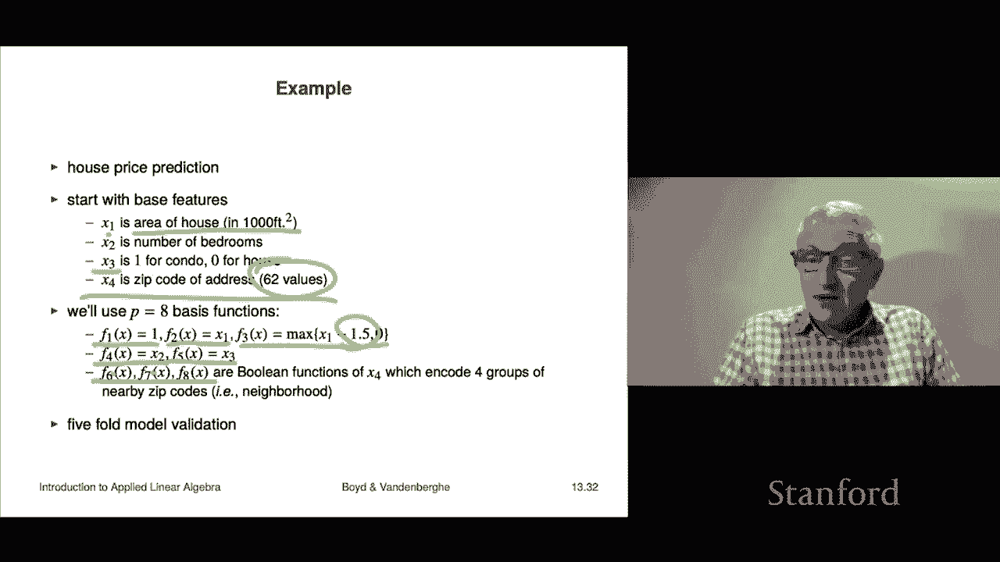

# 37：L13.3 - 拟合效果验证 🧪

在本节课中，我们将要学习一个在构建预测模型时至关重要的主题：验证。我们将探讨如何评估模型在未知数据上的表现，以确保其在实际应用中的有效性。

## 概述

构建预测模型时，我们的目标并非仅仅预测已知数据的结果，因为对于已知数据，我们早已清楚其真实结果。真正的目标是让模型能够准确预测新的、未见过的数据。一个能在新数据上做出合理预测的模型，被称为**泛化**能力好。反之，如果模型在新数据上表现不佳，则可能出现了**过拟合**。

## 验证的基本思想

验证的核心思想非常简单，它模拟了模型在实际中的使用方式。

以下是验证的基本步骤：

1.  **划分数据集**：将初始数据集划分为两部分。一部分是**训练集**，用于构建模型；另一部分是**测试集**（或验证集），被保留起来，在模型构建阶段完全不使用。
2.  **训练模型**：使用训练集来拟合或“训练”模型。
3.  **测试模型**：将训练好的模型应用于测试集，进行预测。
4.  **评估性能**：因为我们知道测试集的真实结果，所以可以计算预测值与真实值之间的误差，从而评估模型在未知数据上的表现。

通过这种方式，我们可以得到一个对模型未来表现的合理估计。虽然这不是绝对的保证，但提供了一个强有力的参考。

## 验证的实践与评估

上一节我们介绍了验证的基本思想，本节中我们来看看如何具体操作和评估结果。

在验证过程中，我们可以做以下几件事：

*   **比较误差**：检查模型在训练集和测试集上的均方根预测误差。如果两者大致相当，会让我们对模型更有信心。通常，测试集误差会略高于训练集误差。
*   **报告测试误差**：在实践中，真正重要的是模型在测试数据上的误差。这是向他人展示模型性能时应报告的数字。

如果验证结果良好，我们可以推测模型将具有良好的泛化能力。例如，你可以说：“我用前一年半的数据训练了模型，然后用过去六个月的数据（模型从未见过）进行测试，预测误差在±7%左右。”这是一个令人信服的证据。

当然，你无法保证模型在未来一定表现良好，因为现实世界可能会发生变化。验证提供的是一个基于历史数据的合理推测。

## 验证的核心作用：模型选择

验证的一个极其有用的作用是解决“哪个模型更好”的争论。在实际工作中，我们常常会生成多个候选模型。

例如，对于一个数据集，我们是应该用三次多项式拟合，还是用八次多项式拟合？仅看训练数据无法回答这个问题，因为更高次数的多项式在训练集上总能拟合得更好，但这并不意味着它在未来数据上也会更好。

验证可以清晰地回答这个问题。以下是使用验证进行模型选择的典型方法：

*   在所有候选模型中，选择在测试集上误差最小的那个。
*   在误差相近的情况下，倾向于选择更简单的模型（例如，选择三次多项式而非十次多项式）。

## 一个验证示例：多项式拟合

让我们通过一个具体例子来观察验证的效果。我们使用一个包含200个数据点的数据集，其中100个作为训练集，用于拟合不同次数的多项式模型（二次、六次、十次、十五次）。另外100个数据点作为测试集。

下图展示了模型在测试集上的预测效果（蓝色曲线），这是一个对模型未来表现的诚实模拟。

随着模型次数增加，训练误差（蓝色曲线）持续下降，这是必然的。

然而，测试误差（红色曲线）的变化则揭示了关键信息：
*   对于低次模型（如二次、四次），训练误差和测试误差都较高，但相差不大。
*   当模型复杂度增加到一定程度（如六次）时，测试误差达到最低。
*   继续增加复杂度（如十次、十五次），训练误差虽然继续降低，但测试误差反而开始显著上升。例如，二十次多项式的训练误差约为0.21，但测试误差却高达0.4。

这个例子清晰地展示了**过拟合**：模型过度学习了训练数据中的噪声和细节，导致在新数据上表现变差。传统的经验法则是选择测试误差最小的模型（本例中为六次）。但考虑到模型的简洁性，测试误差与之接近的四次多项式也是一个不错的选择。

## 交叉验证：更稳健的评估方法

除了简单的训练-测试集划分，还有一种更常用、更稳健的验证方法，称为**交叉验证**。

其工作原理如下：

1.  将原始数据随机分成K个大小相似的组，称为“折”。
2.  进行K轮迭代。在每一轮中：
    *   将其中一折作为测试集。
    *   用剩余的K-1折数据训练模型。
    *   用训练好的模型对当前这一折测试集进行预测并计算误差。
3.  最终，我们会得到K个不同的“诚实”测试误差（因为每一折数据都曾作为模型未见过的测试集）。

以下是交叉验证的常见形式：

*   **5折交叉验证**：K=5
*   **10折交叉验证**：K=10

交叉验证的工程实践价值很高，因为它允许我们进行一些常识性检查：

*   **检查误差一致性**：如果测试误差显著大于训练误差，这是一个危险信号。
*   **评估稳定性**：如果K次迭代得到的测试误差都比较一致，且与训练误差处于同一量级，那么我们可以更有信心地认为模型在未来会表现稳定。

当然，这依然不是绝对的保证。如果数据背后的系统发生根本性变化（例如，市场环境剧变），即使经过完美验证的模型也可能失效。

## 交叉验证实例：房价预测

让我们看一个简单的房价预测例子，使用5折交叉验证。

**模型**：我们用一个非常简单的线性模型来预测房价（千美元），特征只有两个：房屋面积（千平方英尺）和卧室数量。
**数据**：774条房屋销售记录，随机分为5折，每折约155条记录。

我们进行5轮验证，每一轮用4折数据训练，用剩下1折数据测试。结果如下表所示：

| 轮次 | 偏移量 (θ₀) | 面积系数 (θ₁) | 卧室系数 (θ₂) | 训练RMS误差 | 测试RMS误差 |
| :--- | :--- | :--- | :--- | :--- | :--- |
| 1 | 54.5 | 163.1 | -18.4 | 74.3 | 71.8 |
| 2 | 58.3 | 157.5 | -20.3 | 75.1 | 73.2 |
| 3 | 60.1 | 155.8 | -19.7 | 76.8 | 79.5 |
| 4 | 56.7 | 159.2 | -18.9 | 73.9 | 77.1 |
| 5 | 55.2 | 161.5 | -19.2 | 74.5 | 75.6 |

观察结果：
*   模型参数（θ₀, θ₁, θ₂）在不同轮次中虽然不完全相同，但处于同一数量级，这是一个好迹象。
*   训练误差稳定在74-77之间。
*   测试误差在72-80之间，与训练误差处于同一水平，且没有出现异常大的值。

基于此，我们可以对该模型建立信心。我们可以用全部数据重新拟合一个最终模型，并合理预期其在新数据上的预测误差大约在70-85之间。

## 特征工程简介

在构建预测模型时，除了验证，另一个非常重要的环节是**特征工程**。这可以理解为对我们之前讨论的**基函数**的一种设计和选择。

基本流程如下：
1.  从原始特征 `x` 开始。
2.  通过设计**特征映射**或**变换** `f`，生成新的特征（即基函数）。这个过程就是特征工程。
3.  使用这些新特征来拟合模型：`ŷ = θ₁ f₁(x) + θ₂ f₂(x) + ... + θ_p f_p(x)`。
4.  **必须**使用验证（如交叉验证）来检查模型性能。在报告时，应汇报测试误差，而非训练误差。

以下是一些常见的特征变换方法：

*   **标准化**：将特征减去其均值，再除以其标准差，得到近似服从标准正态分布的新特征（Z分数）。这使得不同特征具有可比性。公式为：`z_i = (x_i - mean(x)) / std(x)`。
*   **对数变换**：如果特征 `x_i` 非负且取值范围很大（如计数数据），常用 `log(1 + x_i)` 进行变换以压缩尺度。例如，产品销量可能从10到350,000，取对数后范围变得合理。
*   **创建交互特征或非线性特征**：
    *   多项式特征：`x`, `x²`, `x³` 等。
    *   分段线性特征：例如 `f(x) = max(x - 1.5, 0)`。当 `x < 1.5` 时，该特征为0；当 `x > 1.5` 时，该特征表示 `x` 超出1.5的部分。这可以捕捉“超过某个阈值后效应增强”的现象。

## 特征工程实例：改进的房价预测

现在，我们用一个更复杂的特征工程例子来预测房价，并与之前的简单模型对比。

**原始特征**：
*   `x1`: 房屋面积（千平方英尺）
*   `x2`: 卧室数量
*   `x3`: 布尔特征（1=公寓，0=独栋屋）
*   `x4`: 邮政编码（分类特征，有62个不同值）

**特征工程（设计8个基函数）**：
1.  `f1(x) = 1` （偏移量）
2.  `f2(x) = x1` （面积）
3.  `f3(x) = max(x1 - 1.5, 0)` （超过1500平方英尺的面积部分）
4.  `f4(x) = x2` （卧室数）
5.  `f5(x) = x3` （房屋类型）
6.  `f6(x), f7(x), f8(x)`: 将62个邮政编码归类为4个区域，并用3个布尔特征进行“独热编码”表示。

我们使用5折交叉验证来评估这个模型。结果发现：
*   训练误差在67-70之间。
*   测试误差与训练误差处于同一量级（略高），大约在68-75之间。
*   模型参数在不同折之间保持相对稳定。

与之前仅使用面积和卧室数的简单模型（测试误差约70-88）相比，这个经过特征工程的模型表现更好（测试误差约68-75）。这表明我们设计的特征确实提升了模型的预测能力。

关于如何找到这些特征，答案通常是**尝试和验证**。你可能会尝试几十甚至上百种不同的特征组合、变换和阈值（例如，`max(x1 - B, 0)` 中的 `B` 可以尝试1.0, 1.5, 2.0等）。然后，通过交叉验证的测试误差来选择表现最好的模型。在性能相近时，优先选择更简单的模型。

最终模型的选择也取决于应用场景。有些场景（如向监管机构解释）需要模型简单可解释；而另一些场景（如某些量化交易）则只关心预测精度，不关心模型本身的意义。

## 总结

本节课中我们一起学习了预测模型构建中的关键环节——验证。
*   我们理解了验证的目的是评估模型在**未知数据**上的泛化能力，避免过拟合。
*   我们掌握了简单的**训练-测试集划分**验证法。
*   我们学习了更稳健的**K折交叉验证**方法及其工程实践意义。
*   我们探讨了**特征工程**的基本概念，即通过设计特征变换来提升模型表现，并认识到其效果必须通过验证来确认。
*   我们通过实例看到，验证是进行**模型选择**和**超参数调优**（如多项式次数、特征变换阈值）的客观依据。

记住，一个模型的最终价值在于其解决实际问题的能力，而验证是我们连接模型与实际问题之间最重要的桥梁。