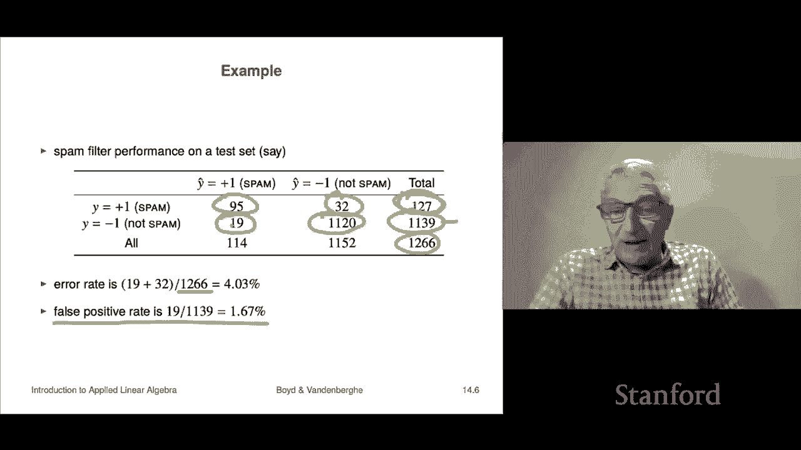
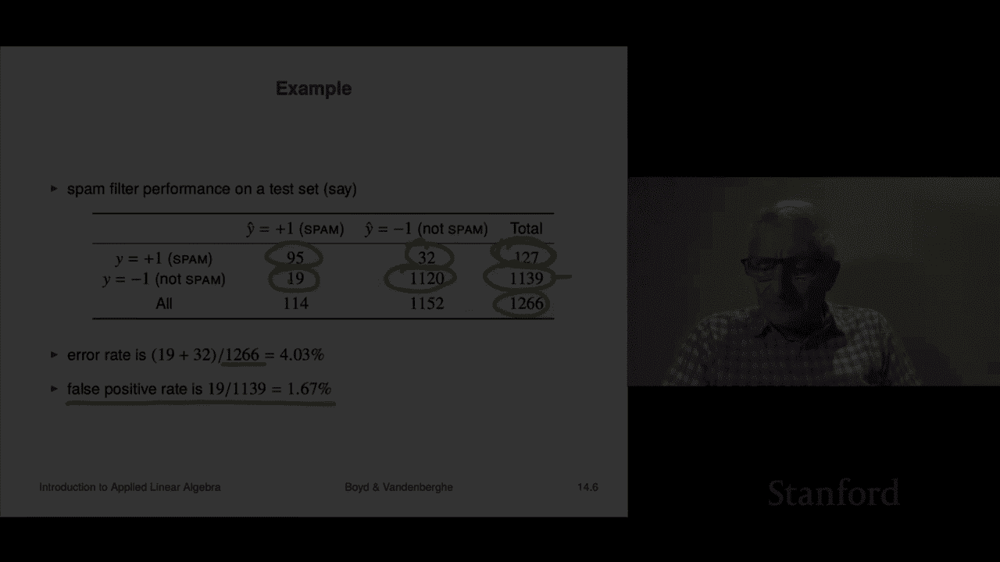

# 38：L14.1 - 分类问题 📊

在本节课中，我们将学习什么是分类问题。我们将了解它与回归预测的区别，探讨其核心概念，并学习如何评估分类器的性能。

---

## 什么是分类问题

上一章我们学习了最小二乘回归，即预测一个数值。现在，我们将学习另一种预测形式——当你要预测的事物只取有限个值时，例如“真”或“假”，这被称为**分类**。在本讲中，我们将了解其工作原理，并看看如何使用最小二乘法来实现它。

分类本质上是数据拟合，但其输出（或称结果）通常是非数值的，例如：
*   真或假
*   垃圾邮件或非垃圾邮件
*   狗、马或老鼠

这些输出值被称为**标签**或**类别**。这种取有限个非数值结果的变量，可以称为**类别变量**。我们进行数据拟合的目标，就是完成**分类**。

---

## 布尔分类

我们将从最简单、也是最常见的情况开始：**布尔分类**。这意味着只有两种可能的结果，例如“真”和“假”，或“垃圾邮件”和“非垃圾邮件”。

为了便于数学处理，我们需要将它们编码为数值。一种常见的编码方式是：
*   **+1** 代表“真”
*   **-1** 代表“假”

另一种常见编码是“1”代表真，“0”代表假。

因此，一个分类器可以看作一个函数。它接收一个 n 维向量 **x**（我们的特征值），然后输出 **-1** 或 **+1**。输出 **+1** 表示模型预测结果为“真”，输出 **-1** 表示预测结果为“假”。

---

## 分类的应用

分类有非常广泛的应用，以下是一些例子：

以下是几个典型的应用场景：
*   **电子邮件垃圾邮件检测**：特征向量 **x** 可以包含邮件的词频统计、发件来源等信息。我们根据这些特征预测邮件是否为垃圾邮件。
*   **金融交易欺诈检测**：特征向量 **x** 包含交易信息（如金额、时间、商户）和发起者信息。分类器需要判断该交易是正常还是欺诈。实践中，这常被设计为“红-黄-绿”三分类系统。
*   **文档分类**：例如，从大量文档中找出与政治相关的文章。特征 **x** 可以是文档的词频直方图。
*   **疾病检测**：特征 **x** 包含患者的特征、医学检测结果和症状。分类器预测患者是否患有特定疾病。
*   **数字通信接收器**：特征 **x** 是接收到的信号（如不同天线或时间点的测量值）。需要预测传输的比特位是“真”还是“假”。

---

## 分类与数值预测的差异

分类与预测一个数值有本质区别。对于一个数据点 **(x, y)**，其中 **y** 是真实标签（-1 或 +1），我们的预测结果是 **ŷ = f̂(x)**，也取 -1 或 +1。

在数值预测中，我们通过误差大小（如均方根误差）来衡量预测的好坏。但在布尔分类中，真实值和预测值都只有两种可能，因此总共只有四种可能的情况：

以下是四种可能的预测结果：
*   **真阳性**：真实值为 +1（真），预测值也为 +1（真）。**预测正确**。
*   **真阴性**：真实值为 -1（假），预测值也为 -1（假）。**预测正确**。
*   **假阳性**：真实值为 -1（假），但预测值为 +1（真）。**预测错误**。
*   **假阴性**：真实值为 +1（真），但预测值为 -1（假）。**预测错误**

假阳性和假阴性在不同场景下可能带来严重后果。例如，在欺诈检测中，假阳性会错误地阻止合法交易；假阴性则会漏过欺诈交易。

---

## 混淆矩阵与性能评估

当我们对一个数据集（如测试集）应用分类器后，可以将所有数据点根据其真实标签和预测标签，归入上述四个类别，并统计数量。将这些计数放入一个矩阵中，就得到了**混淆矩阵**。

混淆矩阵的格式通常如下：

| | 预测为 +1 | 预测为 -1 |
| :--- | :--- | :--- |
| **真实为 +1** | 真阳性 (TP) | 假阴性 (FN) |
| **真实为 -1** | 假阳性 (FP) | 真阴性 (TN) |

*   **对角线元素（TP, TN）** 代表预测正确的次数。
*   **非对角线元素（FN, FP）** 代表预测错误的次数，体现了模型的“混淆”程度。一个完美的分类器，其混淆矩阵将是对角矩阵。

从混淆矩阵中，可以衍生出多种性能评估指标：

以下是几个核心的评估指标：
*   **错误率**：`(FP + FN) / (TP + TN + FP + FN)`。即预测错误的数据点占总数的比例。
*   **真阳性率 / 召回率**：`TP / (TP + FN)`。即在所有真实为正例的样本中，被正确预测出来的比例。
*   **假阳性率**：`FP / (FP + TN)`。即在所有真实为负例的样本中，被错误预测为正例的比例。

评估一个分类器时，我们至少会关注一个（如错误率），有时会关注两到三个指标（如召回率和假阳性率）。需要注意的是，**这些评估必须在测试集上进行**，在训练集上计算没有意义。

---

## 实例：垃圾邮件过滤器

假设一个垃圾邮件过滤器在一个包含约1300封邮件的测试集上，得到如下混淆矩阵：

| | 预测为垃圾邮件 | 预测为非垃圾邮件 |
| :--- | :--- | :--- |
| **真实为垃圾邮件 (127)** | 95 (TP) | 32 (FN) |
| **真实为非垃圾邮件 (1139)** | 19 (FP) | 1120 (TN) |

我们可以计算：
*   **错误率** = `(19 + 32) / 1266 ≈ 4.0%`
*   **假阳性率** = `19 / 1139 ≈ 1.67%`

错误率计算隐含了一个假设：假阳性和假阴性两种错误的严重程度相同。但在许多实际应用中，这个假设并不成立，我们可能更关心其中一种错误。因此，有时需要同时查看多个指标来全面评估模型性能。

---

## 总结

本节课我们一起学习了分类问题的基础知识。我们明确了分类是预测有限个类别标签的任务，并重点讨论了最常见的布尔分类。我们了解了分类与回归的区别，认识了真阳性、假阳性等四种预测结果，并学习了如何使用混淆矩阵及其衍生指标（如错误率、召回率）来评估分类器的性能。最后，通过一个垃圾邮件过滤器的实例，我们巩固了这些概念的实际应用。