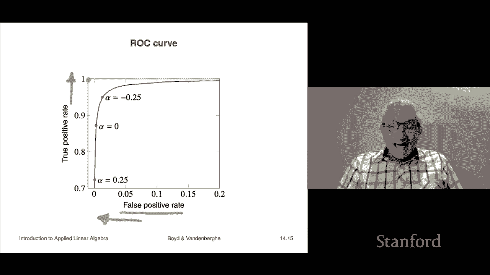

# 39：L14.2 - 最小二乘分类 📊


在本节课中，我们将学习如何利用最小二乘法来构建、调整或拟合一个分类器。我们将从一个简单的二分类问题入手，了解其基本原理，并通过一个经典的手写数字识别案例来实践。最后，我们还会探讨分类中一个重要的概念——ROC曲线。

---

## 最小二乘分类的基本思想 🧠

上一节我们介绍了最小二乘法的基本概念，本节中我们来看看如何将其应用于分类问题。

其方法非常直接。我们将进行标准的最小二乘数据拟合，只不过此时的目标变量（或称“标签”）是 **+1** 或 **-1**。例如，在医疗诊断中，+1可能代表“患病”，-1代表“健康”。我们构建的模型会直接去拟合这个数值标签。

我们把这个拟合出的模型称为 **f̃(x)**，而不是 **f̂(x)**。这是因为 f̃(x) 的输出是一个连续数值，而一个真正的分类器 f̂(x) 必须输出离散的类别（+1或-1）。我们的期望是：当真实标签 y 是 +1 时，f̃(x) 的值接近 +1；当 y 是 -1 时，f̃(x) 的值接近 -1。

为了得到最终的分类结果，我们需要一个决策函数 **s(·)** 来将连续值转换为类别：

```python
def s(f_tilde_x):
    if f_tilde_x >= 0:
        return +1
    else:
        return -1
```

这个函数在 f̃(x) = 0 时（即决策边界）将结果判为 +1，当然，判为 -1 也可以，这在实际中影响不大。

我们可以这样理解 f̃(x) 的值：如果它接近 +1，模型对“正类”很有信心；如果接近 -1，则对“负类”很有信心；如果值在 0 附近（如 +0.01），则模型不太确定，但根据我们的规则，它仍会被归类为 +1。

---

## ✍️ 实战案例：MNIST 手写数字识别

现在，我们来看一个具体的例子，使用的是著名的 **MNIST 数据集**。该数据集包含 70,000 张 28x28 像素的手写数字图像（0到9），其中笔迹风格多样。

我们将问题简化为一个二分类任务：判断一张图片是否是数字 **0**。
*   如果是 0，则标签 **y = +1**。
*   如果是 1-9 中的任何一个，则标签 **y = -1**。

**数据准备**：
每张图片被展开为一个向量 **x**。由于图像边缘的像素总是黑色（值为0），这些像素不提供信息，因此我们实际使用的特征维度是 493，并额外添加一个常数项 1。

以下是我们在训练集（60,000张图片）和测试集（10,000张图片）上得到的结果：

**训练集结果（混淆矩阵）**：
*   **真正例 (TP)**：模型预测为0，实际也是0的图片数。约 5000+ 张。
*   **假负例 (FN)**：模型预测不是0，但实际是0的图片数。765 张。
*   **假正例 (FP)**：模型预测是0，但实际不是0的图片数。167 张。
*   **真负例 (TN)**：模型预测不是0，实际也不是0的图片数。占大多数。

总体错误率约为 **1.6%**。

**测试集结果**：
在未见过的测试集上，我们得到了与训练集非常接近的错误率（同样约1.6%）。这表明我们的模型没有过拟合，泛化能力良好，可以用于识别新的手写数字0。

> **补充说明**：虽然1.6%的错误率听起来不错，但在现代机器学习中，更先进的方法（包括本课程后续会介绍的一些方法）可以达到远低于此、甚至超越人类水平的性能。最小二乘分类是一个非常基础但有效的入门方法。

---

## 深入分析：得分分布与系数解读 📈

一个非常有趣的分析是观察模型在训练集上输出的 **f̃(x)** 值的分布。

下图展示了这个分布：
*   **蓝色点**：代表真实标签为 0（正类）的样本的 f̃(x) 值。
*   **红色点**：代表真实标签为非 0（负类）的样本的 f̃(x) 值。

我们的分类器在 **f̃(x) = 0** 处设置了一个阈值。位于阈值右侧（f̃(x) ≥ 0）的样本被分类为 0，左侧（f̃(x) < 0）的则被分类为非 0。

从图中可以清晰地看到两个类别的分离。虽然存在一些重叠（导致了错误分类），但整体上模型成功地区分了“0”和“非0”。

我们还可以查看分类器的系数（即模型学到的权重）。这些系数可以直观解释：
*   系数为负的像素：如果该像素位置较亮，会显著降低图像被判断为 0 的可能性。
*   系数为正的像素：如果该像素位置较亮，则会增加图像被判断为 0 的可能性。
*   从系数热力图中，我们甚至能隐约看到一个环状结构，这与数字 0 的书写形状是吻合的。

---

## ⚖️ 决策阈值与 ROC 曲线

在之前的讨论中，我们默认使用了 **0** 作为决策阈值。但有时，调整这个阈值可以优化分类器的表现，以适应不同的应用需求。

我们可以选择一个任意的阈值 **α**，并重新定义决策规则：

```python
def f_hat(x, alpha):
    if f_tilde(x) >= alpha:
        return +1
    else:
        return -1
```

当 **α = 0** 时，就回到了我们之前的情况。**α** 被称为**决策阈值**。

*   **提高 α（如设为 0.2）**：模型会更“保守”地预测正类（0）。这会减少**假正例 (FP)**（将非0误判为0），但同时也可能增加**假负例 (FN)**（将0误判为非0）。
*   **降低 α（如设为 -0.3）**：模型会更“积极”地预测正类。这会减少假负例，但增加假正例。

通过系统性地改变 α，并计算对应的**真正例率 (TPR)** 和**假正例率 (FPR)**，我们可以绘制出一条曲线，称为**接收者操作特征曲线**，即 **ROC 曲线**。

**ROC 曲线解读**：
*   曲线的横轴是**假正例率 (FPR)**，纵轴是**真正例率 (TPR)**。
*   一个完美的分类器的 ROC 曲线会紧贴左上角（FPR=0， TPR=1）。
*   对角线（从原点到右上角的直线）代表随机猜测的性能。
*   我们的分类器的 ROC 曲线越靠近左上角，性能越好。

**如何选择 α**：
这没有统一的数学答案，完全取决于**实际应用**。我们需要权衡两种错误的代价：
*   **假正例代价高**：例如，垃圾邮件过滤器将重要邮件误判为垃圾邮件。我们应提高 α，减少误报。
*   **假负例代价高**：例如，疾病筛查中未检测出患者。我们应降低 α，确保尽可能捕捉所有病例。

---

## 课程总结 🎯

本节课中，我们一起学习了如何将最小二乘法应用于分类问题。

1.  **核心思想**：通过最小二乘回归拟合数值标签（+1/-1），再通过阈值函数将连续输出转换为离散类别。
2.  **实战演练**：我们使用 MNIST 数据集构建了一个区分数字“0”和“非0”的分类器，取得了约1.6%的错误率，并验证了其泛化能力。
3.  **模型分析**：我们通过得分分布图直观看到了分类效果，并通过系数图对模型决策进行了解释。
4.  **高级话题**：我们引入了决策阈值 α 的概念，并学习了如何通过绘制和分析 **ROC 曲线** 来评估和优化分类器在不同错误代价下的表现。




最小二乘分类是一个简单而有效的分类入门方法。在其他课程中，你将会学到更复杂、性能通常也更优的分类算法（如逻辑回归、支持向量机、神经网络等），但它们的许多核心概念（如决策边界、阈值、ROC分析）与本节课所学是相通的。理解最小二乘分类为你进一步探索机器学习领域奠定了坚实的基础。