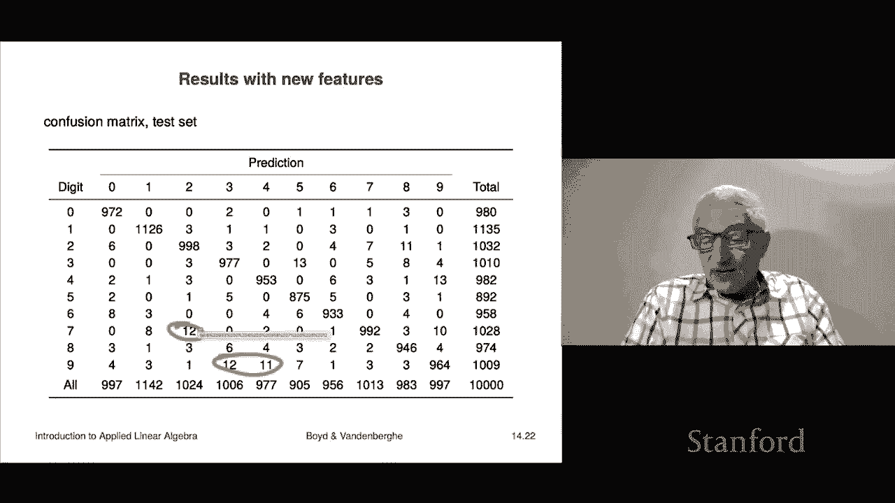

# 40：L14.3 - 多类分类 🎯

## 概述

在本节课中，我们将要学习多类分类。多类分类是指预测结果 `y` 的可能取值不止两个，而是有 `K` 个（`K > 2`）的情况。我们将介绍多类分类的基本概念、应用场景，并学习如何使用最小二乘法构建一个简单的多类分类器。

## 多类分类简介

上一节我们讨论了二分类问题，本节中我们来看看当类别数量超过两个时的情况。在多类分类中，标签集通常是整数 `1` 到 `K`，每个整数代表一个类别（例如，类别3可能代表“大象”、“橙色”或“欺诈”）。预测器 `f̂` 是一个从特征空间 `R^n` 映射到这些标签的函数，即 `f̂: R^n → {1, 2, ..., K}`。这实质上将特征空间划分成了 `K` 个区域，每个区域对应一个预测类别。

对于给定的预测器和数据集，混淆矩阵现在是 `K×K` 的，而不再是二分类时的 `2×2` 矩阵。在某些应用中，混淆矩阵中不同非对角线位置的错误可能具有不同的严重程度。

## 多类分类的应用示例

以下是多类分类的一些典型应用场景：

*   **手写数字识别**：输入一张数字图片，预测它是 `0` 到 `9` 中的哪一个（`K=10`）。
*   **市场营销人口统计分类**：根据客户的购买历史等数据，将其划分到数十个人口统计群组之一。
*   **疾病诊断**：根据患者的症状、检测结果和历史记录，从多种候选疾病（包括“无病”）中做出诊断。
*   **翻译中的词义选择**：根据上下文，确定一个多义词（如英文的“bank”）在目标语言（如波斯语）中对应的正确词汇。
*   **文档主题预测**：根据文档内容（如词频统计），将其归类到预设的多个主题（如体育、政治、科学）之一。

## 基于最小二乘法的多类分类方法

与二分类类似，虽然存在更复杂、效果更好的多类分类方法，但最小二乘法因其简单且能引入重要概念而值得学习。该方法的核心思想是为每个类别构建一个独立的二分类器。

以下是具体步骤：

1.  **为每个类别构建分类器**：对于 `K` 个类别，我们构建 `K` 个最小二乘分类器。第 `l` 个分类器 `f̂_l` 的任务是判断一个样本是否属于类别 `l`（正类），还是属于其他所有类别（负类）。其输出为 `+1`（属于类别 `l`）或 `-1`（不属于类别 `l`）。

2.  **获取原始分数**：我们实际使用的是分类器决策函数 `f̃_l(x)` 的原始输出值（一个实数），而不是最终的 `±1` 符号。这个值可以理解为模型对“样本属于类别 `l`”的置信度。值越接近 `+1`，表示越确信属于该类别；越接近 `-1`，表示越确信不属于该类别；值在 `0` 附近则表示不确定。

3.  **最终决策规则**：对于一个新样本 `x`，我们计算所有 `K` 个分类器的原始分数 `f̃_1(x), f̃_2(x), ..., f̃_K(x)`。最终的预测类别是给出最高原始分数的那个分类器所对应的类别。这可以用数学公式表示为：
    `f̂(x) = argmax_{l=1,...,K} f̃_l(x)`
    其中，`argmax` 返回使函数值最大的索引 `l`。

**举例说明**：假设有三个类别：苹果、香蕉、桃子。对于一个样本 `x`，三个分类器的原始输出为：`f̃_苹果(x) = -0.7`, `f̃_香蕉(x) = +0.2`, `f̃_桃子(x) = +0.8`。虽然 `f̃_香蕉(x)` 也是正数，但 `f̃_桃子(x)` 的置信度最高，因此最终预测为桃子。

## 手写数字识别实例

将上述方法应用于 MNIST 手写数字数据集（`K=10`），我们得到一个 `10×10` 的混淆矩阵。测试集上的错误率约为 `14%`。虽然这个错误率不低（大约每六次预测错一次），但考虑到这是最简单的模型，效果尚可。观察混淆矩阵可以发现，模型犯的错误大多是人类也容易混淆的数字对，例如将 `9` 误判为 `4`，或将 `9` 误判为 `7`。

## 通过特征工程提升性能

仅仅使用原始像素特征可能限制了模型性能。一个有趣且有效的方法是**特征工程**，即构造新的特征。这里介绍一种简单甚至有些“疯狂”的方法：添加随机特征。

具体操作是：生成一个 `5000 × 784` 的随机矩阵（`784` 是 `28×28` 图片的像素数），矩阵元素随机为 `+1` 或 `-1`。然后将原始特征向量 `x` 乘以这个随机矩阵，得到 `5000` 个新的随机特征，与原始特征拼接，形成总共 `5784` 维的新特征向量。

使用这个扩展后的特征集重新训练模型，性能得到显著提升：训练错误率降至约 `1.5%`，测试错误率降至约 `2.6%`。混淆矩阵中的非对角线元素大多变成了很小的个位数（如 `0`, `1`, `3`），表明模型性能大幅改善。

这揭示了机器学习中的一个重要观点：有时增加特征（即使是随机特征）可以扩展模型的表示能力，从而提升性能。当然，如果能够根据领域知识精心设计有意义的特征，性能还可以进一步提升。目前最先进的方法在手写数字识别上的错误率已经极低，甚至在某些测试集上可以达到接近零错误。

## 总结

本节课中我们一起学习了多类分类。我们了解了多类分类与二分类的区别，看到了它在诸多领域的应用。我们重点学习了如何使用最小二乘法构建多类分类器，其核心是为每个类别训练一个“一对多”的二分类器，并通过比较各分类器的原始输出置信度来做出最终决策。最后，我们通过手写数字识别的例子，演示了该方法的应用，并展示了通过添加随机特征进行特征工程可以显著提升模型性能。这为我们理解更复杂的分类模型奠定了基础。