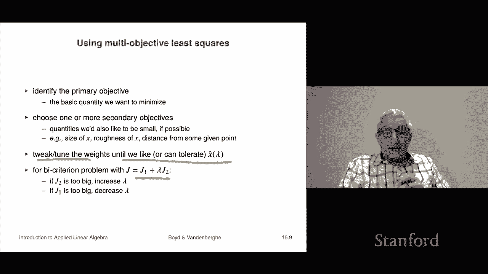

# 41：L15.1 - 多目标最小二乘 🎯


在本节课中，我们将要学习多目标最小二乘。这是最小二乘法在实际应用中的一个重要扩展。我们将看到，这个问题可以非常迅速地转化为一个标准的最小二乘问题，因此我们能够轻松地处理它。多目标最小二乘在实践中非常有用。

## 什么是多目标最小二乘问题？ 🤔

上一节我们介绍了标准最小二乘，本节中我们来看看它的多目标版本。多目标最小二乘问题的核心是：我们需要选择一个 n 维向量 **x**，这与标准最小二乘相同。但不同之处在于，我们现在不是只有一个最小二乘目标（即一个范数平方项），而是有 **k** 个这样的目标。

具体来说，我们有 k 个希望最小化的目标：
*   **J₁(x) = ||A₁x - b₁||²**
*   **J₂(x) = ||A₂x - b₂||²**
*   ...
*   **Jₖ(x) = ||Aₖx - bₖ||²**

其中，每个 **Aᵢ** 是一个 **mᵢ × n** 的矩阵（不同目标的矩阵可以有不同行数），**bᵢ** 是相应的 **mᵢ** 维向量。我们称 **Jᵢ** 为多目标优化问题中的“目标”，也称为“多准则”问题，因为我们同时关心 k 件事。唯一确定的是，我们希望所有这些目标都尽可能小。

## 加权求和法：将多目标转化为单目标 ⚖️

当我们有多个需要优化的目标时，一个传统且有效的方法是给它们分配权重，然后相加，形成一个单一的“主目标”。

我们定义加权和的目标函数 **J** 为：
**J(x) = λ₁J₁(x) + λ₂J₂(x) + ... + λₖJₖ(x)**

这里的权重 **λ₁, λ₂, ..., λₖ** 必须是正数。如果权重为负，则意味着鼓励对应的目标变大，这与我们的初衷相悖。这种方法被称为多准则问题的“标量化”——我们将 k 个不同的关切转化为一个单一的标量 **J**。

由于所有权重同时乘以任意正数不会改变优化结果，我们通常将第一个权重 **λ₁** 设为 1。此时，**J₁** 被称为“主要目标”，通常是我们最关心、最希望使其变小的量。而其他权重 **λᵢ (i>1)** 则表示我们关心第 i 个目标 **Jᵢ** 相对于主要目标 **J₁** 的程度。例如，**λ₂ = 5** 意味着 **J₂** 变大带来的“不适感”是 **J₁** 变大的 5 倍。这些权重参数有时也被称为“超参数”。

一个重要的特例是双准则问题（**k=2**），其目标函数为：
**J(x) = ||A₁x - b₁||² + λ ||A₂x - b₂||²**
这里的 **λ** 直接衡量了第二个目标相对于第一个目标的重要性。

## 转化为标准最小二乘问题 🔄

现在，我们的任务是最小化这个加权目标函数 **J(x)**。我们可以利用矩阵和向量的技巧，轻松地将其转化为一个标准的最小二乘问题，从而直接套用已知的解法。

我们可以将 **J(x)** 重写为：
**J(x) = ||Ãx - b̃||²**
其中，**Ã** 和 **b̃** 是通过堆叠原始数据并乘以权重的平方根得到的：

```
à = [ √(λ₁) A₁;
      √(λ₂) A₂;
         ...
      √(λₖ) Aₖ ]

b̃ = [ √(λ₁) b₁;
      √(λ₂) b₂;
         ...
      √(λₖ) bₖ ]
```

这样，多目标加权最小二乘问题就被完美地转化为了一个关于 **Ã** 和 **b̃** 的标准最小二乘问题。假设 **Ã** 的列是线性无关的，其解为：
**x̂ = (ÃᵀÃ)⁻¹ Ãᵀ b̃**
或者用伪逆表示为 **x̂ = Æ b̃**。我们可以通过 **Ã** 的 QR 分解等多种方法来求解。

一个有趣的点是：单个目标对应的矩阵 **Aᵢ** 的列可以是相关的，但堆叠后形成的 **Ã** 必须保证列线性无关，才能得到唯一解。

## 帕累托最优与最优权衡曲线 📈

上一节我们介绍了如何求解，本节中我们来看看解的性质，特别是在双准则问题下的意义。当我们求解 **min J₁(x) + λJ₂(x)** 并让 **λ** 取遍所有正数时，会得到一系列解 **x̂(λ)**。这些解具有一个非常重要的性质：它们都是“帕累托最优”的。

以下是帕累托最优的定义：
*   **支配**：如果一个点 **x** 在所有目标（**J₁** 和 **J₂**）上的值都严格小于另一个点 **x̃**，则称 **x** 支配 **x̃**。
*   **帕累托最优**：如果一个点 **x** 不被任何其他点所支配，则称它是帕累托最优的。

当我们变动 **λ** 时，解 **x̂(λ)** 对应的目标值对 **(J₁(x̂), J₂(x̂))** 在平面上描绘出一条曲线，这条曲线被称为“最优权衡曲线”。曲线上的每一个点都是帕累托最优点。

为了更直观地理解，请看下图示例。图中横轴是主要目标 **J₁**，纵轴是次要目标 **J₂**。**左下方向代表更优**（两个目标值都更小）。最优权衡曲线展示了为了减少 **J₂**，你必须在 **J₁** 上付出多少代价，反之亦然。曲线有时会有一个明显的“拐点”，在拐点附近，稍微牺牲一点 **J₁** 可以换来 **J₂** 的大幅改善。

## 如何在实践中使用多目标最小二乘？ 🛠️

了解了原理后，我们来看看如何在实践中应用多目标最小二乘。其使用流程通常遵循以下步骤：

以下是具体的使用步骤：
1.  **确定主要目标**：首先，明确你最想最小化的那个核心量，将其作为 **J₁**。
2.  **选择次要目标**：然后，选择一个或多个你“希望”也能小的量作为 **J₂, J₃, ...**。这些目标通常用于引入一些期望的属性，例如希望解向量比较“平滑”，或者希望控制变化幅度不要太大。
3.  **调整权重**：通过调整权重 **λ** 来获得不同的解 **x̂(λ)**，直到找到一个你满意或至少可以接受的解。

调整权重的经验法则是：
*   如果你觉得 **J₂** 太大了，就**增加 λ**。这会给第二个目标施加更大的惩罚，迫使优化后的 **J₂** 变小（但通常 **J₁** 会变大）。
*   如果你觉得 **J₁** 太大了，就**减小 λ**。这会降低对第二个目标的关注，让优化更专注于减小 **J₁**。

这个过程有时是系统性的，但更多时候是通过手动“调试”来完成：输入一个 **λ**，观察得到的解和对应的目标值，进行一些模拟或评估，如果不满意就修改 **λ** 再试，直到获得满意的结果。

## 总结 📝




本节课中我们一起学习了多目标最小二乘。我们首先定义了同时最小化多个目标函数的问题。然后，我们介绍了通过加权求和法将其转化为单一目标的标准最小二乘问题，并给出了具体的转化公式。接着，我们探讨了双准则情形下的帕累托最优概念和最优权衡曲线，这帮助我们理解不同目标之间的取舍关系。最后，我们介绍了在实践中如何使用多目标最小二乘，核心在于通过调整权重参数来获得符合我们偏好的解。这种方法将权重作为“旋钮”，是处理具有多个竞争目标的优化问题的强大而实用的工具。