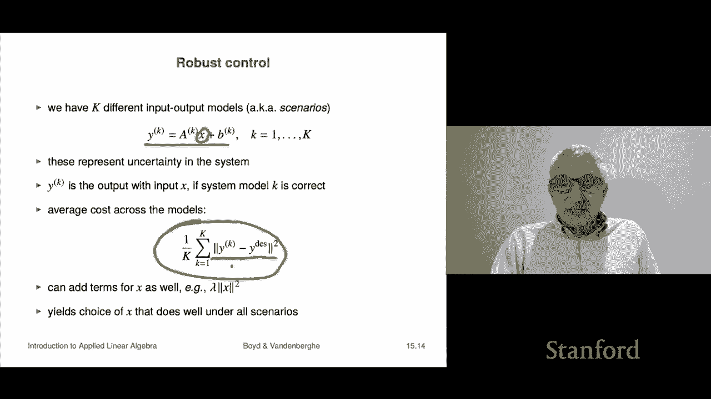

# 42：L15.2 - 多目标最小二乘控制 🎯

在本节课中，我们将学习多目标最小二乘在控制领域的一般应用。我们将了解如何通过选择输入来获得期望的输出，并探讨如何平衡多个相互冲突的目标。

## 概述 📖

控制的核心是选择一个动作或输入，以实现某个期望的输出或结果。我们将使用一个线性或仿射的输入-输出模型来描述系统，并应用多目标最小二乘方法来优化多个与输入和输出相关的目标。

## 控制问题的一般形式

上一节我们介绍了课程主题，本节中我们来看看控制问题的一般数学描述。

我们有一个 **n** 维向量 **x**，代表我们的动作或输入。我们有一个 **m** 维向量 **y**，代表使用输入 **x** 后产生的结果或输出。

输入和输出由一个线性或仿射的输入-输出模型关联，其形式如下：
`y = A * x + b`

矩阵 **A** 和向量 **b** 是已知的，它们可能来自物理原理模型，也可能来自数据拟合。控制的目标是选择输入 **x**（它决定了输出 **y**），并优化与 **x** 和 **y** 相关的多个目标。这正是我们使用多目标最小二乘的原因。

## 典型的目标函数

以下是控制问题中常见的两个目标函数。

*   **主要目标 J₁**：通常我们希望输出接近一个给定的目标值 **y_desired**。这个目标衡量了与期望输出的偏差，公式为：
    `J₁ = ||y - y_desired||² = ||A*x + b - y_desired||²`

*   **次要目标 J₂**：通常我们希望输入本身较小，这代表效率或成本。其公式为：
    `J₂ = ||x||²`
    另一种常见形式是希望输入接近某个标称值 **x_nom**，公式为：
    `J₂ = ||x - x_nom||²`
    这在顺序控制中很常见，**x_nom** 可以是上一时刻的控制动作，这有助于保证控制动作随时间平滑变化。

多目标控制的思想就是在达成主要目标（如接近期望输出）和次要目标（如控制输入不要过大或变化过快）之间进行权衡。

## 应用示例：产品需求塑造

让我们看一个具体的应用实例，虽然从事这项工作的人可能不称之为“控制”，但其数学形式是相同的。

假设我们有一组产品，当前价格向量为 **p**。我们计划通过一个相对价格变化向量 **Δp** 来调整价格。例如，**Δp₃ = -0.1** 意味着将产品3的价格降低10%。

价格变化会引发需求变化，两者通过需求价格弹性矩阵 **Eᴰ** 关联，其线性模型为：
`Δd = Eᴰ * Δp`
其中 **Δd** 是需求的变化量。

我们的目标是：
1.  **主要目标 J₁**：使需求变化接近一个目标变化 **Δd_target**（例如，匹配我们的生产能力）。`J₁ = ||Δd - Δd_target||² = ||Eᴰ*Δp - Δd_target||²`
2.  **次要目标 J₂**：不希望价格变动过大。`J₂ = ||Δp||²`

然后，我们通过最小化加权目标函数来寻找最优的 **Δp**：
`最小化 J₁ + λ * J₂`
其中 **λ** 是一个权衡参数。
*   当 **λ** 非常小时，我们几乎只最小化 **J₁**，力求最接近目标需求变化。如果 **Eᴰ** 可逆，解将趋近于 **Δp = (Eᴰ)⁻¹ * Δd_target**，但这可能导致价格剧烈变动，超出线性模型的有效范围。
*   当 **λ** 非常大时，我们几乎只最小化 **J₂**，价格变动会越来越小。极限情况下，**λ → ∞** 会得到 **Δp = 0**，即不调整价格。

因此，整个设置就是在偏离目标需求（**J₁**）和价格变动幅度（**J₂**）之间进行权衡。

## 进阶主题：鲁棒控制 🤖

上一节我们看了一个具体应用，本节中我们来探讨一个更高级但非常重要的主题——鲁棒控制。“鲁棒”指的是系统能够处理变化和不确定性。鲁棒控制指的是一种能够处理模型不确定性的控制方案。

假设我们有 **K** 个不同的输入-输出模型（例如，基于不同日期数据拟合得到，它们相似但不完全相同），每个模型称为一个“场景”：
`y⁽ᵏ⁾ = A⁽ᵏ⁾ * x + b⁽ᵏ⁾， k = 1, ..., K`
我们选择一个单一的输入 **x**，那么 **y⁽ᵏ⁾** 就表示如果第 **k** 个模型是正确时的输出。

我们仍然希望输出接近 **y_desired**，但由于不知道哪个模型绝对正确，我们采取一种稳健的策略：最小化所有场景下偏差的均方值。
`最小化 (1/K) * Σₖ ||y⁽ᵏ⁾ - y_desired||² = (1/K) * Σₖ ||A⁽ᵏ⁾*x + b⁽ᵏ⁾ - y_desired||²`

这种方法得到的 **x** 将在所有可能场景下，以均方误差衡量的整体表现都较好，而不会为了某一个场景的最优而牺牲其他所有场景。这是一个在实践中极其有用的方法。

## 总结 🎓

本节课中我们一起学习了多目标最小二乘在控制中的应用。
*   我们首先建立了控制问题的一般形式，即通过输入 **x** 和仿射模型 `y = A*x + b` 来影响输出 **y**。
*   我们定义了典型的目标函数：主要目标 **J₁** 追求输出接近期望值，次要目标 **J₂** 追求输入本身较小或变化平滑。
*   我们通过“产品需求塑造”的例子，展示了如何在调整价格以匹配目标需求与保持价格稳定之间进行权衡。
*   最后，我们介绍了鲁棒控制的基本思想，即当存在多个可能的系统模型时，通过最小化所有场景下的平均偏差来选择一个稳健的输入 **x**。

这种方法为我们处理具有多个、可能相互冲突目标的工程优化问题提供了一个清晰而强大的框架。